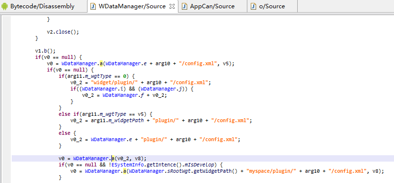
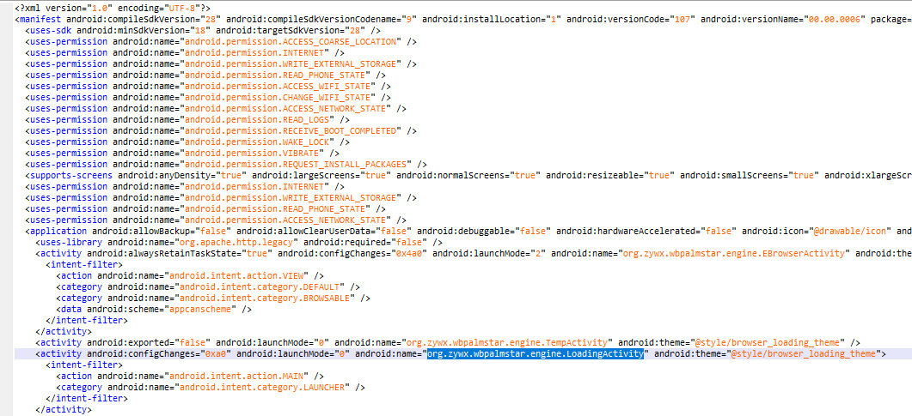
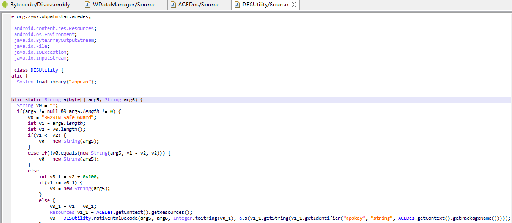
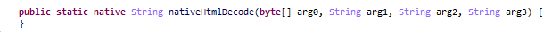
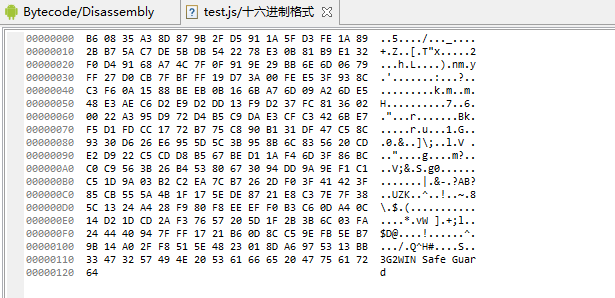
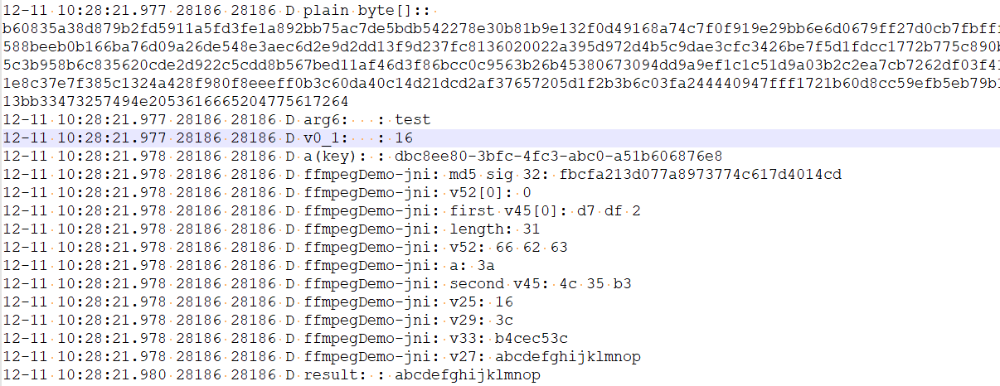

# AppCan Android Rev
作者：beizishaozi，如需转载请注明出处
## 目录
+ 简述
+ 应用特征描述
+ 定位解密
+ 解密算法解析
+ 解密验证
+ 资源数据提取
+ 结论

## 简述
AppCan框架提供了两种APP开发方式：1）webapp；2）hybrid app。<br>
对于第一种开发方式，只需要提供一个url地址即可，该地址保存在assets/widget/config.xml文件的`<`content encoding="utf-8" src="http://example.com" /`> `条目属性src中。 需要注意的是，该地址不一定保存在assets/widget/config.xml文件，因为从逆向分析来看，它还支持保存在文件assets/widget/{*appid*}/config.xml和assets/widget/plugin/{*appid*}/config.xml，但是从测试apk分析默认就保存在assets/widget/config.xml。除此之外，也可以从sdcard的"myspace/plugin/{*appid*}/config.xml"文件中读取。代码截图如下：
<div align=left></div>
对于第二种开发方式，则需要下载appcan IDE开发工具，支持本地编写js、css等文件。这些文件都保存在apk文件的assets目录下。此时，config.xml文件中起始页src的值为存储在assets/widget下的某一页面的文件名，默认src的值为index.html。
具体开发参考：
<a href="http://newdocx.appcan.cn/quickstart/create-app" target="_blank">appcan应用开发</a>  
<br/>  
<br/> 

## 应用特征描述
分析应用特征是为了从海量apk数据中快速筛选出基于AppCan框架开发的应用。从应用apk特征分析，其主Activity名字为“org.zywx.wbpalmstar.engine.LoadingActivity”。通过搜索该特征就可以定位哪些应用使用了appcan框架进行开发。
<div align=left></div>
<br/>  
<br/> 

## 定位解密
通过反编译目标应用apk文件，对反编译代码进行关键词（如config，这是因为config.xml文件解密的时候可能会进行文件名拼接）搜索或者页面加载函数（loadurl等）进行动态调用栈跟踪，分析得出加密文件的解密操作发生在org.zywx.wbpalmstar.acedes.DESUtility类的public static String a(byte[] arg5, String arg6)函数中，代码如下：
<div align=left></div>
其中nativeHtmlDecode函数是JNI函数
<div align=left></div>
在分析nativeHtmlDecode函数具体实现之前，还需要对其四个参数进行逆向分析。经测试，
<br/>
第一个参数是加密文件读取出来之后以字节数组的形式保存；
<br/>
第二个参数是加密文件的名字，如对于assets/widget/config.xml文件，其名字为config；
<br/>
第三个参数是第一个参数字节数组长度减去0x111（273）的值，之所以要减去273个字节，我这边猜测是一方面是为了隐藏加密算法，因为流加密算法的明文和密文是一样长度，另外每个加密文件最后17位是一个固定字符串“3G2WIN Safe Guard”，应用就是通过这个来判断文件有无加密，解密时也需要减去这17个字符；
<br/>
第四个参数是从res/values/strings.xml中读取标签为appkey的值（如887b9563-b0ef-2f07-bb41-4b5e85e3e95d），然后通过相关运算得到与appkey具有相同形式与长度的不同值。
<br/>
<br/>

## 解密算法解析
因为解密算法在so文件中，所以就通过IDA动态调试+F5静态静态反编译来分析，并将算法重新实现即可。为了便于逆向，直接用了C语言实现。<br>
总得来说，appcan框架采用了RC4加密算法。只是密钥生成部分是通过对加密文件的密文长度、文件名以及应用appkey进行MD5处理得到16位签名值，通过十六进制转换以及不停循环最终得到256位初始密码。具体实现，参考以下三部分代码实现即可。
<br>
**代码1如下:**
```
    void *v7 = (void *)name;     //对应第二个参数
    void *v8 = (void *)cipher;   //对应第一个参数
    void *v9 = (void *)key;      //对应第四个参数
    void *v10 = (void *)num;     //对应第三个参数
    const char *v11 = (*env)->GetStringUTFChars(env, name, NULL);
    unsigned int v12 = (*env)->GetStringUTFLength(env, v7);
    const char *v13 = (*env)->GetStringUTFChars(env, v10, NULL);
    unsigned int v10_1 = (*env)->GetStringUTFLength(env, v10);
    const char *v14 = (*env)->GetStringUTFChars(env, v9, NULL);
    unsigned int v9_1 = (*env)->GetStringUTFLength(env, v9);

    MD5_CTX context = { 0 };
	MD5Init(&context);
	MD5Update(&context, v13, v10_1);
	MD5Update(&context, v11, v12);
	unsigned char dest1[16] = { 0 };
	MD5Final(dest1, &context);

	MD5Init(&context);
	MD5Update(&context, dest1, 16);
	MD5Update(&context, "982398e^)f8y99e4^$%^&%^&%^&%&^$#$#sdfsda90239%7we98^bjk789234y6cxzv98324df96621378*28973yr^%UBFG%^&*IOyhfdsuyf892yr98ghwequifyh879esa6yf83g2ui1rfgtvbiygf92183klsdahfjsadhjkfsadfbhdj74e8923yhr32hjfkdsahfuy^&2364327848e^$%^$*(&(&wrtf32$6987987fuihewr87ft872", 255);
    MD5Update(&context, v14, v9_1);
    MD5Update(&context, v11, v12);
    unsigned char dest2[16] = { 0 };
    MD5Final(dest2, &context);

    int sum = 0;
    int some = 0;
    int k = 0;
    for(k = 0; k< 16; k ++){
        sprintf(&some, "%d", dest2[2]);
        if(some > 15)
            sum = sum + 2;
        else
            sum = sum + 1;
        some = 0;
    }
    char *v46 = (char *)malloc(sum);
    sprintf(v46, "%x%x%x%x%x%x%x%x%x%x%x%x%x%x%x%x", dest2[0], dest2[1], dest2[2], dest2[3], dest2[4], dest2[5], dest2[6], dest2[7], dest2[8], dest2[9], dest2[10], dest2[11], dest2[12], dest2[13], dest2[14], dest2[15]);
    LOGD("md5 sig %d: %s", sum, v46);
```
第1-10行是将java类型变量转换为C类型变量（因为一开始目标是将其复现为so形式，为了配合前面java中对各个参数处理），不重要。
<br>
第12-25行是对除了密文之后进行各种MD5计算，最终结果就是获取一个16个字节的MD5值，保存在变量dest2中。
<br>
第26行到最后就是将这16个字节的MD5值，依次以十六进制的形式读取并保存在字符数组v46中，例如对于dest2[0] = 0x23，那么在v46数组中就表现为v46[0]='2',v46[1]='3';但是如果dest2[1]=0x0e,那么在v46数组中就表现为v46[2]='e'。
<br>
<br>
**代码2如下:**
```
    char vunk[256] = {0xD7,0xDF,0x02,0xD4,0xFE,0x6F,0x53,0x3C,0x25,0x6C,0x99,
                      0x97,0x06,0x56,0x8F,0xDE,0x40,0x11,0x64,0x07,0x36,0x15,0x70,0xCA,0x18,0x17,0x7D,
                      0x6A,0xDB,0x13,0x30,0x37,0x29,0x60,0xE1,0x23,0x28,0x8A,0x50,0x8C,0xAC,0x2F,0x88,
                      0x20,0x27,0x0F,0x7C,0x52,0xA2,0xAB,0xFC,0xA1,0xCC,0x21,0x14,0x1F,0xC2,0xB2,0x8B,
                      0x2C,0xB0,0x3A,0x66,0x46,0x3D,0xBB,0x42,0xA5,0x0C,0x75,0x22,0xD8,0xC3,0x76,0x1E,
                      0x83,0x74,0xF0,0xF6,0x1C,0x26,0xD1,0x4F,0x0B,0xFF,0x4C,0x4D,0xC1,0x87,0x03,0x5A,
                      0xEE,0xA4,0x5D,0x9E,0xF4,0xC8,0x0D,0x62,0x63,0x3E,0x44,0x7B,0xA3,0x68,0x32,0x1B,
                      0xAA,0x2D,0x05,0xF3,0xF7,0x16,0x61,0x94,0xE0,0xD0,0xD3,0x98,0x69,0x78,0xE9,0x0A,
                      0x65,0x91,0x8E,0x35,0x85,0x7A,0x51,0x86,0x10,0x3F,0x7F,0x82,0xDD,0xB5,0x1A,0x95,
                      0xE7,0x43,0xFD,0x9B,0x24,0x45,0xEF,0x92,0x5C,0xE4,0x96,0xA9,0x9C,0x55,0x89,0x9A,
                      0xEA,0xF9,0x90,0x5F,0xB8,0x04,0x84,0xCF,0x67,0x93,0x00,0xA6,0x39,0xA8,0x4E,0x59,
                      0x31,0x6B,0xAD,0x5E,0x5B,0x77,0xB1,0x54,0xDC,0x38,0x41,0xB6,0x47,0x9F,0x73,0xBA,
                      0xF8,0xAE,0xC4,0xBE,0x34,0x01,0x4B,0x2A,0x8D,0xBD,0xC5,0xC6,0xE8,0xAF,0xC9,0xF5,
                      0xCB,0xFB,0xCD,0x79,0xCE,0x12,0x71,0xD2,0xFA,0x09,0xD5,0xBC,0x58,0x19,0x80,0xDA,
                      0x49,0x1D,0xE6,0x2E,0xE3,0x7E,0xB7,0x3B,0xB3,0xA0,0xB9,0xE5,0x57,0x6E,0xD9,0x08,
                      0xEB,0xC7,0xED,0x81,0xF1,0xF2,0xBF,0xC0,0xA7,0x4A,0xD6,0x2B,0xB4,0x72,0x9D,0x0E,
                      0x6D,0xEC,0x48,0xE2,0x33};
    char v52[256];
    char v45[256];
    memset(v52, 0, 256);
    LOGD("v52[0]: %x", v52[0]);
    memcpy(v45, vunk, 256);
    LOGD("first v45[0]: %x %x %x", v45[0],v45[1],v45[2]);

    unsigned long v15 = strlen(v46);
    LOGD("length: %d", v15);
    int v16 = 0;
    char v17;
    char v18;
    char *v19;
    //将字符数组的MD5值不停循环直至满足256位，保存在数组v52中，成为RC4解密的密钥
    do
    {
        //v17 = *(&v46 + v16-v16/v15*v15);
        v17 = v46[v16-v16/v15*v15];
        //v18 = *(&v46 + v16 + 1 - (v16 + 1)/v15*v15);
        v18 = v46[v16 + 1 - (v16 + 1)/v15*v15];
        v19 = &v52[v16];
        v16 = v16 + 2;
        v19[0] = v17;
        v19[1] = v18;
    }
    while(v16 != 256);
    LOGD("v52: %x %x %x", v52[0], v52[1], v52[2]);
```
数组vunk是RC4算法的256位初始化状态向量。
<br/>

这段代码就是将字符数组的MD5值不停循环，直至满足256位，作为RC4解密的初始密钥。例如，如果字符数组的MD5值为6fe41cff2a7f993169717563d947c1f，那么v52[] = 
<br/>
6fe41cff2a7f993169717563d947c1f
<br/>
 6fe41cff2a7f993169717563d947c1f
 <br/>
 6fe41cff2a7f993169717563d947c1f
 <br/>
 6fe41cff2a7f993169717563d947c1f
 <br/>
 6fe41cff2a7f993169717563d947c1f
 <br/>
 6fe41cff2a7f993169717563d947c1f
 <br/>
 6fe41cff2a7f993169717563d947c1f
 <br/>
 6fe41cff2a7f993169717563d947c1f
 <br/>
 6fe41cff

<br>

**代码3如下：**
```

    int v21 = v52[0] - 41;   
    char a = v45[v21];
    v45[v21] = v45[0];      
    v45[0] = a;             
    LOGD("a: %x", a);
    int v20 = 1;
    char v22;
    int v23;
    int v24;
    do{
        v22 = v45[v20];   
        v23 = v21 + v22 + v52[v20];   
        v24 = v23 + 255;        
        if(v23 >= 0)
            v24 = v23;          
        v21 = v23 - (v24 & 0xffffff00);     
        v45[v20] = v45[v21];        
        v45[v21] = v22;
        v20 = v20 + 1;
    }
    while(v20 != 256);
    LOGD("second v45: %x %x %x", v45[0], v45[1],v45[2]);

    signed int v25 = atoi(v13);
    LOGD("v25: %d", v25);
    unsigned int v26 = v25;
    unsigned int len = (v25 +15)&0x1fffffff0;
    char *v27 = (char *)malloc(len);
    memset(v27, 0, len);
    jbyte *v28 = (*env)->GetByteArrayElements(env, v8, 0);
    char v29 = dest1[1];    //从签名来看，值为C6
    LOGD("v29: %x", v29);
    memcpy(v52, v45, 256);
    jbyte *v30 = v28;
    signed int v31;
    signed int v32;
    jbyte *v33;
    char *v34;
    int v35;
    int v36;
    char v37;
    int v38;
    int v39;
    if(v25 >= 1){
        v31 = 0;
        v32 = 0;
        v33 = &(v30[v29]);
        LOGD("v33: %x", v33);
        v34 = v27;
        do{
            v35 = v31 + 1;
            if(v35 >= 0)
                v36 = v31 + 1;
            else
                v36 = v31 + 256;
            v31 = v35 - (v36 & 0xFFFFFF00);     //前5行代码：v31=(v31+1)mod256
            v37 = v52[v31];
            v26 = v26 - 1;
            v38 = v32 + v37;
            v39 = v38 + 255;
            if(v38 >= 0)
                v39 = v38;
            v32 = v38 - (v39 & 0xFFFFFF00);     //前5行代码：v32=(v32+v37)mod256
            v52[v31] = v52[v32];
            v52[v32] = v37;

            jbyte v40 = v33[0];
            v33 ++;
            v34[0] = v52[(v52[v31]+v37)&0xFF] ^ v40;
            //LOGD("v31: %d; v32: %d; v34[0]: %x", v31, v32, v34[0]);
            v34 ++;
            //LOGD("v34: %x", v34);
        }
        while(v26);
    }
    LOGD("v27: %s", v27);
    (*env)->ReleaseByteArrayElements(env, v8, v30, 2);
    return (*env)->NewStringUTF(env, v27);   
```

这段代码就是RC4解密算法实现，网上资源很多，这里就不重复了。最后两个函数是释放内存，同时将结果转换为string，返回给java程序。需要说明一下，因为这个基于F5反编译的结果修改的，所以代码量较大，其实内部实现逻辑还是相对简单。在工程对应appcan.py中将该解密算法通过python重新实现了一遍，可参考。
<br/>
<br/>
## 解密验证
最后，我将java层的处理和C层的解密操作都实现在一个android应用中，然后用AppCan提供的在线打包功能，分别构造出了加密的config.xml和test.js，经测试，均能成功解密。
<br>
例如，对于加密的test.js文件，其文件内容为"abcdefghijklmnop"，长度为16，密文如下图所示
<div align=left></div>
加密文件内文件内容长度为0x121，但真实的明文长度应该是0x121-0x111(273)=0x10，即16。
对该文件进行解密，从运行日志输出可判断已经成功解密decryptlog
<div align=left></div>
其中plain byte[]内容正是加密文件的内容，而最后的result是解密结果，中间日志是一些中间结果输出，如md5 sig 32：fbcfa213d077a8973774c617d4014cd就是MD5值以十六进制输出之后的结果。
<br/>
<br/>

## 资源数据提取
资源数据是指应用的web页面、JS、CSS、图片等资源。对于Appcan第一种开发方式，只需要对/assets/widget/config.xml文件进行解析，读取其中content标签项的属性src值，如`<`content encoding="utf-8" src="https://www.appscan.io/" />，src值定义了加载资源数据时的起始页。对于Appcan第二种开发方式，app应用文件中还有开发人员编写的网页资源文件，这些文件分析保存在assets/widget目录下，因此也需要对该目录下的文件进行提取。<br>
考虑到Appcan框架提供了加密功能，所以在提取这些信息时，需要对文件解密，解密算法如上所述。判断文件是否进行了加密，是通过读取文件最后17位是否为“3G2WIN Safe Guard”。如果满足，则对文件进行解密，反之则直接提取信息即可。

## 结论
AppCan框架支持APP快速开发，其框架提供了对应用网页资源(html,css,js等)加密的功能。利用appcan.py脚本可以快速定位基于AppCan框架开发的应用，以及对应用中网页资源进行解密存储。
