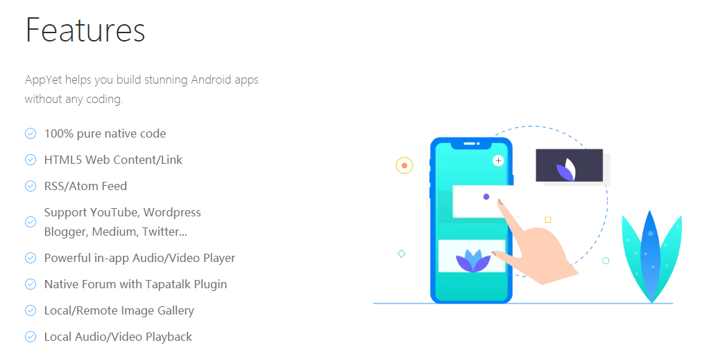
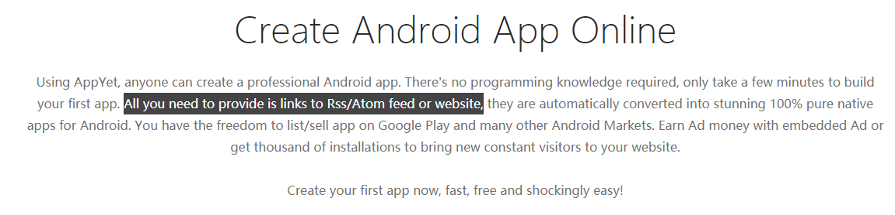
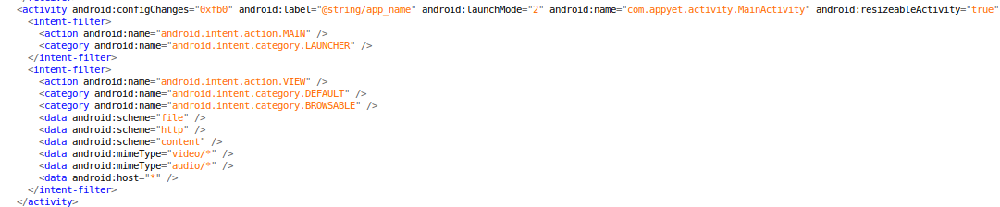
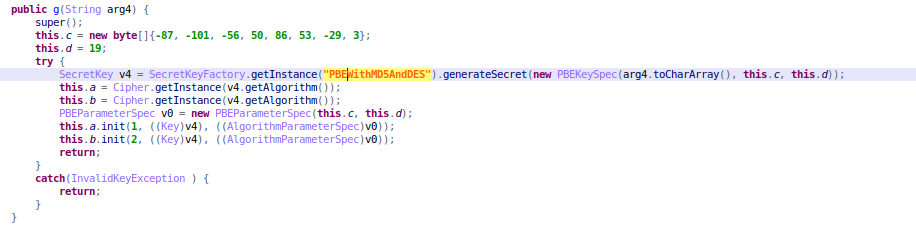
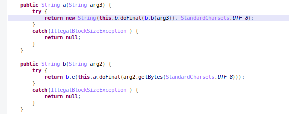
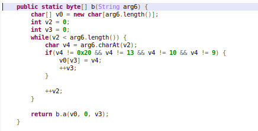
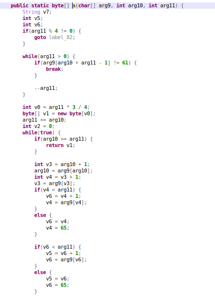
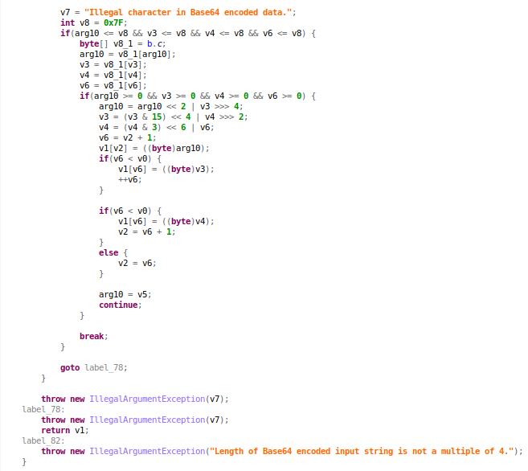

# AppYet Android Rev
作者：beizishaozi，如需转载请注明出处
## 目录
+ 简述
+ 应用特征描述
+ 资源数据提取
+ 解密算法实现
+ 结论

## 简述
AppYet框架只支持Android应用开发，不支持iOS应用。该框架支持在线开发，需创建账户，不限制开发应用数量。根据官网介绍https://www.appyet.com/，它支持有丰富功能

同时，开发简单快速

开发人员只需要提供Rss/Atom链接或者web链接即可。支持基于web浏览器进行开发，生成的apk会发送至注册时的邮箱内，其中提供了下载链接。  

# 应用特征描述
通过对生成的apk进行反编译，发现其主Activity的名字是确定的，名字为"com.appyet.activity.MainActivity"，因此只需要以此作为应用特征即可。

 

# 资源数据提取
在实际使用AppYet生成app时，支持上传多媒体文件，也可以编辑web页面。这些资源信息都是明文保存在assets目录下，直接提取即可。对于开发人员提供的Rss/Atom链接或者web链接则是保存在文件res/raw/metadata.txt中，并且该文件进行了加密处理。因此在提取这些链接信息时，需要对该文件进行解密处理。这里说明一下，app解密该文件是在发生app启动application时，当application发生attach操作时会对文件res/raw/metadata.txt进行解密。 

# 解密算法实现
对Rss/Atom链接或者web链接的解密是使用了PBEWithMD5AndDES算法，算法如下图所示

解密算法是标准实现，但是在解密或者加密之前对数据进行了字节处理，如下图所示

图中a函数是解密函数，b函数是加密函数。参考a函数实现，其中包含有b.b(arg3)的调用，具体实现

上述分析是解密算法逻辑，其中解密密钥为“X5nFe16r7FbKpb16lJGH386S4WFaqy1khWWzo7Wyv3Pr1wJlF5C28g39kNcPYt4p2s3FayL3u28KfLxUQx8c922XH9inECtciY0hgsegn443gfeg543”，这段密钥是分成若干段，分别硬编码在不同类中。 
在复现该算法时，密钥是直接赋值的。随着框架发展，该密钥可能会发生变化，后续需要注意这一点。复现该算法时，由于字节处理部分繁琐，因此直接通过java实现为jar包来提供给python进行调用。

# 结论
AppYet框架仅支持Android应用开发，该框架提供网页和多媒体资源本地明文存储，但是对于链接进行加密存储，需要进行解密提取。