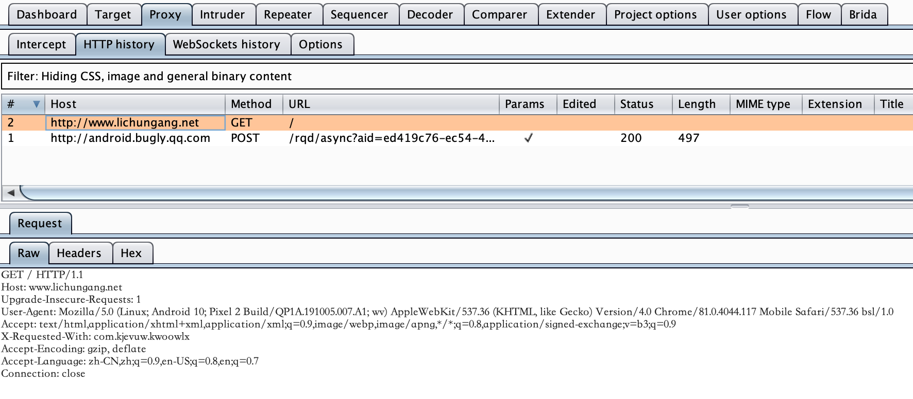

# BSLApp Android Rev

---
作者：fy，如需转载请注明出处
### 目录
+ 简述
+ 应用特征描述
+ 定位url
+ 解密算法分析
+ 解密验证
+ 结论

### 简述
在使用BSLApp框架快速生成Android应用时，开发者只需要在BSLApp平台上提交自己的网站网址，就可以将自己的网站封装成移动端app。为了还原BSL移动端App加载网站网址的过程，所以我们对整个框架做了逆向分析。
<div align=center></div>

以下内容以`和谐医疗`应用为例。

### 应用特征描述
ApplicationName：`com.bslyun.app.MainApplication`<br>
Launcher Activity：`com.bslyun.app.activity.MainActivity`<br>
配置文件： `assets/app_config.xml`<br>

### 定位url
首先获取到apk之后，利用抓包工具（burpsuite）先确定apk在启动时加载的url。通过抓包，我们确定加载的url为 `http://www.lichungang.net` （此时，域名已无法正常访问）。
<div align=center></div>

拿到apk加载的url之后，通过jeb工具反编译apk文件，在全局代码中搜索抓包获取的域名，结果并没有搜索到，由此推测，在代码中是通过解码后获得的url。于是从代码入口Application处，分析代码逻辑，看看他是如何获得的url并加载。

在com.bslyun.app.MainApplication中，onCreate()中调用到了a方法
<div align=center></div>

在a方法中，由于传入的boolean值为false，所以v2_1的值为`app_config.xml`，然后从Assets目录中打开app_config.xml文件，并每次以 0x400 的大小取出文件内容并拼接到v3。之后，在 g.a() 方法中将v3解密（此处代码中有相关提示字段 “解密错误！”，可判断g.a()中是做了解密的处理），最后将v3的解密结果放入v1。
<div align=center></div><br>
<div align=center></div>

随后在 fromXML() 方法中，将v1解析，转换成 `com.bslyun.app.d.a` 对象，以备后续调用对象中的属性。
<div align=center></div>

### 解密算法分析
定位到 g.a() 方法，代码中以 “AES/CBC/NoPadding” 模式进行解密，且key和iv值，硬编码在代码中。解密后再用Base64解码，就得到了app_config.xml实际的内容。
<div align=center></div><br>

代码中的key、iv以及解码模式都已经知道了，我们就根据它的逻辑，写python，用于后续批量对BSLApp框架的应用进行处理。代码如下：

```python
def decode(config_str):
    print(config_str)
    print("++++++++++++++++++++++++++++++++")
    key = 'IUP4fLZ7wuNeOQtE'.encode('utf-8')
    iv = 'handsomehandsome'.encode('utf-8')
    mode = AES.MODE_CBC
    cipher = AES.new(key, mode, iv)
    config_str = cipher.decrypt(base64.b64decode(config_str.encode('utf-8')))

    barr = bytearray(config_str)
    for i in range(len(barr)):
        if barr[i] == 13 or barr[i] == 10:
            barr[i] = 32
    config_str = barr.decode()
    return config_str
```

<details>
  <summary>解密前的app_config.xml</summary>
  s44Iohgp0dhGQrBuUFsFFvUJnLgmhKBsPSfIvdnE3HiQwGUjn3yipdBf0yDQHHWaYEDdfTWGDF5DuUdSw5GYmkRzpgI8gKO/R6kTLMm4HkCKQzXAKYUBlTgQ4InO9CkELCW/rH78ao/AFhBJs5KKtyo3+RcnZxY1klOznytGq/lFAXMfB+rKhHRu0qX+ojjZNGOqIbXFUSl2qb2UMS2i+uh1ONev4UwcIZW0Cvf1y3EidrR0pUswqnsmS/1P/dxq2KkmlxF4DV9iE8G2eSLZnXBid0rYy/6dSTX8V8576ASIz/8IEizUw7G9aTsMLWVLNAS42KIYL4tT0EMo6BEckHTfDFp6Kf8J/FkVFvRRWnobVwA81lSddWjnk6dM9DHhSltn1+clrm5Uja3m3iuDAfuVpybETe+h04NQSb1jUlUiVe4+gPkaUmsW3pM65p14IuW8rT7SHuqGwQ/rYxrZo3JPpTmsD2IVia0Sip+7RhO4Ia3jRB74s8jEh13gPVNnkh+fXutjx1d1oiV8Kj48VFdjHzjOMseEzh437ZNl4jLoLLYAKKSEPbr/c5Tzj4wyDNE/nVFCKtPcPkp5J9td9a/OSgXD5e+eNOT3GpZ1Fr7inABg881w9uSYVqwBNTZxAgLR6M3Rs74KVE3jeWKeEYEgaBwoc+qU2pBa8FbD39fnvYYAkxoVMhJDLqmrCJaNHVwQ5wbtwLpQlddsllRbzzuSg6XxF/8NDeTtVdt/8T3izXjSefj7SQF/OnJPtYCjO0DwdaShPKl+XW7Ewx4lULDbZx1K1Rp6dI7zWmeWHHxm1Cof/9a+UwiWUEoxFJmV9l8LihB0kuNmtkergoUxXlpTu3wMzwzh4qvWhg+btdEQXWYucozG1V6qBdTbtQIjZs6ZZfSjtl9xhtUBYAc+1Zhaa64GZoSSmF3QCZnkb+7O1KWq+/Ig28qGNKgywMby+iIQ0I62cTbf9c58eMwjUyzsHHD8XyNiLKIbwf3Wo9FVQLr/F8DOfAFXh0+PqYxLxVXHXwaTEEZB4me68EomFi0+bGap9KGhJcawDfiFk+JYIjxkAWAO6uddab0mjoLG+lVOU+Kg5678z1akHqzCamRRLelsMd4E0lBkeSmEIlH0E7BfoqQ0fdNfsl/3lEgoMH7TRUYy7nnfbEr+UHqX/DtKTDk4VP/DbaUUe4Rd1lVS+w3SKkoiiJbAuldX9h62B3JF3KD5KYCM2zXTF6b+RlHiaDoNf4FR1yzKxnuVck+VdA96kUkmflHjzwAwyRvxUcCK3PmZgk7zekqvYztyeTZWaXXILqkqIKE9xAxu+OcosQF4eDEDTCJWMjWJvwX0pR5kntQmMSsRzvJ5UyFUuxza6CXTyELl2xHbAlpEuuiSQU0+IZh5p/PnhT43kUSSEhYqznX6xUMjP6ZugjzW2RbB23ZjTaBbjzkk1/ecVoYOCIqJT88KlTMWjyOVNTrhpj9FdalGoaGA7bdgxcddOin9j8dVe6g90LeHjfMY6kYZe1DxnVaVR9VvAkd5BcA1pS14aRcN6TJNb94nCE7+0yiGY7D7qjXMaf9H52yyqGX4JKv1Jq3SZR/4SdrBtchmn6cxNzKH/12Z0n6eqJOb+A9b4QgS4X4FiDLoBNyCBu9F3v76kkiHdw0EtVEPn2UypvLgECPUVOveTa2gi2LzgZyKW7TWQbTpwrl9a3inC3Ud5XTeGFNt2mo9jt+sJgrZA0FVz3GTe6XjvFhJ0svSkElbIt9Le7q3cuqwBErjJgh3mXY2OtB6/RyA9xqVazNgzqf1O2vr5zg6aY61Rw3duqehrriDjowgE0P9QmAG5tdN0MWXo7ZSuRaHiVEOnszJ3hanwZ7rgTgFZXf+LTQRDu0bRJ8jNl8nuIzF0xA2hGyoLBxPERmH9VkVbeN9N3b8rxnkhIARaf2TtuT+QRKi3l4Y95vWmVFSJb06Omwhea66HbhSr1oRltt/5gyWEd6KOP5gswOvwDBO76+6bM5pyReBmOcoWPTtXihYjmtpo1ORvZNZ8PKTXnDVKo4eGmp/rJ5TLTPYBG5PvLJG7NBcKKfpp1ifnkdsI4LQTHhmtlpmgWhxsofvZY8Z9DeQhUKx9NdEvU2o1njwVZGsImkX+tl1JIWDFDKTcZHKt2F8TdnCnhghZgD6EFUUf8Te2+qFKgBz3/jMlG4D9kqgbTode0o2r41VgnlTGRGkS3R4GEFrevjQTKTHLGshBsyl8SmI0lRhdw84vx02hmhKd3WtqQlO1veZhb0BagvyxI/LdX0aP6UCkn3u38WhuUrII5RcQtkbjwtIv4pLEEU9kwkXlQFJ99Bc2kkEYYcFoC2ZTospiTq+AWz/otcYPMVxFz9xAbj0m73mc5FY4wI+Wjbtu/la6h3FnJWBzt9KUecM2lhcTiKlOkqpryX90KGcX4JOqkI3EJdzZldku/XvnO+crNKTtzb9aqdDEXqNBOwm8T+mlWgoj2+Ekp0He0PrZugSmcXsM41xd/IXeVUdm1YAZgtoLVIwSGbdS55IJXMQjGUTeCLiTa7rCeuD1Kxe6bFSVBfTd1GudwcnefJQi8ZEe5YuisJl0Q/C5Gi1DjA8p8lxVFbId60z30XjuG4yxNy9sVLGLRrktmLHYTj0SixbEV91oVV20vnV8bghPpO9I5nEN/Ayf+T8xV2XXA5mUSaY4YJVX3srN8aRxl/7SdObN9NHis1MmM1GLLFuHD4J+zwNpUKQylAYjapxBIWnxhCDC9Bche4abTtKun9q/LHFXBYAAX5gcxZ1BMNsTEwmHgOcIkmpycGNxJB8+OiW6eCugZwJmEQFppG2fsR93VPPUuC2FwYOWthbUch6AqM3YwNOdQp7tCGp4s3T32Sc/jJRbqzH6tKzIQns8GwgFuVQMmyh9BkSMczR6rMnyGsCak9NhIwaJb1TtGUM6bMA+lOEv4ljTgIM1DdsTBgh368Uetk+KJuo8rVob+awVeWwAso4EfjNYX4TcWm2syCIHrB4HYyEVAuRWVxdDEpKi5mwbgJJdwDEaF/iJC5VfNSJuplhqJ8EGJaiiCiIxdMLLUJ0Z+Wl4B7Sspz9OF1RtbNgGMe30KJQdNwF4cluYR76qS04mTBtuuMZWxsz2ppB+Ny4x0I62W9F7imPZRGPkduxsR0H/7aAX7+TcIMvjUCfoe755BPn//YUbLFd3Tj0DaTzperUp3Tphj5p5y4VCWo8VS3H393RqY4Jt1kAvqmg+NLcsUIA2IT2qQDVAoi8HT32kS7Pj7mh2DAZlXWPDonhAqEJ3LXBzV0OQsEA4oC3v4TCBm+Xx/uQ3zfeyafvK8JVYHSinnqZ1XLjq/CquAvBRroGnGRO9l2KJCAb0GT8qyu/C50FNCTVC8alOt1v0l+WMqFIffpNJQCh6+GA1g8Vur4zVXjqlYYMLq3EvV6vxGUEPyYNVbvjImg2uXRqZoIw3mEhcE9m1np/x2rZo/PQW/y3jyqy3NSAJvsIMHzAaPh8QrAudSW3uVaHd13SFrzbXPWDAyjHJAyQ2HaOq83Jq093wfsUo/OmdYJwWwcM8j+b0IL7VSSXsuGsKavlSepKL8u7VIbiZj0hrBFkj9/5yKno8QmCH8GrDqL/Nt/HqPB1r7PzlsdCujclw4lxBPsTUD+/DTxRnZHzGNWMvdZp/MYwdNsD8zXdNp63i6E/v3JnUZB4THVwkBkArAGAQPoxV1lywqpYmhVfxV3HYOsUwNZmuqcFCCY8gWfuW3LYzO+bDBD/c6EkQOIQbaAvdinn7ZJMgWMBM070KQKfiffnMq1H8M6a+QZ8nxG2EsY+qoaQLX3+BiZgIOe7EBcxNQW+tw93pFrQbaxiGENb5Eqpw/BvKYf/hHnFxVV/SYIYNYIH1Tw0FnlnXcPFGXLD3JhJsBIlvCw7b9kCtUhaH1svVuybDp0oUB+0T5OYcNoQKciVeYRf6BgiWGVYfoc853DA3GnQ0FoFmae6aRinFwx7hBO2YcWzgwE8eKH8+viVSDWJd6KDma79nSvhoL5MjhJST/sxTQwKWs7mb68X0uQfQlko3C9irfefYR3q2P9Vph5iu3ZWUKwtV3NpoWoAtf8pY8/RrNTbUojiTMb1wA0YgIBs7xlUNAFsAm1vPV4vB5fCJcHO5P/+M4XQC4d3/v5LO7a6gUzFybR9TkbTCyAPzu6D9npcnUa2qu9uGc456bK0pvvxQoWpdthMT1cubnIQK3REw3bsjixdox0GjvVvFAsKi9eB90Tir/5Xbd5PuBdwyP/l8fI8qpSzyYPzRXKRcSxASr0oM6r7Dx/Sa7KdYcOEdQsM257qZtkOA6LjRWxKPotL1Jr5pWfpcIWpupbRLuYiGL7syQix0EwlHjOxe5z1rFZn49ZEpIjGJxlEG+TrpwKTyvb5He/doFlEjItKCWjiYUVFTOw9XWUeuVoVAyuDSyfKty1+YO3Na2MGkcOP0aPgtwK42mZ7SB+6W0XkfXjLw3jCrHlDAQ1yaaCMyvwQ4SAwnhLxi8NSvqWWuBVSyPLHWdwNZx/1MBE5YtY//5tKX4AOCt16yBWd3/hV2tAW102hOCHouoYgOoxX7NVfbJEV7nXoehWTlimasmLRIotanRdA/wtNmsj3fJZv+8jOnmT2g4BjLETKlV199xn+hpdIz2WbLHCgsZuJ1AJ4cqIdaKNxMrj51qYOcSAz+Td+0Ln2b4+nGUM4AIRo0NR18C/5fCaLRz5ocKkSC/n2BVkSQp0EucrL09J0PT24USgYSOm6+BZZdtsOi36D9cVjEyZzmWxxb/TutlUi+U3rRQJr5WNgopFzf7L/ruurPcFubAbK7ISbJrRxmMRI+FZlw4w4arKRQakfr+apcn14D04NhKYNCQOVtHchy8hdVdYJFlOHUYPVGKj80luhkMQMuhIEluEeqCJu5daKRnMZHXk4331jwll1zhkt0a9XmWisb/E0pB7v/QjoHwbX8NbKS+CRmMvuANPEwOdSdtcu/komU6HTKUzxRt12y2lxjrsGjn3F2Z5rVkTr9igg5f55i77QmJzdiIKl3N8lE/8g6LXc0gEEdqFebNn6uWZPc0EchfB0hspihWFPJcNZEE0hGykkIo1ppH9XlAxdbAveV8EUvdmtZDjDM59yyJ6X3bl/KD10ybL+Lp2GdSzVr+dYilbdfDz6K9hQ7ljpLnGiAhUBPVKwppFL95GfvJGCAaQJSWYX1JxdsgrkLpPyQiF51qi8GLSYj14y60fGX1KDxqPEptXkH+A4tbPd8c/lqUv32qZbjZBQYNbxF1ljTZMvauLswoKieQMJqnYAuiRQ1rlSTS8XIzELREg0gEV4z7+7Nnv6qiIC7kUrlFVM/Anlc46f5MWW5KfjwcHV9Jcn3ldyuPqnqFWoi3OQ542e5eaOxqt7bl1X8J4UOAhvbDVEvaZlSd+ahlNu3oXwpjeWNNC/zGnxcI5FN3ln105T9NRqZ9mhcDKI5nHJBxUn/MMutgMYaQ4ETP6nu4bzWKS3NsA7Is77NNeInXLWLtcF42lo6Nuqy0a3eMq9bEYuM/zO2hjiDY/4QHSD5X0d6PHWxfzbUszSW+pOcDoLy6XaNu89XtFA3CIINHhZldPYoInyEdrAtNvt4drUQ2SlPtGK37yZfS+kqLkoRUFRKTKlOUxG+1Ex2JSOkCfQwGUqq7hhsYA3rbapY/mF0FPFQWr4UNcEVB3e/pMJysfJI6A4t0PbRH+EMCessx5G4Ix6l/n7DS4EnfRHaNnlao8zFCVJdN/QSF/HNkXZug7h7x8vZ2gnPmrW7IhUuuymi4ddFSPeSNO5ySqrRO+Rhtsws97Wn+rACAwtdwWCN5hCaJZX3uHfllcL0NcErwYZxOnUYvjmQwiUPqb6lXksSFQV2E6yU3/esEAkKuIOh0xANY8CsfBMEbnLx6GYAMyH6Bu9sv0C/teKve2w/P8gf1LdsUNH0vLijGuCdFH0IoaqKjOfX62XkGLgPSBrbmCzHnJOqamNTvwESrL1z5mzzWYDoRkW1IMPotZ9o91CR8busPtVBZk1aoMSMqhk861OHMnKRqvCCDT1ogUBM/hEsxUMeuDnTbasrBLqpbRu6tSq0Pn6AeUQ0A75icbj0l5poiKanEdNWJ43KiyZSGteOSA1bAdonEmHJFtf9dK7jnzDUXSl8O/fTa1D12vmrgos3wyAid2mSzocQvs+9R4b0wpFFz+QCPV8SxAN/VvJ4kZFW5kEv2bKlrxiZP7LPaMZ7F/ktBnHv457pOcTetjpn+F49va57IK/51JEZp/RZXMt+LkfDfLdkIFmz1bnx5VpP/UDNw4YSxT4UjPiocrVQJPdjStpgpZU0n8QQnEIM3IXRcO7ZrkWp68GPiBUWjztSNymZpPnG6NG5nn5LOPaz7Up5zIpoxZvsIhIDvPXLPfDvK0LReJMHYqBihacnAM0M9YSwsb0qC43FcDlRW8TGjFn0r8D/WJvArb4b+eKJfkCy3rxqQuLNOkhOhSUG8VmA33fs99V2a3G7eVXAHZB5vv3k5/ktvhXBNYAwWLT8YXNeITbG1iRyRlw5TZ64Zz0glWPRH8jKl7OpJ68aQiXmIMIH3vN1wGX7cOERT6u6yPxYdWZGJn4NoBQ9P4JCNYCTtvYPlUu1iVjncS+khYPeWXFv5/FhNBKL3hnN67aido0YqLPq9cs94+0g3oCxNhAUP3qskQDnm30Xsa6/9qc3et5xDLSPEADjidRolsIq++TpFoUgXTwDW6/OHr0VkIEj2qKieEX/VQPKHMLWrvXQsYYjsC2Nu0tzM8I9uAnTBYIp+sXjx2hFaS822XBjFGRKQNhwyuquyLPrf2T+SKYcEb8PQZOBjZwM4+RF8/0cRPcuuxterkOh2XbH53EmecHsGLLR2Z5w9O7/OcWDJ8EaSDlMIEr5TfOJYYF118EvPCbVgrAQ3Vnj7iSRvXg/O5NO6/GNn7XT3X6B4p+JkHSSMcOFlGRAJmoQ83MHCv0h9k50W4td2aw39w5MqTpqqdvCYxaS60S+TQ6ryBjX7CfE8mC+TUDZ48XbiNDBTWFyPLMDwiwK2o+1Iwep2CMjhHUa+2voOWwoE4GADBQbIG+6L26Z6j8lvDfzBqsend9eOQy9dDthOiciHBaiuqocmq4SQ27AXfVxr5GXtG3JJ/gV//ohNtKWqflC6WzLCgzfsjZqe2XZgoiNoQQMHpBNHxkP/IxF5mHvodt1DtG94rT6NKmG/+GDRTbQpbIa7GKyXRnueVubXQuj6+1gxohosZaidz0mM0wRBGIF34DI/0CVucfn9G939d/hF9OfOEupzmvrVDgn13AvLNyRjB7t9y1qjgu8wVmLaLNL8U7+9eOCZr7+5sGVpP+LFXvvldNCtyil/RcwyIPrqHLAEHJilZrVDKcX9MzWvRP1Qlk1jf+8pACSMm3j6Ch/AiP3O4BqV7Yn9JlG663DynsrOzjuUjqzymCM6DKN6NNe+jDEBR4YRwv1MU10O74g3P6Ul+v+R+6Or3rrn1opmNLn7vKgSmxllFnHc0dt7+Bx3k3M5uv4L6KbXbLX2oiyVx0nNLynz/JA3+vVIF3gVnmy4Qe08ntb1/qjwiwpF3/Je5GGss+wUbm85EGUOAgOMWxtog3kGxL3vCEiQBAI5LT5Dcs3qrsbjbfFlVZSRp4hY0siJNFSZClaIMznOAznm+2RuYR2VapxGddQHAXBOHwbA6P9ysFZC9CYDn38+3BKirprp9IKTyHilKQ6oPaWYCpMQxv6UzVUn9b4M3VjEQkLASR0EVqd3W0Hxt60MAqcYeiwi1t6c+wwEAzySm+WW5PSXoLlNiTPXZzOoLgygV/WJHyDMyVIeH/gyKGYtGmDrpE1gidQ6NK8dPLoNC5EwaMaQdBMrldKZjXcVHvj+Ui9EqocQV1OmgZBjqFLfYJocl/yZ3RIhBp+JB8VADk2mRXveqaKqyPBUn7Juh+w+rxdfX9wE1RahOMXGpK/y4XP298whm8FlKtOhPnUwegbnJZGcXM9ckEmlQEouRqiuwyBIzq2RRTXF8faxVkbjFsWn7dBuiAKwRb7BDv+A3PdC8+XXl+xcMzBtyQpHFHo0kjsq0/iMMmTSGfG1LnqqOZt1NCwNvR8zqRtGyDMIWlh4FhLNlaful9AoV8OzPquv+W7gaywYpMZDvwqO1OvRzWr2xalIFjlZAX/ktZAj+WJkciqzs0zYcDW4Cjh948rox3GYAklA62EgGvm5SgBTJlx+2o8ooNOMGzIVXoV1P6qTV/tuoIJ4JSflp2VH8wsLqXX9wiiWB1TajcGPrCh0H/ftm1zFOwOTFoL+hNd1qfHOLz+AApZ5k8c5SdzlL0cJHnTrbCslpGw6ppCLKfSH4XizDjxGPA397087mLRuGd3R67JFhiBNGEH57avAtBH5daxBoeTjLeEHRZNKRm0U/lOLg56tiCBjR2mVjeI7hWUr2cEb0sAbf1WcJvlKOXRGxyOxWYny2KAk4iDhhHrbC2+3qgzBnNKa1cFHA4ON5+REpCZ4uXHJ4Nl/KSAFrIdxP+gr7q9A0tQowSJx9GhsFZpRD2iatUIF4SQUEoult+H1+o4bvzmyTYDG6pkjS2vnACsSfLezQr2zCMv0/30x6SHyfsMxckzrWQBymN5SLG/XxWM2QurjWPHHFT4l05rDGil4qYfwoc9BQpvjofUYuoFOz/QaIIN2ohHElJtiKI/ytbq6L7JziQBmyAALd8toi7ShVsXWqYpFulnLMM739An5Vc1hBSJAZBYAGVYu05m+2Uj2Xtf4C5mImM6t9VaW1fVDSmXN9Q1Ezm05DA72gHnQpLRohYfkag7BO9ixRVNIkno6VDHaWbIxTahpC5l1eXItq0m6mlJW0TL3BVv8R1Onhrrx0TZibQ9blIyf+KLkA4ugyDzYT5RT2YYNt2LqXwLanOsllNJehP99TYE7nyAufmGVRyUQ0Z3/0/0e8THrDu5lSCs5VDdT2xKlwRWFWxx7T1xBhxaMQBwb6ApSx3TcFuFFuNE61m1a3Pe0IQBy2W9tCKlhb6jLKdXV+jf5U1s4JqR27R4VfIYvhr1cwUNiSwZMuokw7wc8Oq3N+HLoc9/YLslHAKBinwoPiHvuI/0/TPmJUj3ek3aulO6qsS4qqpcUNlWFTej/7O3GSJ6oEo7zgtk4y6gQmeM0X/h2i/fWt7lGFGW5STi+V3T/R/njhGShe0g9gNOrkENjr/8mm1LcQxjejVN3vHX7B4UCCSLxVjVVhJEDKT89ke2f29JTYh4WqH5kpyHFluhU1BTlsnAWIUTRny3BljvPGkgXvV+x8HI29E0W1FyWE5DFWUgPjQrleck99ESNvkRcdXjX9IDJdRfN3AQvVuzGvoS7ceTvBm7WGsuP5QprhcbJQa4ftDXPSQDB/EmYQU0j1xdBZFlYz7/uShGAf0MjBactX6ZI4NiMu1yhUgdeZac8C+TOu3UAeMQ1dxy25OOJg3uwnGTCWp8FbXIeEKXV5UeW79x6zD8FMloZC2awE3aVj0+/W14CVBHDVdIORN+PIMAYLGhwx/gbbvNxeDttDnHtocslAKHAVSG5EaYH9WDkj+GMX82Z5WLaPAaTesSs46mscPtpf+SPOWl0XMLPf+htK928MNeABGpz1tyvoda72b/J1ro4/tRk7tVUu3Zewk5cFSz53nVQzPC0aByTq7PU3FbhY0zLmJbvii1Yh1MylNpzZmjaQquZSDFZgV2iy+r4JiBfAd2NZiN6/MtQ6NiVFU691l0t/9odiPv0XPbtRbsyBGznfxokwEDfmQpWXMrmq0VzzmQ15nBVqAWao4+SxpBe5Kjk2oJreY8844pFWdsS96i8K3PxV/1R3qaGI0udn7m/At5YciEr8lxzS4p9lOqoPU4OOy8Lwkwa/vI9SUYd3ELHCK+m5eJwTfy3Z7SCUHKoaXkmNROO1ksxNDeNa0lujCC65eVN0wjYE/sOuRKd2nX4LxCaOEkZePBlTGIIXD41JK74tFA2BvRHEn5OeI6R0tPaSPKOIk9AVrmMoTJt8ofsakvvSB689i5LXjAo9xatHx6ca6BDxteB+9wfkISnuLSOZ7uOLqB/NLVnMEJCgVY1/TGZjCuCKFRJRAfvKjQPTS4S+1UuF1waTbOqVeDx+GWZyI/Eoj0wYJ7bliAHGmWEYW0ZttKbUWHVmazHUSzk1yEgEkgmn/Mec9anGVXEJkHw6x2S5tkOztKz/dPI8oOzpnSl0/LhFAehZa8aSOO4uLzN6dc/YR3UCE7jklVK4Vz0CQdbRyzTm6sd7bv3lOop5o/cuBSfcvcLOO03cH8xI+kghMbygZxPVKTSCEnrPnmTSaivZBa3OvRU/8lbzyrDD9b0hCQiRry5nomPG2Sdns6CEi90YdP+gaOtLmTukEaVrAPaOPXYVpgJUndbqbj2PGsXMOtjQpvcl3MykLUutf7iZnMzv4XnvfqkJ+9m4TyTg9Vg9OmMeW18aDtF2upoZar15Ss7pM+MnwipNs6eGUkbmWchgGB4VQp/JGtwYvZsJDZCmYCXqt5I9tso8WLPyckvNHAkFVLsJFF79fx+DNO8ohSlo6y/gKGzKyWFTS/+oQZwRaKaEJG3ZiGWvTpuDSWanxdGCeVEoByPdWy0xaHdEl5VLV56TuBBebmDzHwt+8XWEzMVLCfzKPU3E9Mt6JnP435T6/nQy9+Y9XRRrWah/zpOhTws/TeI4NKVGI2FiieBu9OtbCuJReHS/36SII00NQH0xgxJ/FmRi4HrbxxNV73cEHIrFHaMjqw0EDwkDeQltY3ddbeBoPUVvzwvZ+NHJU1fvhyZD6gMqunJQkitI3ibsAoqeOwlgya05Uvnx5h2up5ScSX2WjHcr/7hp1C4kGKusTBUSLIaVE/8mCfMxJ5T2wRucHYDLjnh2ZkehX+1pWcxB05nFG9aGk3hH2DxtY75YYYTEwGE3VRi1kUK+8vad5ahOOTIIoTbA18gv/dYfSfZQQGfYCTdLPxDPtpmylFDnqGc3pp5GMVySrA9Awp3jJMjhqPpchmpFbKErC1U7FcaeVb6fsUUzOCEUZo1vENTwIYvsSfjJ67D66Bf/TLGnGTgDi1gw0+1RAXK5/JqOHVssGxV7EbNEyT5yt4Eb+9OxGayhTxfx62JMknhO1MXaWADyVnG/f5mH/IN2s0G8EEx9N7fzvbZOr6Mp+zM2NTvKZfvc61lQ827j/5SlhO3fmb+qcn8TD/15zKpaeePR4ga6jgzsRrjxU9hnomI+Qfx1qtmtOPSEUkT1baq+zPew8GCI9rEr4JDcgu6bp0Wibc1skGGw57Wz6teE2lfiHprMvVOBR9bVus/VqJys4Uqz5AypxcjrrHaAUaszkiNMIUZZOcoe/VSD2jMX2NNeNhJV4D7g8NwOOqWn4EZSaxN52Z0nFRpFYSF/Yy4bYg0dniZFULsb4CRu3gL4nuHhOf5UH8KSyFtiS68lQV7jMqga4eturH174N2LA9A+HV7+HPI12D7a37X90eXeQd/ABgMS9/3jJ/jefO0w3gxPpSjfPtkk2xNDnNXD8mw07UU+VT4hGejhmhVASlwV9jmI0O/o0oqni5WoBFyC/k8RXqXV4zNGw/rocwSL3Cf1lTd5QpsogAwQIgQRUDeDeMS6POWeCOenb7jKRxUGdz0blJzd80Jpn5mA/yx++WcYlMrF3Uknpw427xL6pO9jsmrFX7B6umFYKueERwPM0lJCQ81Op6yobb1x5kj2/tHx5tb6wzJoN+FA68gP8U9Pqfp9Ec0+dA0bmN/IxEvMdCDLvJq6ur8brsTfvV1IHIS3T1RI28ozpwv6tQcTWDnx84hl6xpHTMYPsJBeTsjeA9yB4nqpKs2V7nIx2zIQLAGWFANCUMuTozgN+22lXdKxNLbuh436PikcLAqKIzzgwbOoD+Be9ifCCepC8/U78HmHj29OKoXRNu/1GfOKQPw8owhrsQWQ/3Su+0stnBWj+CMuyKc8SjAuBUh7iVFSj+HUiI4oY2/1n0bKPIHSzWJnNnHYRr4tAHLpE6LXCueGIByFTfhn4zy+oC/09DkyAQYIAYKA1xCMEHeHkEHJjF36nVdsy/y7C+48z5qFN+YEg44l4ZcYt9MlZoyY1h222kRda5F+1+Dqn5K9Ur69KvrQvSRGtxXCVM1RVbypiwAiQ0V/M3vpch0twv3tgI0AVkCg4ExP7grrJiFsQh/Ylhbi4i3eMruJ5+qtbI7CRyRVENmrt0LIEiIZttVUP0W578ijW1uwiZQjaik8De4a/LrKYXSiRNrWKydszsYwp6CVejOKbMeahjf8lkwVlOJVKfn8MNNZ/3tNwTMYqebx20GBIIs10mBPa7I/t26tqk1BDJAyHryHXwogGmBwJ7bCfp+5Q7YAlwVg9HWd+Htrn66gRf7UUuNc3plT0Da5E6yYFANHJM34f7Eve8Hk3jgh6OK+nOo89LliOb3YwyI6tC/K2fJCVRoIk9mqwvEvCW7t0ogegSSGaT58SLq8hSAncpAr4DQ5Y1UGaEv204cRFcb2HDo2+Y3K5N4CxtOxU9BPXkgV+Z1h2862Oqh0T/uoAciHA7oXu5z4iBrV8w49DJo7ocxHO0S5OCGGJ8oEmg4v2BVNRelMSKd+vPovlO/7gjRSDpf+WXxjd/+LdN5Mnp9JfQgY5SxET1VPwUsxgUV+A/Id0HhB8vzjnO601w7pJckBI/5rz90OMeAmFYveCVQP7WWgoclGlerXZLoKUSl3OrEyhhefOaLUzThx2ohE/CSnhDcfYLVnZkFe3rgQSPvPTGrRtbj7Aa2m+2yZNJsjWRScH5sAc6wuJShCxowfYd6pxV2gWkEUqTV+CbPxxQY0RnL9XMkiQOmVtRuS0uBrjCYP50AUXAiYDHA7zwCnp26y1LbJDo1LlBgs4b8qYBCpa3KamQMIpDHRWvibOYfnTGSJ4MAARMCMaqI8WdmvXMk1htrXvoZiRN9lsqOLTXqLruslMNZg/mdsT5mm4Vou++fhPb7tptNieJpqWdJW0uil5NibAZwQ7sSDUcpliaTUO/zTzNTG5AukRqrkxJVbFT3zBP0V7aUK1qZv+lqymoYgvoqKZA9kt7MRWcOQ/nnbEfNk8OOO97N4+cf4r1hOatugqVpGMi7yHSKhT78hAIjksjaoc2ua+rI62RyAA64FRN1Sfn2PJKsr6D0rHU7DGSyFFMxp0v2hAO1C3rwtJ19zp8loW01kl3z2bdxIS0pmI+3/vtnfeMVv7aM/YT/NDRqks2LQyeoREHYyvkgkHK2O2+TSdJ0SWRmAVQm6ReT73li0ojbwISInIgazajt6npiiWDM6AKKvmHDmZA3Zd2jC54KrBb2rWxzRnO7zR3eUdWXV5XSiX3aAWXCtwnAgHs+Qi01FzfHg7bEmynMjOJE5gArhmzfDrnGQmozsRrZN1On8wTNxAkWIzotZCNtMAKL7PP/K0VRaZwgHpvIszT7GT9T6qcX1hfGjsvOq1r0DsZmmujOF3kybJClLY0SyOz6ZlBxbdcOA7ZOt+TED/s2H8fbRQHb4Vvc57WRBKwZLj3mHRkq8INLnZP3E+dK86MdP2t6+83Mtg2OV0pnDpTbfsOXG9dkb3CD+lAIhBBAy7FUYtFfq2cXyb7oUXi5rDIZQjSAVsCnaRsYjWV8NH9OJ0MvpImPqFEZ+a1NZZG4l1C86eTyLuijwsyYj4Fq8XNd38Rm2O+BR80FJoDq9XYZYS2lG2Ln7+S2qbaeDU98FoBpkG8K3y3xT+rVKeGSdXUwZCNuO86hdaWLuHFRNWMsX7IKSoZsTBZp/HqvT5gyTUVxm0Itu3Tb6KT+8M9BEeHlfzfp6Xb3uJ80RYp7kqesgz6t5YvzkNR6awPTOJJd2x8ikTeBAipaJHc1Ucgrfq38GyyeOybBMTspO3donaQv4MahiB77maH29X10PkUS/p+qJFfZeuXZHpU8hAdflbq8E/FZ4MWOosOskfchjuW+luVsaUblHoetqlaSExx5B+Ad1A8XVLi6U5k9wN5fOhH72IFW4xChFE2eF1hL/B4YmTA5daVbdccliFHJevqbWm4lBBqP15V+J45q9w02FsX8DSIWOW+nqCYqlu+Oi6/EfSfGt2J6YxO87+cSj+2KsqrTUCGa1haAOeVcn7+KjtjFjsmFEpDj7lKWIRa+e7lJdZfqvFbXsluFjEROTLLGijr9smrky6zbfJlbwzWzu43xWWFhk2F8Hs+F8iM0NSZ2FsgSR+pmX4LCLebPtNP1Yrz9+cEOqTXKrhTk5TjeJYoC7y4H1IsQsq3uqNSYCvQEtzYHXcP55cCh5BATkTUwNBOu8bkXlrw73OOGFv2IrSRW0xeIPI4JwmefhVRgrHMnsj3zPPrTKnLDHtvZKoh73tzUV+YOQHRaszvEcxEoroLBPJJ+s5xRXagPXAOI2sLq9rk1vIQyONAdyj2bkpCIOvOfleUQiblGakh2k+cZiI/LahbKnX6B6egPCLVvrqWSEVpSZ2hz44G/WJj0lNMzYGCV33C8RQ0qAm33sxJ2tQ0swnHmqf8BYyQs8ChXOjX8Bwrrby1Qlsu+0cssVIqN/4erLANtdsGKFrH6yDfX9iIw+osMqlMlWoIceBb90P+TAPn8actiXYe486iNKqsOVm1DcGltu344JTP/jSYfCcuaYVpEMacaE1/180OVxN/L2LowajI5uNdjzHvXWzEoxFQuaI++JXPGMpSS7fmftfgbv9R2mYR2D03xqW+YbnQ8WVvIBX/iZrpZsZ+xZ/Y2zpdCUgE4s3fdazqxk6UGmw2gp8n+36O+F1/E27DWgjkHdeZXSz30GH+CX254kj1QXOiP+jM6LRP12ElYizgMw1D0AHZBCiqdN6A7fqAPUrZUfUInLk2MxAuqbuhz6t9EJo3/QBCpbc6FzqeRSl9/h1M0Jne/KTHxEmH0JiYaWuSRGC11DcZ3qgMAO8kcPl3WWuO8NDsDnBvcfW4u/QfdVKs+J78pD0QA78V89ry2o5h/P3o1ZYAjycsJElhzhHS3oPjHgtHhum8kOXtapTsvf1wONyllVouUcXdLhKEikZpayYqXOf3qdEYDmEZIb8rVZEbhnmW2kP8dwIaRxty+qpt59rfKay3w0jcYP6bZHMYc215HELMXgOl1E2kSidvw81MEyiCEjBHivCOjoBInGy3ok91MSaAq03DU9AFgPrjqJydQfP0w1P6EmirGEeCogCcMqAfaeRpsRu6Q8RS4zYS53XIFzo2XjKew5k3/JnavmBumGbp+RMQlGsGp20XXmi5XqmlvLmfAOpEnODSeBWE2DfuQALGCrGlHu7uC2dtlda4pKwIwfMqCkhHpU8rIrxHJZ+2+mLYQ+8f50cgB8CcCGJFeaglizj0RY5nhCNWt1YjfOhVHa/sKVnaHEIPqLGPYoyVwiip99qbB94poL/dzl6SbljbjT3VnPzElW+bA8clVwowKOJIUfjmfcLJ6sE2N0DOLXpIIoNni/iUgfybulePms0lFjaNIXDWnKU4rQ6+g4rhEE6x3yaR7T4PFrWjK/gW8u3I4/DoNOclZ4pTv8YAyCUoq+ulqiP1hJyCFdpYK5Z3+hmgsvN6gZQD/6nKtHEOhAULWHrH2pCfN3bpPgFS14mLyshZk88fYXdSSNvo6xN7VeJTmwmtVmDDfRqTrLfiEKSzAnXhvh6U1kjqZM6oEAHKzaJEcQDD0dkeQr29Rj2aPhQlTO92R4hySSgGzabZXfsiFzbW37DPLK38k9tpz6pddwToo+esyTnUagkQrv5gPOZqzhXJgJ/4C0WgFy2KdAC8CPFMD22k5FAuIYJ0w7yeo6P5hJedsTJzVu042g0qJI+6Ld6Tv7b/NksbSXfIglzsXX3XmD6CuHLrcoZG5Vtucs+hMUVeZ6omrUM6uCqWaBt5Id4iBkihsmCNVXfCDsn7PjfT+Pomp6w32hGI31iOtJ9QfJSWi95KtnTbpNn/3dY2lob91/c1ZwaFFRU1++8glPtW47ud1eznXyAXhR+opq0+ByXxHwgs8upHKouFTUQfQE035IvBujcP9GAowZNwHv6m8+9iN4Q49uQdLUwdrtIrbrnAGg2jD8ORJfasQ9i14SN8lvn2v8s89++v3vEBN0mLeutKMPXBFLbAc1MgwXBu3NCiyd49F0xh+fY368RfMDJHVxvQLc0LSm3Gt/zNoNOZp278X7VrVT4z/G9ACVGiTDlDbGy4JeGl/tFJ6AMtvIvLq7SMw3PsN+9h4xNqIIk2oZ7C4cZ4GBM3Ln56kvVj/Ia6HAnQoBVJLc5k0yl4p5hjsAMXNsLV7doxUBlosKBTa6cNke20CcS+bgMROOYoB6A/FApAHqfgej+KsCHTPgbSMwONCnLTFhmSNQX/nOv+2hDlNUHxgbVbDIessTPgbVZTYiKaft1PFbm0GCTJzvRfYdpn0Pj+UPb+NMv5zYwwHC9tiZYSUVVHqcjcnuWmNWgElz0Q6mLtTXbJuBgTM9HFXMVueUPFaxx9T8kJyaCtYu2PKbqusXe6j4k2s/nZRkW9gCM9cK390gD0BngbgwoeKc9f7Y0bS1FeMCCOBL0xJjPqp1iJ0VcTeuJessfowT0D4UP1Y9vtzI3ggdr88I2vc6IS17NBrmGIt7n2oaN5DAywblxyDF3K2PcK7+WyOM96VKJRE6bw5hQqiT2LYaq2UAsleV7kZB5y/pA8jG4XOxYwJrNaJFzldj3USco9b23VoiTqTCZfctrhLzZEdgcQdfIYFC7a4O+9X1/gdb90Jm0R3L2rdcvzkZIIVC3y3fIgcoAXkVSPkiYdeHqn7P+xztNcDRushfShtlo13IHHOdQlRUe0JyW4FPJfbmq4/vAOhIi6NHpmCu9F1dlJchLZx6rwGwIo6KJvnyiVlp1KMQl+NlRMA8muC4oKw+4BhDSGHo++Wn9+hoHvL5HzEoSiyaFgYDZPj0Ly8w2omeofAUzRVqUK0mrVVY614bwOM4cuhifdgldT/N9pK6Lnn17sA8xwiHINEvK5ZhtAJ+/xbjj9HnP22oGV2vBv3HU3qOAAEU1tQySvfvgJX6lhAnrMP0r6tzzO/gVmAHYLBftjVlpMzKhb/mjF7fJI/4Zabu6sF1vff3RMvhdkpYsfsuLyF0X0x0pXNXAIyE6jwgVkeZZ9IO1u898k0K+FGg5WXIrEiAQqdfi2Ifuq8YPkPc+RsJbA5qSEc8Elw5wKZdH5fblJfFFNjxIZegZkox6pPLAlOQUVepjlxZs20HGJroW8JfEqW0u+A9686BiQ6HUGyAdojZWhspT3vlhp6VbbM9qLgcmfSGZFCBPLsGdembbcIBkS2Sx061FKhsBoG0i8xMdW4D1zO0MrFQTCGNPUb4HURmu0Z4hMGFNvRZVki1QfiUErlYdETgih0PxEjvKI4eW7x5uF4/f5DfPprzyAKc6sDmd6/HBeMQK+BJ5XUZaku4IvF1f81Zk/VtKPPXwyYqkJ49QCopyUy/kY7M1lIf9G/OKonP6gZCl1G4SfJF67nwis6JvNMPm9awsjDcy+J96zAWWXZ3C8nnyG7rBRWUJAlGyDGUOlaY13sGUm+kawltQQlpInTE3SurIb9F0mP0FdGdrbCLeL7ICQnXtL21yP0Nn30Ey+67DkXW9gQt7grVSxgoEPslTmB1QcKvnAl4zf2dYmyM3m4JLtCUQyoDLsExhfhFNK1CWW5JjBykJT6sfXhXJbPSXsYIfvI/T4q19CEpNsabO+9RmEOz6DyLCCR32l6JvLwbxZv1sTp3EwwyaycgRqzGEPG9FLVpKcjsQJ7a6PK/Pyw+uG0/sgcptSIFuYg+QhqDH1q7V94IUK6uyWOIE+SNjJ2rIueKEm0fVCgevrmwZe+PqoT4M5QMdGuSNc5MzZmkP1EDhS4jF4QQ/VAZm7gHe1MTDRGkh3n0EWnzO6sl45kwvM04rT2Ayk3ThE7MRY5/nTnfIMyImhr0omXlw9KwGDkA8kXHrDuQfnTpotd0OLKrOuqoCExvZybHGt27dUg2rWSzOi4C53B8N7Hm4PvtJw0rrfBqOrhwZR8ZG8BQXMPSFr0Jj1BoRDYmXIyYHmSXAyGCNkGfdc798/RelrT9NyumExvxULDnZ4AAWkUbjJ34e9wh8jaqZV+OHUvj4L4/rLswbl8vvxHdhswsmAr4I1ZMHdFIuum1PdawU31s9hhkOSyHruCd/YVMe+WdQrZs8TmrFCvsM5mJlGcx4Uxft7Im5N2F/QKI2CbpddTlrStJQTvKyj+MfHkt7qcs3up5MDQkgDdJxJxb2IufYKdF2keDU3UYujBCinZRR+7zsZ98Mk329TTenWb8+uTCrH6r5G7IVPf/geFDMFjS1Ul82Pbe0q8A2eErgPrOaOcc4vTVdQDKj25ntM2h+cLuSWR3rwuhog/Jqgfg+Qpx19joxFE62u2O0zge9OHL1TaL3HuCSjQ/7ZRBsVZ1ImZpZbxN0BKLWLJ87jJq7bEFMKqRFdWdx7d2GBXyZmXI+PxA7FOcOSBAUdN05yshSUFFzvKq7KXpuAAPqMOCaLad+Ht6LQgUqXpUR/3ntk39Z2oG8ZYJpMlx+KPaQpUJnyqJ4yx9jsTg5jEgGNzwu6tkNs2vu33LoYfZwf6K3bVcQ0/f5HFFEOYUQg7GNd294UMB137a9Zc5+IfEN5PkO4Dzfog024AtBxddtu4oHgZV7HAsKqZCcXmNAhJC3Emlq+f2WjIkTtmog0GHrSu+vfqdlnUyaF5aY8qJpwEzhYFlo0R6JX08Qr7LZniTPUVtk7ror3mQfXI7D7iVRcmLcVAyudXj1e/fFla0qiWC4LoP2dVum0b8RB9C0KI8hSZ+GyXuc+iucQ5qFwU6Uqce9te32PrKCmQPaWeACXzAXekqKY5vXHZ7fhpOQtYxlhmJix5I4YK+2POYvPJn3hvGSCHvUtE1LzQYMsTzywa4rcjEQUJpn8z8PHJGMtOcjqXSAxtyJRaVxALwyq9CmgOr3N3mD1Nr7Kc+/CThj/Y+nznwSnC2b+2zavbqcp3Kt7uIqiW7G2dFcAJ9doXCkpjI9yEHgbMg+ArV7QSgOZl+OlxBq+vZd1AIPvlQIkcZMjfFkOkJ8wM08k3CxiEsdhdG0qmniNYdr4CHbvKMaG9C9JwzxA182XiiCamCblJT+q1fW+uriMHN431vNy/ZF+Iyu1icR+GHplPFWsyY4eUxtey5VcIIGri+0SXEoP89RJ1CTEU+hggx44Gj8+U01wdVawpwE8FpFV+osVHtjXcQzD5tzFRN+FuyargBkOqgRH1crEHaUVuWcO5ZYN0AOht/XdQzXQ2U2UO0j3XYAmrVckEQsdCrQX3ZhVxAbUd4AG4KZHjuvSkYVkFVDLWQ7hJM3rzVTu/MG11+iEvEaPLytMNTeg7Agiiu8xhx9qm8DNMDyYr44wduoCBP4nQYbrYlv5rzDh3v9/sb1FC6bIwxSNfiyRuuk9iOjpCQkJNbYN5wAs937Be3nXkrkjRAmUPiZ6egZsnQ6v07BVHFMXtf4YxUP6B0JBC88/BO+G1sOy5BvyJJEuD/2L/GmvQl7+QvOnWF26tuzp/kMNjzodSr1uuTvWsQcmTQZcO7CgQjVsC95i6Jxk74QYcrhkrgtuWfKaclDiAJqMErA/5W8MbJFuzt3A0JQA7Ui1dgdb38HfQ0h6NP3UzGInkL0KEnawtfiyBlFaASgptEqW6CcjHE0X75WbNBY8UELhzs0BSFNciqABny9AvtTOtOWKPK7WIVp7eYcw2uaEF/exTFUVKStyDptiaJbN4FQ6aDFaYkdF4F0aPkO9dzP7A05rYpvQt8NIl6ZbYCoHElIXIUbYn9cd9y4SaCwqlmGI94goFrJp9Abi8R9rSCrFtPgaFXb2ztDt3/jsyLtFZ1UUj6jxb6mz6H51C1Q7DDSF6HJGieZ3d+sDRoCYnAwAMh/8eIxr5R4BR7w26wD7o3VBC5mYmZiN/UGZxWhhO991MPlTNL7LFsKp8XijxJEPebanMOO3hg2QdLcby1DgfYm6f92gQo8JBFLvJ8RGX4/C6h9gUMNZxA1+Br+TgIS3IB2h3yfxGttOmkUwYCFUzh2sdEa+O9xbH8c/72nt/c+fkmqT4jrBnqstidWaRxprlKxMGiwroYe37bSE0VhhTNqiqMuw7aMIgF+0ULE47dbMrWVib+PF+j3WeaAtHpP7i8bMAxvfdLhG7T2HXDFgkz/6JoAr60MlMFXe0eS+TNje74gjQomtvQqJRwqn0Q/TZu8mgWJdQF98m6nwZNHoFuWL2Z5HCMCXVNGr3L7NGVwDIrjsta5ng8oEP+1rmJaYE/FwcUjYDoUPLAqMXeBtGhpSJxbnPdJGGE+gL/TlRDcromF2mDkK6fP6AF06ZSan4fynAM1JrZcwT6Ntl9WsRf4NrkWJNJS9mWQ26pi/jJx/I4exadSo5jH2Xs33zL8KUhbLDqIxPqlJXrn4LwsozNB1HJmXQva6WzJqR4Akm8Bh00rhwyngn31iqKnuABsP+aM8sRTX3mEYi0i5rdqDHZF31Ly3o3DveLqV7OGiFM7gh14boy/ikbDYC6zESD3uknbq3hJUT51PzqQJ6y5GfiVE0PRx2X8pl7+4sYLQjxRzoPi4Kj5CqOwz85Se6+UwrorO2QVe3c+fKLWafOnKYfv1WVZDgKnt/wDq5BIzTTWGGKuqCVIXKZaQSE/JsoUnjV0uVbaLd+4/0v2ggO86NPofOEhN8usVJ/F/jm162/duPBQspkGxpdkGUvL8D39kWVi6EKQJk63MYO0rg/ozaqu24ItifI/6i/bOK8KPN3G/LJctXk1xXXwbiFtTzN+LNU0+mUw2B8c8+7dhzhUGpkrIBVfXvp/S8ok7KGxCvKcT4eKb2EC4L3vSuuxwm2HaQClQ8mOvmGV0WzIxywKga8PAxawVdGAOBe02ifbAKgVEJ9h/fKiIuYXKWBZUsxrDV3viD28bGZotq8HNu2CIDNJF4nKWMfeeH3hxNld0QA/ptczkU6UID+n/0kOaB6zOq2XI0SPTHu3loGqnymSPmk5M5Brdx6ssVB4PdEC6TbHQL+NbxOo9u4DggFRxYJ9xrizZPf5PEGchqH3dtT/7Vb0laHD8PGVXF1ZfE9onmbVqzCXTJTktDK59qc4+yRIbB7PBde5gbSkZYR1eIfmV0cbsR/Ow+AvAkgb+cyS2A6lZ3ESnIgDQSEnkrirqmJlGM8uFIrFpSDBvilywEnrXjkz
</details>

<details>
  <summary>解密后的app_config.xml</summary>

  ```xml
  <?xml version="1.0" encoding="utf-8"?>
<config>
    <!--免费-->
    <!--是否有广告-->
    <is_adve>false</is_adve>
    <api_adve>https://www.appbsl.cn/index.php/app_port/Advertisement?appid=com.kjevuw.kwoowlx&amp;mark=vejYvuvEzNDM5MTAmKjI1Mg</api_adve>
    <!-- app升级 -->
    <api_updata2>https://www.appbsl.cn/index.php/app_port/VersionInfo?appid=com.kjevuw.kwoowlx</api_updata2>
    <api_updata>https://www.appbsl.net/index.php?g=port&amp;m=Appverify&amp;a=check&amp;inid=com.kjevuw.kwoowlx&amp;unionid=7</api_updata>
    <!--分享图片-->
    <share_image>http://down.tutu001.com/d/file/20101129/2f5ca0f1c9b6d02ea87df74fcc_560.jpg</share_image>
    <is_nav>false</is_nav>
    <!--导航布局默认是否显示，0：隐藏，1：显示-->
    <controlHidenNavBar>1</controlHidenNavBar>
    <!--导航布局颜色 ,关配置在WebFragmentFixup-->
    <nav_color>#666666</nav_color>
    <!--导航布局透明值-->
    <NavBarAlpha>1</NavBarAlpha>
    <!--导航 title的字体大小-->
    <title_text_size>18</title_text_size>
    <!-- 导航标题字体的颜色-->
    <nav_text_color>#ffffff</nav_text_color>
    <!--是否显示标题-->
    <isNavTitle>true</isNavTitle>
    <!--分割线颜色-->
    <NavBarLineColor>#cccccc</NavBarLineColor>
    <!-- 左侧菜单图片，直接写图片的名字-->
    <LeftBtn>bslc62e36</LeftBtn>
    <!-- 左侧按钮功能，空为无功能，0分享，1二维码,2关于,3清除缓存，4打开链接，5前进,6后退,7刷新,8关闭,9打开左侧栏-->
    <NavBarLeftBtnFunction>6</NavBarLeftBtnFunction>
    <RightBtn>bsl5a8365</RightBtn>
    <!-- 右侧菜单图片，直接写图片名字-->
    <!-- 右按钮功能（空为无功能，0分享，1二维码,2关于,3清除缓存,4打开链接,5前进,6后退,7刷新,8关闭,9打开左侧栏）-->
    <NavBarRightBtnFunction>-1</NavBarRightBtnFunction>
    <nav_back_icon>bslf33d37</nav_back_icon>
    <!-- 返回图片，直接写图片名字-->      	  	  	  	  	//==========  侧滑菜单   ============        
    <!--是否开启左侧菜单,关配置在MainActivity-->
    <is_left_menu>false</is_left_menu>
    <!--true : asset/ left_menu.json-->
    <!--是否开启侧边栏广告-->
    <!--new-->
    <!--<is_left_adve>_is_left_adve<-->
    <!--0:移动并缩放 1:平移  2:覆盖-->
    <left_menu_type>2</left_menu_type>
    <!--是否开启左侧菜单顶部图片-->
    <is_left_menu_top_image>true</is_left_menu_top_image>
    <!--是否开启左侧菜单顶部图片圆形-->
    <is_left_menu_top_image_circle>false</is_left_menu_top_image_circle>
    <!--是否底部菜单,关配置在MainActivity-->
    <is_bottom_menu>false</is_bottom_menu>
    <LeftBGImage>bsl7aef6d</LeftBGImage>
    <!--true : asset/bottom.json-->
    <!--默认是显示否底部菜单,0：隐藏，1：显示-->
    <controlHidenTabBar>_controlHidenTabBar</controlHidenTabBar>
    <!--直接写名字就可以了 ,放在 res/mipmap-xxhdpi/-->
    <!--加载动画背景色-->
    <loading_bg_color>#ffffff</loading_bg_color>
    <!--是否导航图片 ,相关配置在MainActivityFixup-->
    <is_guid_images>false</is_guid_images>
    <!--引导图片  ,相关配置在 GuideFragment-->
    <guide_images>
        <!--直接写名字就可以了 ,放在 res/mipmap-xxhdpi/-->          _str_guid_images      
    </guide_images>
    <!-- 是否开启推送 开启推送必须设置 key-->
    <is_push_message>false</is_push_message>
    <!--是否开启Tag推送-->
    <is_tag_push>false</is_tag_push>
    <!--1:极光  2:小米   3：华为，默认极光-->
    <!--<push_type >1</push_type>-->
    <!--二维码 ,相关配置在 BaseFragment  -->
    <is_qrcode>false</is_qrcode>
    <!--是否分享  ,相关配置在 BaseFragment -->
    <is_share>false</is_share>
    <!--是否联合登陆  ,相关配置在 BaseFragment -->
    <is_login>false</is_login>
    <!-- 是否开启支付功能 -->
    <is_pay>false</is_pay>
    <!--如果有微信支付的话，需要填写appid -->
    <wx_app_id>_WX_APP_ID</wx_app_id>
    <!--是否强制竖屏-->
    <is_portrait>false</is_portrait>
    <!--是否支持下拉刷新-->
    <is_Refresh>false</is_Refresh>
    <!--是否有加载动画-->
    <is_loading>true</is_loading>
    <!--加载动画的 gif 图片，相关配置在BaseFragment -->
    <load_animation>bsl1588d9</load_animation>
    <!--是否支持第三方浏览器打开-->
    <is_browser>true</is_browser>
    <!--是否支持获取唯一标识-->
    <is_imei>false</is_imei>
    <!--是否有退出提示-->
    <is_exit_dialog>true</is_exit_dialog>
    <!--退出模式  0：网站首页双击退出  1：任意界面双击退出-->
    <exit_mode>0</exit_mode>
    <!--推出提示 0：dialog提示，1：toast提示-->
    <exit_type>0</exit_type>
    <!--是否允许js控制顶部导航栏显示-->
    <is_js_navigator>true</is_js_navigator>
    <!--是否允许js控制底部导航栏显示-->
    <is_js_BottomTab>false</is_js_BottomTab>
    <!--底部分割线颜色-->
    <TabBarLineColor>#ffffff</TabBarLineColor>
    <!--是否允许js控制左侧菜单栏显示-->
    <is_js_LeftMenu>true</is_js_LeftMenu>
    <!--是否允许js控制屏幕方向-->
    <is_js_screen>false</is_js_screen>
    <!--是否开启定位功能-->
    <is_location>false</is_location>
    <!--标题栏的高度-->
    <title_height>45dp</title_height>
    <!--是否开启页面内版权信息-->
    <is_copyrightBtn>false</is_copyrightBtn>
    <!--页面内版权信息内容-->
    <copyrightTitle>变色龙云-免费app打包平台,封装app,app分发,网站打包App,申请软著,小程序无需写代码免费制作App</copyrightTitle>
    <!--页面内版权信息链接-->
    <copyrightUrl>https://www.appbsl.cn</copyrightUrl>
    <!--启动页显示时间-->
    <start_page_time>0</start_page_time>
    <!-- 是否开启超时提醒-->
    <is_timeout>false</is_timeout>
    <!-- 给定一个时间，超过这个时间加载进度还未到70%使用-->
    <loadingTime_70>30</loadingTime_70>
    <!-- 给定一个时间，超过这个时间加载进度还未到100%使用-->
    <loadingTime_100>30</loadingTime_100>
    <progressValue>100</progressValue>
    <!--清除缓存的加载动画的 gif 图片-->
    <clear_load_animation>_ClearA</clear_load_animation>
    <!--是否开启清除缓存-->
    <is_clear_cache>false</is_clear_cache>
    <!--底部导航栏的透明值-->
    <TabbarAlpha>1</TabbarAlpha>
    <!--广告模式,0:全屏，1：窗口-->
    <adveType>_adveType</adveType>
    <!--是否允许跳转第三方应用-->
    <isIntentExternal>true</isIntentExternal>
    <!--使用指定浏览器打开 0：默认浏览器，1：UC浏览器，2：QQ浏览器，3：谷歌浏览器-->
    <appoint_browser>0</appoint_browser>
    <!--引导页进入app方式 0:两种进入方式 1：按钮进入 2：滑动进入-->
    <enterType>_enterType</enterType>
    <!--user-agent  0:默认  1:微信 2:自定义 -->
    <userAgentType>_userAgentType</userAgentType>
    <CustomUA>_CustomUA</CustomUA>
    <!-- 手势：0：关闭，1：前进后退，2：侧栏 -->
    <is_swipe>0</is_swipe>
    <!-- 升级唯一标识 -->
    <inid>com.kjevuw.kwoowlx</inid>
    <!--0:顶部加载进度条； 1: 2秒后加载框消失； 2:直到数据返回加载框消失-->
    <loadType>0</loadType>
    <!--webview 内核选择： 0.原生，1.x5-->
    <webType>1</webType>
    <!--是否开启指纹-->
    <isFinger>false</isFinger>
    <!--屏蔽长按事件-->
    <isLongClick>false</isLongClick>
    <!--分享-->
    <!--QQ需要配置-->
    <tencent>tencent_QQ_APP_ID</tencent>
    <QQ_APP_ID>_QQ_APP_ID</QQ_APP_ID>
    <QQ_AppSecret>_QQ_AppSecret</QQ_AppSecret>
    <!--微信配置-->
    <WX_APP_ID>_WX_APP_ID</WX_APP_ID>
    <WX_AppSecret>_WX_AppSecret</WX_AppSecret>
    <!--新浪微博配置-->
    <SINA_APP_KEY>_SINA_APP_KEY</SINA_APP_KEY>
    <IsAutoClearCache>false</IsAutoClearCache>
    <!--大小处理-->
    <CacheLimitSize>0</CacheLimitSize>
    <CacheTime>0</CacheTime>
    <!--滑动 隐藏上下菜单布局-->
    <SlideHideNavWithTabLayout>false</SlideHideNavWithTabLayout>
    <slideHideNavWithTabBar>false</slideHideNavWithTabBar>
    <!--是否开启设置屏幕零度-->
    <IsBrightness>false</IsBrightness>
    <nav_menu_bg>#ff5d62</nav_menu_bg>
    <mainUrl>http://www.lichungang.net</mainUrl>
    <is_ssid>false</is_ssid>
    <!-- ======2017-11-02=========-->
    <!--状态栏颜色,这个是没有开启状态栏的时候才有作用-->
    <StatusBarColor>#666666</StatusBarColor>
    <notification_icon>bsl4b6b14</notification_icon>
    <is_adapter_notification>true</is_adapter_notification>
    <!--状态栏文字颜色 0:白色 1:黑色-->
    <stateBarTextColor>0</stateBarTextColor>
    <!-- ======2017-12-05=========-->
    <longClickSaveImage>true</longClickSaveImage>
    <longClickCopyImageUrl>true</longClickCopyImageUrl>
    <longClickCopyUrl>true</longClickCopyUrl>
    <!--js调用本地安装的地图导航-->
    <jsCallNativeNav>false</jsCallNativeNav>
    <!-- ======2017-12-28=========-->
    <isStateBar>true</isStateBar>
    <isShareByPlatform>false</isShareByPlatform>
    <!-- ======2018-01-15=========-->
    <clickShowImgs>false</clickShowImgs>
    <!-- ======2018-02-28=========-->
    <interceptVideo>false</interceptVideo>
    <!-- ======2018-03-21 =========-->
    <!-- ======是否开启读取本地资源=========-->
    <isReadResource>false</isReadResource>
    <!-- ======是否开启js读取联系人=========-->
    <isReadContacts>false</isReadContacts>
    <!-- ======是否开启js读取手机信息=========-->
    <isReadPhone>false</isReadPhone>
    <!-- ======是否每次都使用引导页=========-->
    <isGuideEvery>false</isGuideEvery>
    <!-- ======是否开启调用js网络方法=========-->
    <isNetMethod>false</isNetMethod>
    <!-- ======是否开启调用js检测app是否安装=========-->
    <isCheckAppInstall>false</isCheckAppInstall>
    <!--js下载文件-->
    <jsDownloadFile>true</jsDownloadFile>
    <splashAnimator>0</splashAnimator>
    <!-- ======2018-05-17 =========-->
    <!-- 是否允许音频后台播放 -->
    <isAudioSwitch>false</isAudioSwitch>
    <!-- 是否允许js控制音频后台播放 -->
    <jsAudioSwitch>false</jsAudioSwitch>
    <!--是否开启js控制下拉刷新-->
    <jsControlRefresh>false</jsControlRefresh>
    <!--是否开启按键监听-->
    <keyListen>false</keyListen>
    <!--是否开启推送自定义铃声-->
    <isPushSound>false</isPushSound>
    <!--是否开启js截屏控制-->
    <isJsScreenshot>false</isJsScreenshot>
    <!--导航栏左右按键触发js方法-->
    <jsButtonMethod></jsButtonMethod>
    <!--是否可以使用计步器-->
    <isOpenStep>false</isOpenStep>
    <x5_video_full>true</x5_video_full>
    <!--小程序-->
    <jsOpenXCX>false</jsOpenXCX>
    <!--是否有悬浮按钮-->
    <isFloatBt>false</isFloatBt>
    <!--悬浮按钮位置：1：左，2：右-->
    <floatBtLocation>1</floatBtLocation>
    <!--是否是免费版-->
    <isFree>false</isFree>
    <!--红包接口用到mark参数-->
    <hbMark>vejYvuvEzNDM5MTAmKjI1Mg</hbMark>
    <open_new_window>false</open_new_window>
    <!--0:系统，1：定制-->
    <file_upload_type>0</file_upload_type>
    <hiddeLunchImgProsess>0.6</hiddeLunchImgProsess>
    <!--是否开启选择下载的文件路径-->
    <isSelectFolder>false</isSelectFolder>
    <!--是否开启定位权限-->
    <isOpenGps>true</isOpenGps>
    <!--是否开启相机权限-->
    <isOpenCamera>true</isOpenCamera>
    <!--启动页读完设置时间后网页还未加载完成，继续等待的时间，单位s-->
    <splashWaitTime>10</splashWaitTime>
    <!--启动页是否显示跳过按钮-->
    <isShowSkip>true</isShowSkip>
    <!--无网状态不考虑开关读取本地资源替换规则，使用替换主页地址-->
    <isNoNetworkToReplace>false</isNoNetworkToReplace>
    <!--是否开启录音权限-->
    <isOpenRecordAudio>true</isOpenRecordAudio>
    <!--是否开启广告拦截-->
    <isOpenADfilter>false</isOpenADfilter>
    <!--是否开启shareinstall APP推广-->
    <isShareInstall>false</isShareInstall>
    <!--是否开启shareinstall 统计-->
    <isOpenStatistics>false</isOpenStatistics>
    <!--底部虚拟按键背景颜色-->
    <NavigationBarColor>#000000</NavigationBarColor>
    <!--是否开启今日每次打开回调次数-->
    <isTodayOpenNumber>false</isTodayOpenNumber>
    <!--今日每次打开回调次数，0为不限制次数-->
    <todayOpenNumber>0</todayOpenNumber>
    <!--选择定位服务，0：腾讯，1：百度（百度必须填写api_key）-->
    <loactionService>0</loactionService>
    <!--导航栏背景 0：颜色，1：图片-->
    <navBackgroundType>0</navBackgroundType>mm      
    <!--导航栏背景图片-->
    <navBackgroundImage>bslceab6c</navBackgroundImage>
    <!--菜单栏背景 0：颜色，1：图片-->
    <tabBackgroundType>0</tabBackgroundType>
    <!--菜单栏背景图片-->
    <tabBackgroundImage>nav_bg_image</tabBackgroundImage>
    <!--AI文字识别开关-->
    <isBaiduAIText>false</isBaiduAIText>
    <!--js多窗口开关-->
    <apiNewWind>false</apiNewWind>
    <!--手势为前进后退，滑动多大距离响应-->
    <AboutSlideLength>200</AboutSlideLength>
    <!--语音识别开关-->
    <isOpenSeepchRecog>false</isOpenSeepchRecog>
    <!--虚拟按键按钮颜色 0：深色，1：白色-->
    <NavigationBarButtonColor>1</NavigationBarButtonColor>
    <!--是否有启动页-->
    <isOpenSplash>true</isOpenSplash>
    <!--启动页类型 0:图片 1：gif 2：视频-->
    <splashType>0</splashType>
    <!--隐私声明开关-->
    <isOpenPrivacyStatement>false</isOpenPrivacyStatement>
    <!--是否每次打开都显示隐私声明,false只有第一次打开弹出-->
    <everyPrivacyStatement>false</everyPrivacyStatement>
    <!--本机一键登录开关-->
    <isQuickLogin>false</isQuickLogin>
    <!--没有网络广告，是否加载本地广告-->
    <isNotNetAd>false</isNotNetAd>
    <!--没有网络广告，加载本地广告的资源名-->
    <notNetAdName></notNetAdName>
    <!--下载完成之后的打开提示-->
    <downloadOpenFileDialog>true</downloadOpenFileDialog>
    <!--使用google版本的极光sdk-->
    <jpushSDKGoogle>false</jpushSDKGoogle>
    <!--阿里百川-->
    <isAliBC>false</isAliBC>
    <!--腾讯统计开关-->
    <mtaSwitch>false</mtaSwitch>
    <!--百度统计开关-->
    <mtjSwitch>false</mtjSwitch>
    <!--ssl验证开关-->
    <isOpenSSLCheck>false</isOpenSSLCheck>
    <!--穿山甲广告开关-->
    <isOpenCsjAd>false</isOpenCsjAd>
    <!--x5内核，记住密码弹窗-->
    <openRememberWindow>false</openRememberWindow>
    <!--直播开关-->
    <isOpenZb>false</isOpenZb>
    <!--是否开启连麦-->
    <isOpenMic>false</isOpenMic>
    <!--直播自动登录-->
    <isAutomaticLogin>false</isAutomaticLogin>
    <!--人脸识别-->
    <isFaceLiveness>false</isFaceLiveness>
    <!--linkpage-->
    <isOpenLinkpage>false</isOpenLinkpage>
    <!--乐播投屏-->
    <isOpenProjection>false</isOpenProjection>
    <!--腾讯广告开关-->
    <isOpenTxAd>false</isOpenTxAd>
    <!--启动页的两种模式，0：原图平铺。1：裁剪适配-->
    <splashImageScaleType>0</splashImageScaleType>
</config>
```
</details>

在解密后的app_config.xml文件中，找到了app在启动时访问的域名，对应的标签为”mainUrl“
<div align=center></div>
<div align=center></div>

### 解密验证
这种向平台提交网址就可以快速封装apk的方式，推测后台服务器根据提交的地址自动打包生成apk，那么通过这个方式相应的解密方式也应该都一样。为了验证推测，就以密钥和类名为筛选规则进行apk的筛选，在janus平台上，规则命中的部分结果如下。
<div align=center></div>

选取其中几个apk进行验证
- 网商联盟（SHA1：027b400101de73a226bbe2c3d21d718e11a05515）
<div align=center></div>

- 招联金融（SHA1：07c2ea563d779941ce512253b25a791d41d72a2b）
<div align=center></div>

### 结论
BSLApp框架封装的apk，在Application中提取并解密 assets/app_config.xml 文件，解密后的文件内容转化成对象，后续需要加载时，提取其中的 mainUrl 进行加载。BSLApp框架封装出来的apk，解密使用的是一样的 key 和 iv 。分析到此结束。
