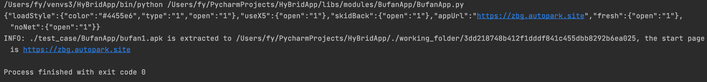

# BufanApp Android Rev

---
作者：fy，如需转载请注明出处
### 目录
+ 简述
+ 应用特征描述
+ 定位url
+ 解密算法解析
+ 解密验证
+ 特殊情况
+ 结论


### 简述
在使用BufanApp框架快速生成Android应用时，开发者只需要在<a href="https://www.bufanapp.com/" target="_blank">BufanApp平台</a> 上提交自己的网站网址，就可以将自己的网站封装成移动端app。为了还原Bufan移动端App加载网站网址的过程，所以我们对整个框架做了逆向分析。
<div align=center></div>
以下内容以 `ZBG` 应用为例。

### 应用特征描述
Application： `com.bufan.app.BFApplication`<br>
Launcher Activity： `com.bufan.app.MainActivity`<br>
配置文件目录： `assets/source/`<br>

### 定位url
首先获取到apk之后，利用抓包工具（burpsuite）先确定apk在启动时加载的url。通过抓包，我们确定加载的url为 `http://zbg.autopark.site` （此时，域名已无法正常访问）。
<div align=center></div>

拿到apk加载的url之后，通过jeb工具反编译apk文件，在全局代码中搜索抓包获取的域名，结果并没有搜索到，由此推测，在代码中是通过解码后获得的url。于是从代码入口Application处，分析代码逻辑，看看他是如何获得的url并加载。

在Application中，读取了 `assets/source/config.json` 文件，并调用 `JwtUtils.mainDecode()` 进行解密，并将解密后的 jsonString 转换成 `com.bufan.wrap.config.AppConfig` 

<div align=center></div>

在 AppConfig 中，属性值 `appUrl` 为应用启动时加载的网址地址。在 MainActivity 中，通过 loadMainPage() 进行 loadurl()。

<div align=center></div>

### 解密算法解析
App获取url并加载的过程我们已经知道了，接下来处理加密的 `assets/source/config.json` 文件。在代码中是通过工具类 `JwtUtils.class` 进行加解密操作，我们就直接提取 JwtUtils.class ，并把它封装成一个jar包。

jar包的main函数
```java
package com.decode;

import java.io.File;
import java.io.FileInputStream;
import java.io.IOException;
import java.io.InputStream;

public class Main {

    public static void main(String[] args) {
        System.out.println("-->in decodeBufan");
        System.out.println(getUrl(readJSON(args[0])));
    }

    public static String get_appUrl(String filepath) {
        return getUrl(readJSON(filepath));
    }

    public static String readJSON(String jsonFile) {
        InputStream inputStream;
        StringBuffer configStr = null;
        StringBuffer blockStr;
        int len = 0x400;

        File config = new File(jsonFile);
        try {
            inputStream = new FileInputStream(config);
            byte bytes[] = new byte[len];
            blockStr = new StringBuffer();
            while (true) {
                int boo = inputStream.read(bytes);
                if (boo == -1) {
                    configStr = new StringBuffer();
                    configStr.append(blockStr.toString());
                    break;
                } else {
                    blockStr.append(new String(bytes, 0, boo));
                }
            }
        } catch (IOException e) {
            e.printStackTrace();
        }
        return configStr.toString();
    }

    public static String getUrl(String jsonFile) {
        return JwtUtils.mainDecode(jsonFile).get("appUrl").toString();
    }
}
```

代码中直接提取的 JwtUtils.class
```java
package com.decode;


import org.json.JSONException;
import org.json.JSONObject;

import javax.crypto.Mac;
import javax.crypto.spec.SecretKeySpec;
import java.io.PrintStream;
import java.io.UnsupportedEncodingException;
import java.util.Collections;


public class JwtUtils {
    public static final String TAG = "JwtUtils";
    public static final String key1 = "U2xkVQ";
    public static final String key2 = "VFVRMQ";
    public static final String key3 = "czIwMT";
    public static final String key4 = "kwNTIw";
    public static final String key5 = "MWtOTD";
    public static final String key6 = "V4UEdMRTlOU3paSA";
    public static final String key7 = "H3kTiX";
    public static final String key8 = "keyW3ABy46";

    public static final String KEY(String str) {
        return key3 + str;
    }

    public static final String KEY2(String str) {
        return key5 + str;
    }

    public static final String KEY3(String str) {
        return key7 + str;
    }

    public static byte[] initKey(String str) {
        byte[] bytes = str.getBytes();
        byte[] bArr = new byte[256];
        for (int i2 = 0; i2 < 256; i2++) {
            bArr[i2] = (byte) i2;
        }
        if (bytes == null || bytes.length == 0) {
            return null;
        }
        int i3 = 0;
        int i4 = 0;
        for (int i5 = 0; i5 < 256; i5++) {
            i4 = ((bytes[i3] & 255) + (bArr[i5] & 255) + i4) & 255;
            byte b2 = bArr[i5];
            bArr[i5] = bArr[i4];
            bArr[i4] = b2;
            i3 = (i3 + 1) % bytes.length;
        }
        return bArr;
    }

    public static JSONObject jsonDecode(String str) {
        try {
            return new JSONObject(str);
        } catch (JSONException e2) {
            e2.printStackTrace();
            return null;
        }
    }

    public static String jsonEncode(JSONObject jSONObject) {
        return (jSONObject == null || jSONObject.length() == 0 || "null".equals(jSONObject)) ? "" : jSONObject.toString();
    }

    public static JSONObject jwtDecode(String str) {
        String safeUrlBase64Decode = safeUrlBase64Decode(KEY2(key6));
        String[] split = str.split("\\.");
        String sign = sign(split[0] + '.' + split[1], safeUrlBase64Decode);
        if (sign.equals(split[2])) {
            return jsonDecode(safeUrlBase64Decode(split[1]));
        }
        System.out.println(TAG + " jwtDecode error: " + split[2] + "-signature: " + sign);
        return null;
    }

    public static String jwtEncode(JSONObject jSONObject) {
        String safeUrlBase64Decode = safeUrlBase64Decode(safeUrlBase64Decode(key1));
        String safeUrlBase64Decode2 = safeUrlBase64Decode(safeUrlBase64Decode(key2));
        String safeUrlBase64Decode3 = safeUrlBase64Decode(KEY(key4));
        String safeUrlBase64Decode4 = safeUrlBase64Decode(KEY2(key6));
        JSONObject jSONObject2 = new JSONObject();
        try {
            jSONObject2.put("typ", safeUrlBase64Decode);
            jSONObject2.put("alg", safeUrlBase64Decode2);
            jSONObject2.put("kid", safeUrlBase64Decode3);
        } catch (JSONException e2) {
            e2.printStackTrace();
        }
        String safeUrlBase64Encode = safeUrlBase64Encode(jsonEncode(jSONObject2));
        String safeUrlBase64Encode2 = safeUrlBase64Encode(jsonEncode(jSONObject));
        String sign = sign(safeUrlBase64Encode + "." + safeUrlBase64Encode2, safeUrlBase64Decode4);
        return safeUrlBase64Encode + '.' + safeUrlBase64Encode2 + '.' + sign;
    }

    public static JSONObject mainDecode(String str) {
        return jwtDecode(rc4Decode(str));
    }

    public static String mainEncode(JSONObject jSONObject) {
        return rc4Encode(jwtEncode(jSONObject));
    }

    public static byte[] rc4(byte[] bArr, String str) {
        if (bArr == null || str == null) {
            return null;
        }
        byte[] initKey = initKey(str);
        byte[] bArr2 = new byte[bArr.length];
        int i2 = 0;
        int i3 = 0;
        for (int i4 = 0; i4 < bArr.length; i4++) {
            i2 = (i2 + 1) & 255;
            i3 = ((initKey[i2] & 255) + i3) & 255;
            byte b2 = initKey[i2];
            initKey[i2] = initKey[i3];
            initKey[i3] = b2;
            bArr2[i4] = (byte) (initKey[((initKey[i2] & 255) + (initKey[i3] & 255)) & 255] ^ bArr[i4]);
        }
        return bArr2;
    }

    public static byte[] rc4Base64Decode(String str) {
        String replace = str.replace('-', '+').replace('_', '/');
        int length = replace.length() % 4;
        if (length > 0) {
            replace = replace + Collections.nCopies(4 - length, '=');
        }
        return Base64.decode(replace, 0);
    }

    public static String rc4Base64Encode(byte[] bArr) {
        if (bArr == null) {
            return null;
        }
        return Base64.encodeToString(bArr, 2).replace('+', '-').replace('/', '_').replace("=", "");
    }

    public static String rc4Decode(String str) {
        return new String(rc4(rc4Base64Decode(str), KEY3(key8)));
    }

    public static String rc4Encode(String str) {
        return rc4Base64Encode(rc4(str.getBytes(), KEY3(key8)));
    }

    public static String safeUrlBase64Decode(String str) {
        String replace = str.replace('-', '+').replace('_', '/');
        int length = replace.length() % 4;
        if (length > 0) {
            replace = replace + Collections.nCopies(4 - length, '=');
        }
        try {
            return new String(Base64.decode(replace, 0), "UTF-8");
        } catch (UnsupportedEncodingException e2) {
            e2.printStackTrace();
            return "";
        }
    }

    public static String safeUrlBase64Encode(String str) {
        return Base64.encodeToString(str.getBytes(), 2).replace('+', '-').replace('/', '_').replace("=", "");
    }

    public static String sign(String str, String str2) {
        String str3;
        try {
            SecretKeySpec secretKeySpec = new SecretKeySpec(str2.getBytes(), "HmacMD5");
            Mac instance = Mac.getInstance(secretKeySpec.getAlgorithm());
            instance.init(secretKeySpec);
            str3 = Base64.encodeToString(instance.doFinal(str.getBytes()), 2);
        } catch (Exception e2) {
            PrintStream printStream = System.out;
            printStream.println("Error HmacMD5 ===========" + e2.getMessage());
            str3 = "";
        }
        return str3.replace('+', '-').replace('/', '_').replace("=", "");
    }

    public static String test() {
        new JwtUtils();
        JSONObject jSONObject = new JSONObject();
        try {
            jSONObject.put("id", 1);
        } catch (JSONException e2) {
            e2.printStackTrace();
        }
        String mainEncode = mainEncode(jSONObject);
        JSONObject mainDecode = mainDecode(mainEncode);
        return mainEncode + '\n' + mainDecode.toString();
    }
}

```

加密的 `config.json` 
```
SHZnaEcJfDObrtknQMQl67B2GixHDGrIl821OY72E-AAxmFGYLVewVmLkmRWFybJHYRfMjGy2K8PZVEzNCDEA0aubKeZd3s3SJBg7XpxtlGzspDF8JxbAMlV2LAFyaWeha2G5MPljB3l2Z1ruZDV4sli1L1aXAv42c0ZUv5xAoQMKRwt6TGgiDUGfoQbsuJB0wb1zYkA6Zqhvq-gCMG6Ch7UaAugiWzUCTfmupyUSQfy9m9C43zodFu-wpRMkru5QxdfgWn_Qcllx84FnV2oV8J-OGXZesMFAx1UcwUOhbjpkXeNQVxcWv-CzzgH0If-O7b_FQ12Bhn58sJ4FkiHGEHM5PcLFGwg4aW3kMi7YTPos33j6XeOCrddt3MRppIoEKE4mRJim2plqeypXLximjCt9aBx-bAuBA_sH-gQsHj-m0GF
```

解密后的jsonString，其中，appUrl就是应用一开始加载的网站网址 `https://zbg.autopark.site`
```json
{"loadStyle":{"color":"#4455e6","type":"1","open":"1"},"useX5":{"open":"1"},"skidBack":{"open":"1"},"appUrl":"https://zbg.autopark.site","fresh":{"open":"1"},"noNet":{"open":"1"}}
```
<div align=center></div>

### 解密验证
可以注意到，在 JwtUtils.class 中使用的密钥为可拼接获得的固定密钥。而且像BufanApp这种向平台提交网址就可以快速封装apk的方式，推测后台服务器根据提交的地址自动打包生成apk，那么生成的apk相应的解密方式也应该都一样。为了验证推测，就以密钥和类名为筛选规则进行apk的筛选，在janus平台上，规则命中的部分结果如下。
<div align=center></div>

选取其中两个app进行验证，是否可以提取相应的 appUrl 。
- 惠普分期 （SHA1: 022d1cbac33d86b8555b423923f6efdfb046df51）
appUrl = `https://hpfq2.mljic.cn` （已不能正常访问）
<div align=center></div>

- 淘客（SHA1: 02ef7c7fffa5fdc28fbf236cc384b6da9d760435）
appUrl = `https://huituitui123.com/`（已不能正常访问）
<div align=center></div>


### 特殊情况
在测试不同的BufanApp的过程中，遇到了少数一些特殊的，不需要解密的apk。<br>
以 `世耀国际` 应用为例
<div align=center></div>

在资源文件 assets/source 目录下，除了前面分析涉及到的 config.json 之外，多出一个 dconfig.json 文件，文件内容为明文的 jsonString。
```json
{"name":"\u4e16\u8000\u56fd\u9645","url":"http:\/\/wwww.wxfaycp.cn","appVersion":"1.0.0","packageName":"com.dcloud.QYHVPEU","isLoadRealAddressByUrl":false,"supportActionBar":false,"actionBarColor":"#3F51B5","titleColor":"#FFFFFF","titleBarText":"\u4e16\u8000\u56fd\u9645","clearCookie":false,"supportSplash":true,"supportNavigator":false,"hideNavigatorWhenLandscape":false,"supportRightSlideGoBack":false,"supportPullToRefresh":true,"supportForwardBackGesture":false,"supportLongPressSavePicture":true,"supportFullScreen":false,"supportQRCodeScan":true,"screenOrientation":0,"supportScheme":true,"exitMode":"0","guide":0,"leftActionBarIcons":[],"rightActionBarIcons":[],"menu":[],"menuBackgroundColor":"#3F51B5","menuTextColor":"#FFFFFF","menuPressedTextColor":"#FFFFFF","umengId":"","jPushId":"","wxAppId":"","wxAppScrect":"","qqAppId":"","isSupportZoom":true,"webViewType":"0","loadingAnimationType":0,"loadingAnimationColor":"","splashTime":"3","isSupportSplashTime":true,"isSupportShowSplashSkipButton":true,"isSupportShare":false,"isSupportLongPressCopy":true,"isSupportConfigureStatueBarColor":true,"statusBarColor":"#00b589","statusBarTextColorMode":0,"appId":"498697864919121920","secureId":"498697864919121920","secureUrl":"https:\/\/ck.dierna.com\/valid\/pack\/498697864919121920.json","secureMsg":"error","supportDownloadFile":true,"supportUpgradeTip":true,"supportWebPageZoom":false,"supportPhoneBook":true,"supportAdBlock":true,"supportSideBar":false,"supportSideBarLogo":true,"sideBarBackgroundColor":"#000000","sideBarTextAndIconColor":"#FFFFFF","sideBar":[],"shareText":"","shareUrl":"","supportGuideEnterMainPageButton":true,"guideEnterMainPageButtonColor":"#ffffff","isSupportStatusBarBackgroundExtend":false,"UserAgent":"","Configuration":"https:\/\/ck.dierna.com\/logs\/pack\/498697864919121920\/config.json"}
```

再次分析 Application 中的代码，直接读取的 dconfig.xml 文件。转换为 com.bufan.wrap.dibaqu.DibaquConfig 类型的 dibaqu 对象，在方法 adapterConfig() 中，dibaqu 的 url 赋值给 AppConfig 的 appUrl，appUrl 就是应用一开始加载的网站网址

<div align=center></div>
<div align=center></div>
<div align=center></div>

### 结论
 BufanApp框架提供了快速开发apk，开发者只需要提供网站网址就可以完成。在生成的应用中，启动时通过工具类 JwtUtils.class 进行解密获取 config.json ，再转换成 AppConfig 对象，加载 MainActivity 时加载 AppConfig 中的 appUrl 。在通过BufanApp框架开发的apk，解密使用到的是一样的密钥。在少数不需要解密的应用中，加载的 url 不是 assets/resurce/config.json 文件中的 appUrl 字段了，而是读取 assets/resurce/dconfig.json 中的 url 字段为需要加载的网站网址。
