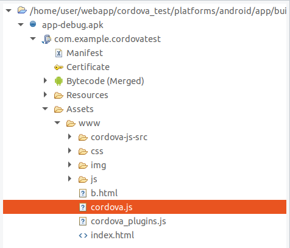

# Cordova Android Rev
作者：beizishaozi，如需转载请注明出处
+ 简述
+ 应用特征描述
+ 资源数据提取
+ 结论

## 简述
Apache Cordova是一个开源的移动开发框架。允许你用标准的web技术-HTML5,CSS3和JavaScript做跨平台开发。 应用在每个平台的具体执行被封装了起来，并依靠符合标准的API绑定去访问每个设备的功能，比如说：传感器、数据、网络状态等。对应的应用程序架构如下图所示

其中Web App是这是保存应用程序代码的地方。应用程序的实现是通过web页面，默认的本地文件名称是是index.html，这个本地文件应用CSS,JavaScript,图片，媒体文件和其他运行需要的资源。架构其他部分介绍，具体参考：<a href="http://cordova.axuer.com/docs/zh-cn/latest/guide/overview/index.html" target="_blank">Cordova概述</a>  

 
 

## 应用特征描述
在进行应用特征分析之前，先简单介绍一下如何通过Cordova命令进行应用开发：
1. 创建App : cordova create /all/myApp/app1 com.site app1  
   app路径：/all/myApp/app1  
   包名（按照官方建议使用自己的反向域名）：com.site  
   app名：app1
2. 添加平台：cordova platform add android
3. 构建：cordova build android
4. 运行：cordova run android  
##
具体参考：<a href="http://cordova.axuer.com/docs/zh-cn/latest/guide/cli/index.html" target="_blank">创建你的第一个应用</a>  
开发时，应用所在目录内部结构：

其中www文件夹保存了应用程序代码，也就是开发人员编写的web页面、js、CSS、图片等资源；   
platforms目录下针对不同平台都具有一个文件夹，例如对于android平台，其结构如下：

这个结构与android studio开发的结构相似，其中app目录下保存有应用程序java代码，开发人员也可以进行java开发。
上述部分介绍了基于Cordova如何开发应用，可以发现它支持通过web页面形式来实现应用功能，同时它也支持本地java代码开发。  
接下来，分析基于Cordova开发的应用程序特征，因为我们需要通过特征分析从海量apk数据中提取。通过对比反编译之后应用的目录结构与开发时的目录结构，发现生成的apk文件会在assets/www目录下包含有文件cordova.js，cordova_plugins.js和文件夹cordova-js-src。也就是说，这三部分是由框架生成而不是应用开发人员生成，因此这三部分可以作为基于Cordova开发的应用程序的特征。 

**应用开发时www文件夹目录结构**

**应用反编译后www文件夹目录结构**

 

## 资源数据提取
资源数据是指应用的web页面、JS、CSS、图片等资源，不关注java部分的开发。因此只需要对应用apk文件进行解压缩，然后从assets/www目录下将资源数据读取并保存即可。 
另一方法，我们注意到在开发时，应用目录下存在文件config.xml，该文件中content标签项的属性src里定义了加载web页面时的起始页`<`content src="index.html"`>`，默认是index.html。对这一信息，我们也需要提取和保存。打包之后的apk文件中，config.xml保存在目录res/xml/下，因此通过aapt读取该xml信息，就可以获取起始页地址。

## 结论
Cordova框架支持java开发和web页面开发，但是该框架没有提供加密功能，因此定位到存储资源数据的目录直接解压缩进行提取即可，比较方便。