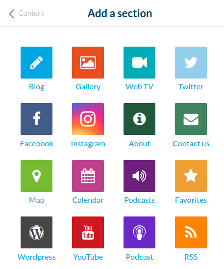
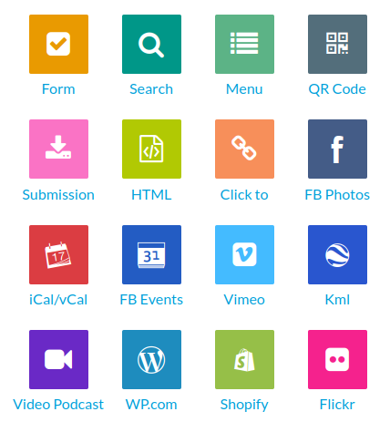
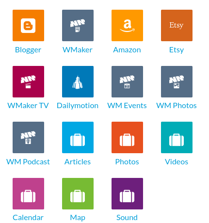
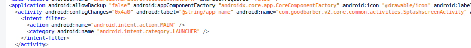
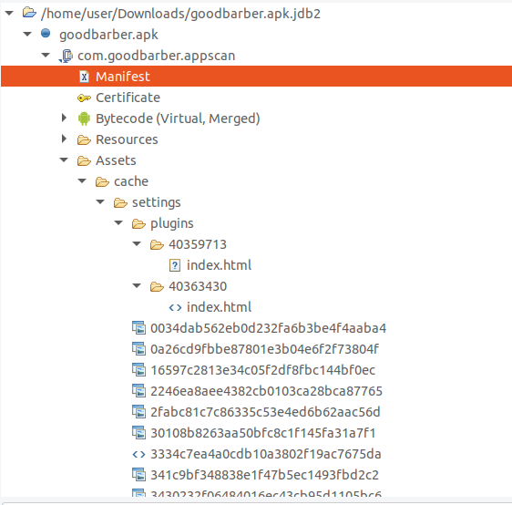

# GoodBarber Android Rev
作者：beizishaozi，如需转载请注明出处
## 目录
+ 简述
+ 应用特征描述
+ 资源数据提取
+ 结论

## 简述
GoodBarber框架支持Android和iOS应用开发。该框架支持在线开发，需创建账户，不限制开发应用数量。在线开发网址：https://appscan.goodbarber.app/manage/publish/apptest/android/。 该框架提供了很多模块用于开发，如下图所示

其中Facebook等模块要求url域名是固定的。HTML模块则是提供了两种情况，一种是编辑网页保存在本地，一种是输入url链接。Click to模块也是可以填入url链接。RSS模块也是填入url链接。其他模块不涉及网页本地生成，这里不进行关注和讨论。 
在实际生成Android应用之前，需要配置google开发者项目，使用谷歌服务和firebase；生成iOS应用之前，则是需要配置开发者账号信息和证书等。因此，在生成测试用例时，没有生成iOS应用。
  

## 应用特征描述
对基于该框架生成的应用进行逆向分析。发现其主Activity的名字是确定的，即“com.goodbarber.v2.core.common.activities.SplashscreenActivity”。

因此，将该主Activity名字作为基于GoodBarber框架开发的应用特征。  

## 资源数据提取
GoodBarber框架不支持对资源数据进行加密，因此相对来说提取工作比较方便。
编写的HTML页面保存在assets/cache/settings/plugins/目录下，而应用起始页URL链接则是保存在assets/cache/settings/7b070bc294dc48bb947a2b4e0885cd58文件中。  7b070bc294d48bb947a2b4e0885cd58是固定的，因为这是“settings_json”字符串的md5值，而该字符串是硬编码在应用代码中。7b070bc294d48bb947a2b4e0885cd58文件就是一个配置文件,里面配置了很多信息，以json格式组织的。因此，直接从assets目录下提取即可。 
apk文件目录结构如下

这里需要注意一点，这些本地页面在assets/cache/settings/目录下也有一份，只是名字是md5值，是由配置文件7b070bc294d48bb947a2b4e0885cd58中sectionUrl字段的值进行md5处理得到的，例如"/apiv3/release/android/10/section/40359713/index.html?v=1609754175"。为了方便，我们选择直接从assets/cache/settings/plugins/目录下提取。
  

## 结论
GoodBarber框架支持基于web的Android和iOS应用开发，但是该框架没有提供加密功能，因此定位到存储资源数据的目录直接解压缩进行提取即可。
