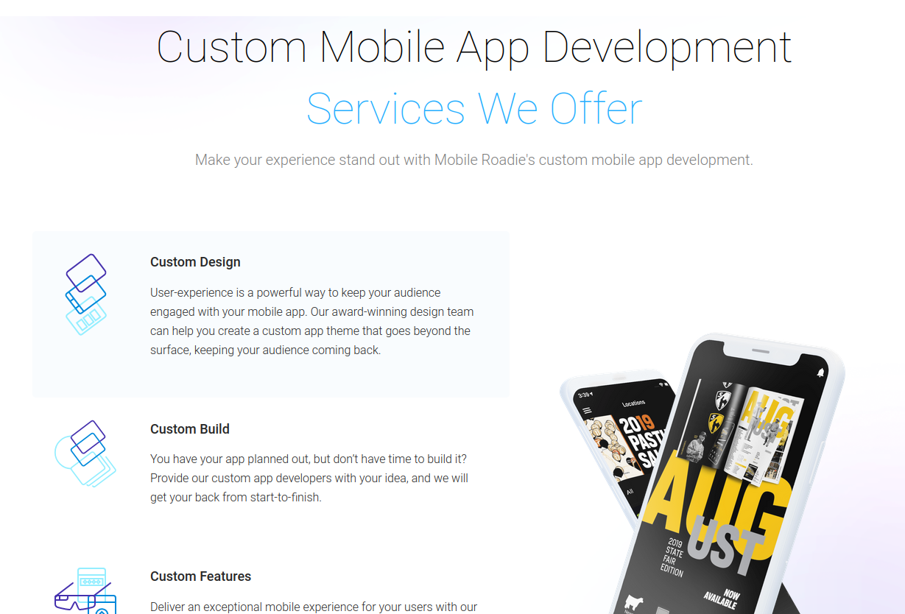
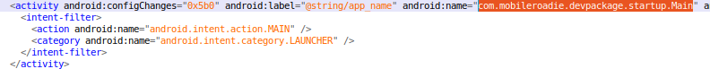

# MobileRoadie Android Rev
作者：beizishaozi，如需转载请注明出处
## 目录
+ 简述
+ 应用特征描述
+ 资源数据提取
+ 结论

## 简述
Mobile Roadie框架并没有提供免费使用的接口，但是它提供了一个应用市场https://mobileroadie.com/app-gallery，因此可以通过该应用市场下载使用了该框架开发的应用样例。该框架支持应用的设计、构建以及团队为应用自定义特征。

 

## 应用特征描述
### Android
通过对样例app进行逆向分析，发现这些app的主Activity名字都是固定的，为”com.mobileroadie.devpackage.startup.Main“。

因此，将该主activity名字作为框架特征，以识别使用了该框架的应用。
  

## 资源数据提取
### Android
通过逆向分析几个应用样例，从代码静态分析，应用会去框架平台（http://mobileroadie.com）请求各自信息，包括配置信息，图片信息，第三方登录信息等。没有发现本地资源存储的情况。其中，这些信息中最重要的是动态配置信息，这部分信息在应用启动时就会去访问框架平台获取。以应用Modanna为例，访问链接为http://mobileroadie.com/services/builder/tabs/416/fec9ac2c-9ba7-4eac-9bff-37ba1e47bbe7/93a46114c7f29b595d37f3bee7de422b，其中416表示应用appid,fec9ac2c-9ba7-4eac-9bff-37ba1e47bbe7则为device_uuid,93a46114c7f29b595d37f3bee7de422b则是device_uuid、appid以及密钥“MobileRoadieApp”进行md5处理之后得到的值。但在测试过程中发现，将访问链接修改为http://mobileroadie.com/services/builder/tabs/754即可获取应用配置，返回的配置信息相同。 
因此，对于使用了该框架的应用，提取其中的访问链接并进行记录即可。

## 结论
应用的资源信息都是保存在Mobile Roadie平台，需要通过访问这个平台获取，本地没有保存的资源信息。