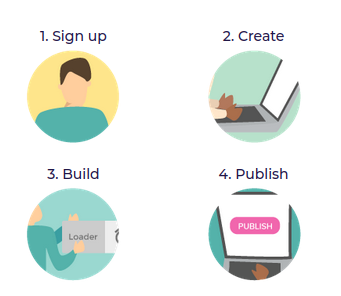
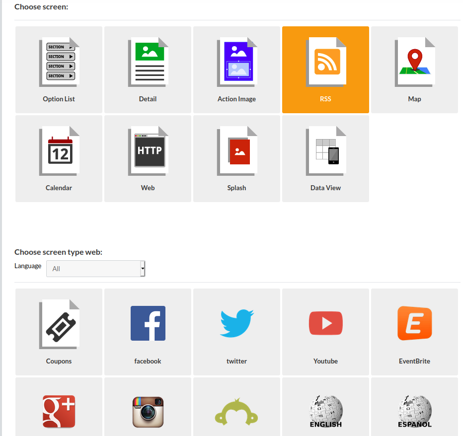
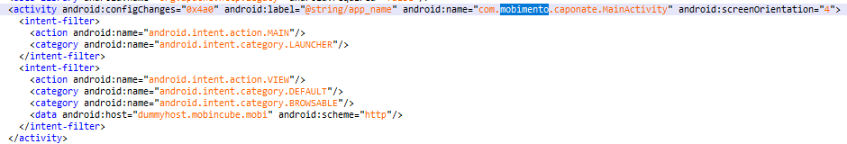
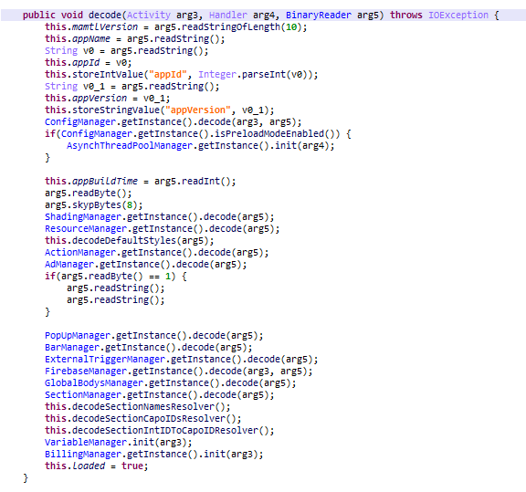

# Mobincube Android Rev
作者：beizishaozi，如需转载请注明出处
## 目录
+ 简述
+ 应用特征描述
+ 资源数据提取
+ 结论

## 简述
Mobincube支持iOS和Android平台的应用免费开发，只需要注册账号即可。Mobincube的开发步骤简单明了。

一共有四步。第一步是注册，第二步是创建，第三步是构建，第四步是发布。 
Mobincube提供了很多界面

在这些界面中有支持各种web页面，也支持配置链接，上传本地资源文件。  

## 应用特征描述
### Android
通过对生成的app进行逆向分析，发现这些app的主Activity名字都是固定的，为”com.mobimento.caponate.MainActivity“。

因此，将该主activity名字作为框架特征，以识别使用了该框架的应用。
  

## 资源数据提取
### Android
该框架支持上传资源文件，配置url链接。这些信息都明文记录在应用包的assets/app.dat文件中。虽然是明文记录，但是没有固定格式，因为它是根据不同配置按字节进行编写的，所以无法按照固定格式直接读取。通过逆向代码，发现应用会如此解析app.dat文件，解析代码如下：

参数arg5即读取的app.dat文件流。
按照该代码逻辑，其中代码中ResourceManager解析得到了本地资源文件信息，因此重现时只实现到ResourceManager部分。配置的URL链接信息则是需要通过SectionManager解析得到的。  
在提取本地资源文件过程中，首先按照上述所说对app.dat文件进行解析，获取本地资源文件列表。获取资源文件列表之后，依次从assets目录下读取对应名字的文件即可，需要注意的是，上传的zip文件会被解压为一个assets目录下的文件目录。assets目录下包括了两个文件夹android和config，这两个文件夹内容与资源文件无关，在提取资源文件时，除这两个之外的assets目录下的文件夹都进行提取。 
在提取URL链接时，则是通过正则匹配的方式从app.dat文件中提取即可。  

## 结论
Mobincube框架支持模块化的Android和iOS应用开发，并且该框架也没有提供加密功能，因此为了提取网页资源信息和URL链接信息，只需要从assets目录和app.dat文件中提取即可。
