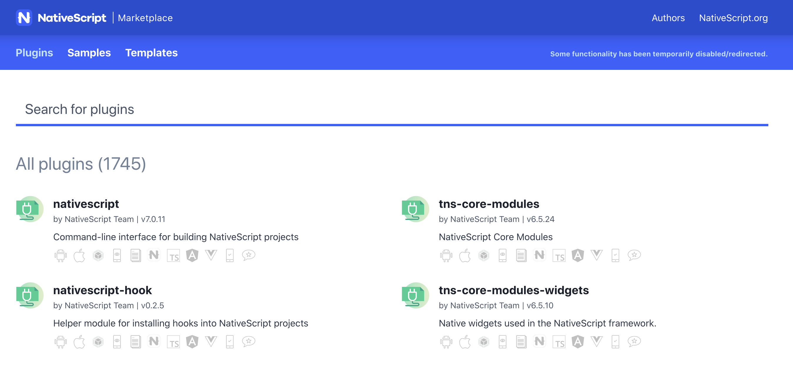
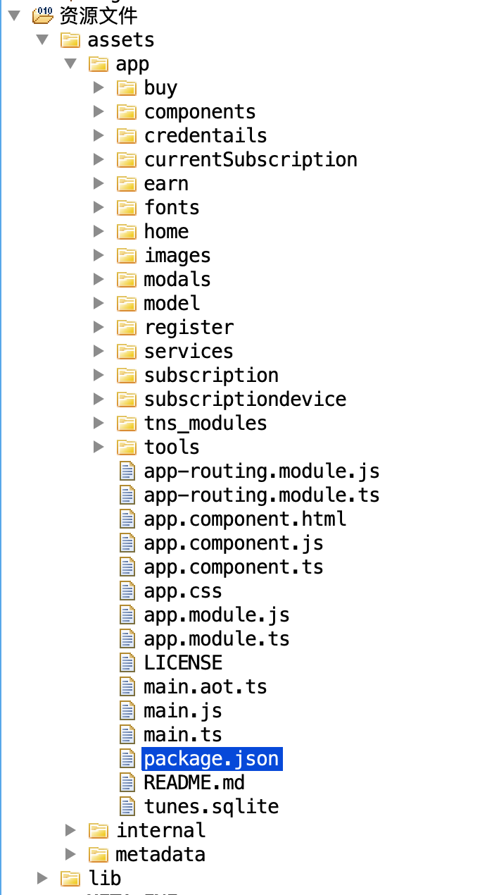
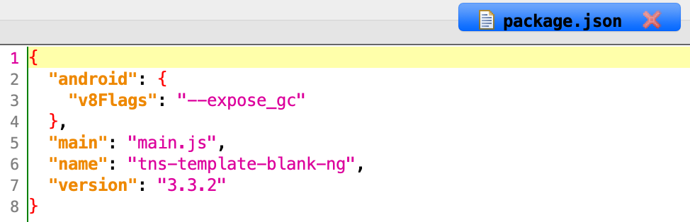

# NativeScript Android Rev
作者：fy，如需转载请注明出处
## 目录
+ 简述
+ 应用特征描述
+ 资源数据提取
+ 结论

## 简述
开发者根据 <a href="https://nativescript.org/#" target="_blank">NativeScript</a> 官网上的提示搭建开发环境，即可开发 android 和 ios 应用。NativeScript 支持纯 JavaScript，同时也支持 Angular2。开发者只需要在框架提供的代码中编写相关的 html、CSS、JavaScript等代码，即可完成一个 app。NativeScript的代码与网页开发的代码很相似，都是用 CSS 写样式，JavaScript 写业务逻辑，不同的是 NativeScript 使用 XML 来描述页面结构（NativeScript封装了自己的UI库）
官方也提供了各类例子（https://market.nativescript.org/?tab=samples&framework=angular&category=all_samples ）
开发者可以直接下载并修改代码，然后编译成应用

## 应用特征描述
Application: `com.tns.NativeScriptApplication`
Launcher Activity: `com.tns.NativeScriptActivity`
根据Launcher Activity特征，检索到应用 `POP Tounes` 为例进行分析和资源数据提取

## 资源数据提取
一个 NativeScript 应用，真正的逻辑是在 `assets/app/` 目录下。在 assets/app/ 目录下的 package.json 文件中，声明了应用的入口文件。提取资源数据时，直接将 assets/app/ 一并取出即可。
`POP Tounes` 提取的 assets/app/ 内容如下

解析 package.json 可以获得，`POP Tounes` 的入口文件为 main.js 

## 结论
有关 NativeScript 框架生成的应用，提取 assets/app/ 目录，内容，该目录下的 package.json 记录了应用的入口文件。资源数据提取时没有碰到需要解密资源的情况。
