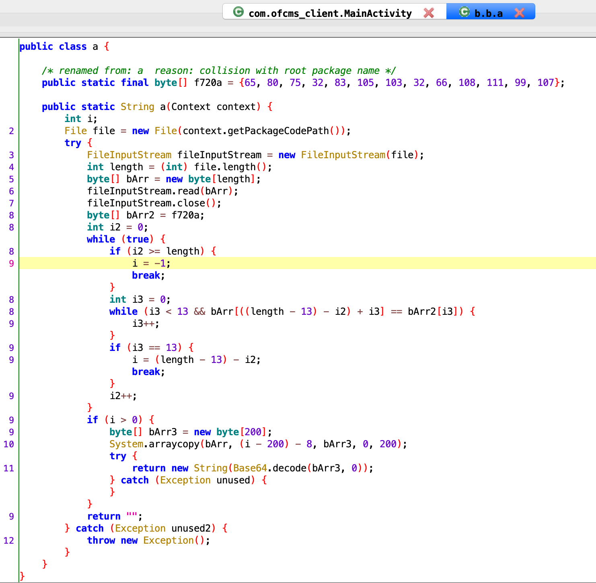
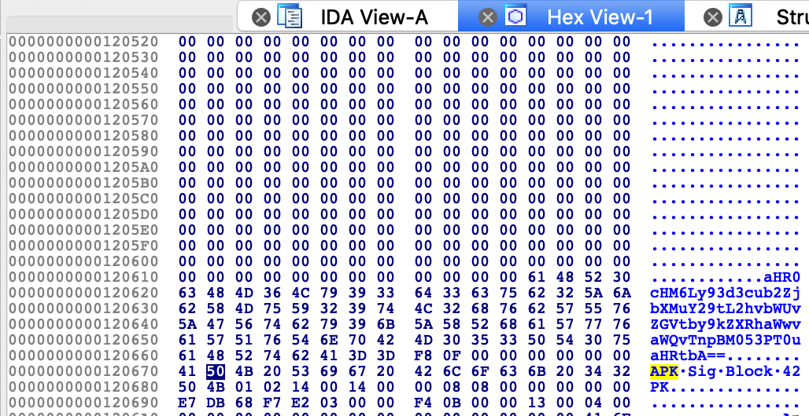
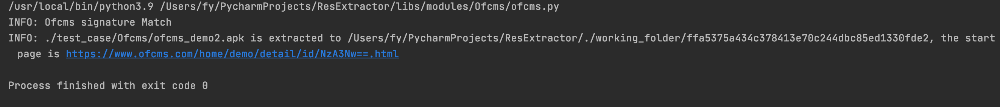
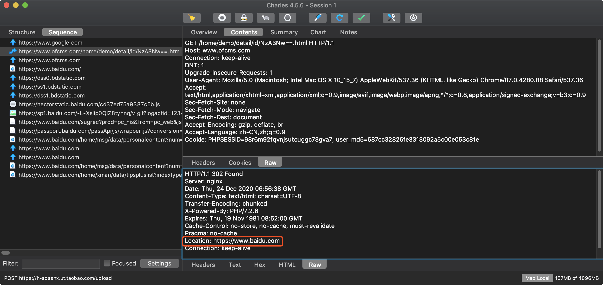
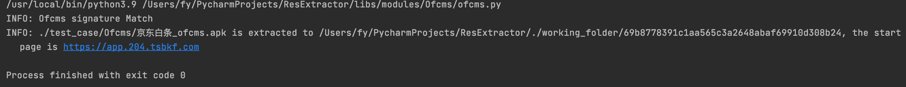
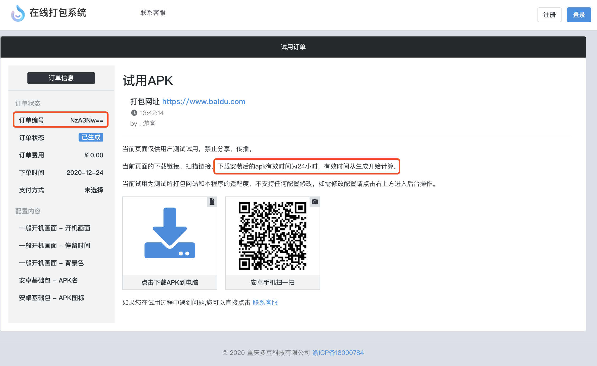

# ofcms Android Rev

---
作者：fy，如需转载请注明出处
## 目录
+ 简述
+ 应用特征描述
+ 资源数据提取
+ 数据提取验证
+ 其他样本
+ 结论

## 简述
开发者可以使用 <a href="https://www.ofcms.com/" target="_blank">ofcms在线打包系统</a> 快速生成Android应用。开发者只需要在网站上提交自己的网站网址即可免费下载试用。平台正式版的打包需要收费；试用版打包出来的apk，网址访问的有效期为24小时。
<div align=center></div>
<div align=center></div>

以下分析结果，基于试用版apk。<br>
试用版apk打包的网址为: `https://www.baidu.com`<br>

## 应用特征描述
Launcher Activity: `com.ofcms_client.MainActivity` <br>

## 资源数据提取
获取到试用apk之后，反编译apk，直接搜索打包的网址，但并没有直接搜索到，那么我们就从应用的入口处开始分析，确定应用在启动后是如何获得并加载网址的。

<details>
  <summary>com.ofcms_client.MainActivity.onCreate</summary>

```java
public void onCreate(Bundle bundle) {
    NetworkInfo activeNetworkInfo;
    super.onCreate(bundle);
    boolean z = true;
    requestWindowFeature(1);
    getWindow().setFlags(1024, 1024);
    setContentView(R.layout.activity_main);
    this.f721b = (WebView) findViewById(R.id.webView);
    this.c = (FrameLayout) findViewById(R.id.video_fullView);
    this.c.setBackgroundColor(Color.rgb(0, 0, 0));
    WebSettings settings = this.f721b.getSettings();
    settings.setBuiltInZoomControls(true);
    settings.setUseWideViewPort(true);
    settings.setLoadWithOverviewMode(true);
    settings.setSavePassword(true);
    settings.setSaveFormData(true);
    settings.setJavaScriptEnabled(true);
    settings.setGeolocationEnabled(true);
    settings.setGeolocationDatabasePath("/data/data/org.itri.html5webview/databases/");
    settings.setDomStorageEnabled(true);
    settings.setSupportMultipleWindows(true);
    settings.setBuiltInZoomControls(false);
    settings.setSupportZoom(false);
    settings.setDisplayZoomControls(false);
    this.f = new b();
    this.f721b.setWebChromeClient(this.f);
    this.f721b.setWebViewClient(new c(this));
    Log.i("wdebug", "\u5f00\u59cb\u52a0\u8f7d");
    ConnectivityManager connectivityManager = (ConnectivityManager) getApplicationContext().getApplicationContext().getSystemService("connectivity");
    if (connectivityManager == null || (activeNetworkInfo = connectivityManager.getActiveNetworkInfo()) == null || !activeNetworkInfo.isAvailable()) {
        z = false;
    }
    if (!z) {
        b();
    } else if (getString(R.string.of_demo).equals("true")) {
        try {
            String a2 = b.b.a.a(this);
            if (a2.equals("")) {
                this.f721b.loadUrl(getString(R.string.of_0_core_url));
            } else {
                this.f721b.loadUrl(a2);
            }
        } catch (Exception unused) {
            b();
        }
    } else {
        this.f721b.loadUrl(getString(R.string.of_0_core_url));
    }
    if (getString(R.string.of_2_checked).equals("true")) {
        Log.i("wdebug", "\u5f00\u59cb\u542f\u52a8\u9875");
        startActivity(new Intent(getApplicationContext(), Splash.class));
    }
    Log.i("wdebug", "\u663e\u793awebview");
    this.f721b.setVisibility(0);
    Log.i("wdebug", "onCreate \u7ed3\u675f");
}

```
</details>

在 MainActivity 的 onCreate 中，先通过 `b.b.a.a` 方法获取一个字符串，如果为空字符串，则读取 `R.string.of_0_core_url` 的值并加载到 webview，如果不为空字符串，则将获取到的字符串加载到 webview。

`b.b.a.a` 方法很有意思，它是根据应用的 .apk 文件提取需要加载的地址字符串。大致过程是从 apk 文件的字节码中，获取 `APK Sig Block` 前面的200字节，并进行 Base64 解码，解码后得到的就是应用要加载的地址字符串。
<div align=center></div>
<div align=center></div>

直接对照 `b.b.a.a` 方法写 python 脚本，输入为 apk 文件，输出 url 字符串。
<details>
  <summary>python 根据 .apk 文件获取 url</summary>

```python
def getUrl(detect_file):
    i = 0
    i2 = 0
    url = ""
    length = os.path.getsize(detect_file)
    bArr = open(detect_file, 'rb').read(length)
    bArr2 = bytes([65, 80, 75, 32, 83, 105, 103, 32, 66, 108, 111, 99, 107])
    bArr3 = bytearray(200)
    while True:
        if i2 >= length:
            i = -1
            break
        i3 = 0
        while i3 < 13 and bArr[((length - 13) - i2) + i3] == bArr2[i3]:
            i3 += 1
        if i3 == 13:
            i = (length - 13) - i2
            break
        i2 += 1
    if i > 0:
        mm = 0
        while mm < 200:
            bArr3[mm] = bArr[i - 200 - 8 + mm]
            mm += 1
        url = base64.b64decode(bArr3).decode()
    return url
```
</details>

接下来处理 `b.b.a.a` 方法返回为空字符串的情况。代码中直接读取 R.string.of_0_core_url 的值。我们直接反编译 apk 并提取 `res/values/strings.xml` 文件中的 `of_0_core_url`。

<details>
  <summary>python 提取 res/values/strings.xml 中的 of_0_core_url</summary>

```python
def getSourceUrl(tmp_folder):
    SourceUrl = ""
    strXml = os.path.join(tmp_folder, "res/values/strings.xml")
    tree = ET.ElementTree(file=strXml)
    root = tree.getroot()
    for child in root:
        if child.attrib.get("name") == 'of_0_core_url':
            SourceUrl = child.text
    return SourceUrl
```
</details>

## 数据提取验证
执行了脚本之后发现，通过代码中的方法转换的 url， 并不是我们一开始在网站提交的 `https://www.baidu.com` ，而是 `https://www.ofcms.com/home/demo/detail/id/NzA3Nw==.html` 

<div align=center></div>

但是在浏览器中直接加载这个转换后的 url ，又确实能跳转到对应的 `https://www.baidu.com` ，简单抓一下包，看看这个 NzA3Nw==.html 返回了什么。
<div align=center></div>

在 `https://www.ofcms.com/home/demo/detail/id/NzA3Nw==.html` 中只包含了一个 Http 响应的首部字段，在首部字段中，包含一个 Location。 使用 Location 可以将请求引导至某个与请求 url 位置不同的资源。而这个不同的资源正是我们一开始在`在线打包系统`中提交的网址。

## 其他样本
根据`在线打包系统`的特征，在Janus平台进行规则匹配，命中一款应用名为“京东白条”的应用。该应用与之前试用版 app 不同的是，它在调用 `b.b.a.a` 时返回的值为空字符串，加载的网址是从 strings.xml 中提取的。利用对应的脚本，进行提取验证。
<div align=center></div>

## 结论
`在线打包系统`打包生成的 apk 文件中，先是根据 apk 文件获取访问地址，存在两种情况两种情况

#### 1 返回值为带订单号的地址

该网址通过服务器统一管理，仔细观察试用版访问的网址和在线打包系统的订单的界面，我们可以发现，访问的网址为 以订单号命名的 html 文件，服务器是根据订单号返回对应的网址，由于存在收费机制，服务器可以在正式版付费到期时，对携带订单号的请求不做处理，也就无法加载真正的网址了。

试用版访问的网址:  `https://www.ofcms.com/home/demo/detail/id/NzA3Nw==.html` <br>
订单号：`NzA3Nw==`<br>
订单界面：
<div align=center></div>

#### 2 返回值为空字符串
应用启动时加载的地址为 string.xml 中的 `of_0_core_url`。
