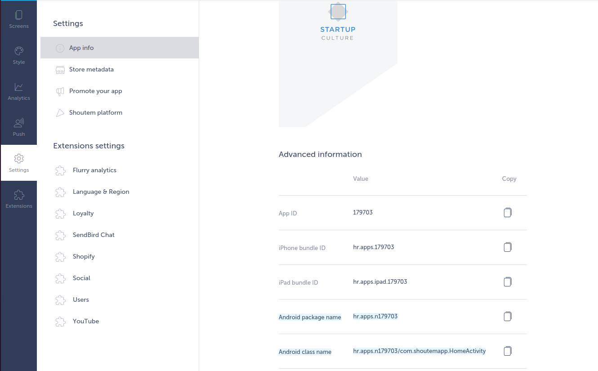
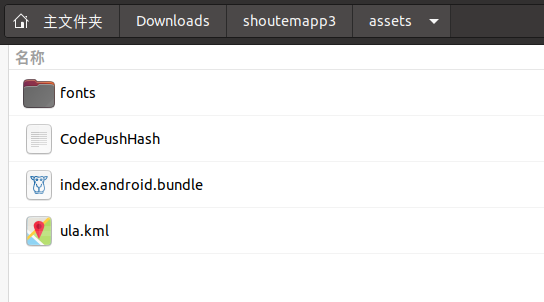

# Shoutem Android Rev
作者：beizishaozi，如需转载请注明出处
## 目录
+ 简述
+ 应用特征描述
+ 资源数据提取
+ 结论

## 简述
Shoutem框架支持Android和iOS应用开发。该框架支持在线开发，需创建账户，但是不提供试用功能。在线开发网址：https://builder.shoutem.com/apps。 该框架提供了很多扩展模块用于开发，如下图所示，图上展示的扩展模块并不完整，详见在线开发网址。

经过对各个模块测试之后，发现Shoutem框架中很多模块都支持传入自定义的URL链接，但是并没有发现本地编辑网页资源的扩展模块。 
由于无法生成试用的apk文件，因此通过关键词信息在virustotal（https://www.virustotal.com/gui/home/search）进行检索，关键词包括"shoutem"等。另外，通过观察应用生成时的配置信息，如下图所示

我们发现其包名是以"hr.apps.n"开始，后跟一串数字，并且MainActivity为com.shoutemapp.HomeActivity。因此，通过virustotal检索出来的应用再配合包名进行筛选，最后在virustotal上找到6个目标应用并进行反编译分析，发现其主activity并不固定为com.shoutemapp.HomeActivity，猜测是框架设计应用信息随着时间发生了变化。 
接下来在使用这些应用时，需要逆向分析出URL链接保存的位置，以及URL链接是否加密保存。通过一系列分析，我们了解到Shoutem框架是通过React Native来构建app应用，因此在对应用进行反编译之后，发现在assets目录下存在一个名为index.android.bundle文件，打开该文件之后发现其中有应用配置的各个模块信息、URL链接信息等。再配合应用运行时的抓包信息，进一步确定了URL链接信息就是保存在文件index.android.bundle中，并且没有加密，明文保存。 
针对iOS部分的分析用例，则是根据android部分找到的真实实例在App Store上下载即可。
  

## 应用特征描述
根据简述中所描述的，应用app主Activity的名字并不是确定的。另外我们还发现，反编译之后生成的应用其assets目录下的文件数量和名字是确定的，如下图所示

因此，为了能尽量不遗漏目标应用，我们将包名和应用assets目录下的文件共同作为基于Shoutem框架开发的应用特征，而不是应用的主activity名字。  

## 资源数据提取
Shoutem框架不支持网页资源本地存储，因此只需要提取扩展模块中URL链接即可。这些链接又是明文保存在assets目录下index.android.bundle文件中。由于Shoutem框架提供了很多扩展模块，其中有不少扩展模块都支持填入URL链接。因此，在提取URL链接时，先是识别index.android.bundle文件中所有配置的扩展模块，如果模块信息中配置了URL链接，那么就将其提取出来即可。URL提取实现通过python正则匹配获取。

## 结论
Shoutem框架支持模块化的Android和iOS应用开发，并且该框架也没有提供加密功能，因此为了提取网页资源信息，只需要从index.android.bundle文件中提取即可。