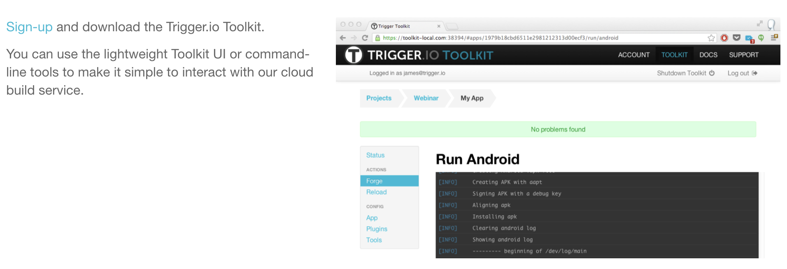
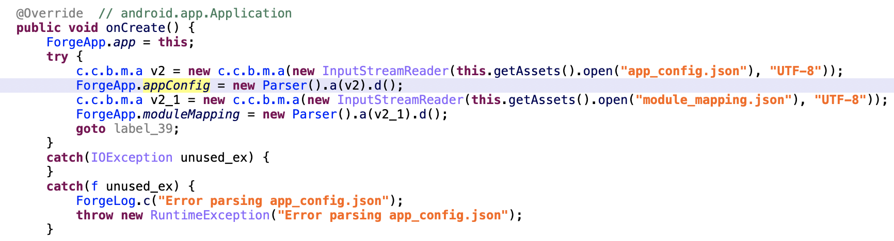
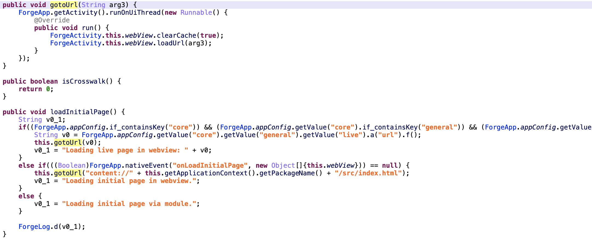
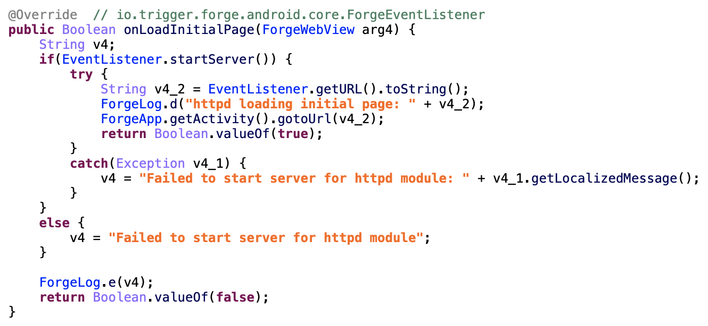
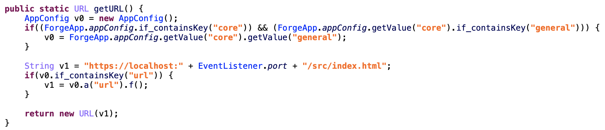
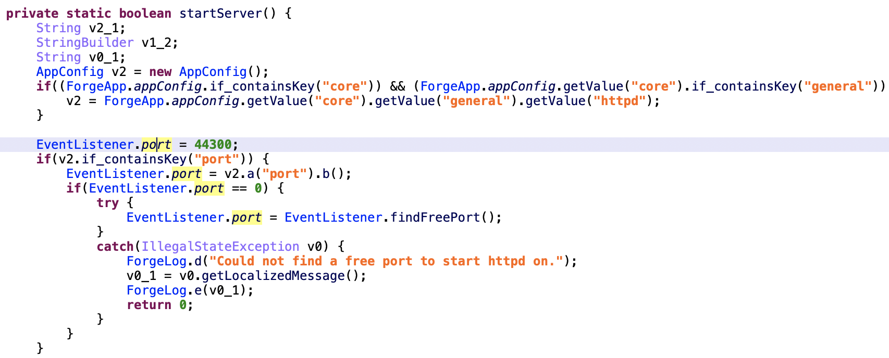

# Trigger Android Rev

---
作者：fy，如需转载请注明出处
## 目录
+ 简述
+ 应用特征描述
+ 资源数据提取
+ 结论

## 简述
在使用 <a href="https://trigger.io/" target="_blank">Trigger.io</a> 快速生成Android应用时，开发者只需要下载`Trigger.io Toolkit` 并在页面中进行apk的相关配置，就可完成开发。
<div align=center></div>

## 应用特征描述
Launcher Activity: `io.trigger.forge.android.core.ForgeActivity`<br>
本地资源目录： `Assets/`

## 资源数据提取
以 `helloworld-sethomepage.apk` 应用为例。启动应用时 Application（io.trigger.forge.android.core.ForgeApp）读取 `Assets/app_config.json` 并将json数据转换为 `ForgeApp.appConfig` 的对象中。
<div align=center></div>

app_config.json文件内容为
```json
{
    "author": "98xxxx19@qq.com", 
    "config_hash": "4cce9ef9b931f1f4f25ec578fe804b7595fa689d", 
    "config_version": "4", 
    "core": {
        "android": {
            "package_name": "io.trigger.forgee8f8dc91e3914a589a2191a6ab19c729"
        }, 
        "firefox": {
            "package_name": "e8f8dc91e3914a589a2191a6ab19c729"
        }, 
        "general": {
            "trusted_urls": [], 
            "url": "https://www.baidu.com"
        }, 
        "ie": {
            "package_name": "{6B8DF399-2FBE-8DF1-D6F1-DCC647D41FF3}"
        }, 
        "ios": {
            "package_name": "io.trigger.forgee8f8dc91e3914a589a2191a6ab19c729"
        }, 
        "osx": {
            "package_name": "io.trigger.forgee8f8dc91e3914a589a2191a6ab19c729"
        }, 
        "safari": {
            "package_name": "forge.safari.helloworlde8f8dc91e3914a589a2191a6ab19c729"
        }
    }, 
    "description": "An empty app created by default", 
    "modules": {}, 
    "name": "helloworld", 
    "platform_version": "v2.8.6", 
    "trigger_domain": "https://trigger.io", 
    "uuid": "e8f8dc91e3914a589a2191a6ab19c729", 
    "version": "0.1", 
    "version_code": "1608106437"
}
```

appConfig 对象准备好之后，在 LauncherActivity（io.trigger.forge.android.core.ForgeActivity）中调用 loadInitialPage 方法，在 loadInitialPage 中确定了应用需要加载的 url 
<div align=center></div>

在 loadInitialPage 中首先判断 appConfig 中是否满足条件，如果包含 `core\general\live\enable`，则设定应用加载的页面 url 为 `core\general\live\url` 的值，通过 gotoUrl 方法加载到 webview中。
```java
    public void loadInitialPage() {
        String v0_1;
        if((ForgeApp.appConfig.if_containsKey("core")) && (ForgeApp.appConfig.getValue("core").if_containsKey("general")) && (ForgeApp.appConfig.getValue("core").getValue("general").if_containsKey("live")) && (ForgeApp.appConfig.getValue("core").getValue("general").getValue("live").if_containsKey("enabled")) && (ForgeApp.appConfig.getValue("core").getValue("general").getValue("live").a("enabled").a())) {
            String v0 = ForgeApp.appConfig.getValue("core").getValue("general").getValue("live").a("url").f();
            this.gotoUrl(v0);
            v0_1 = "Loading live page in webview: " + v0;
        }
        else if(((Boolean)ForgeApp.nativeEvent("onLoadInitialPage", new Object[]{this.webView})) == null) {
            this.gotoUrl("content://" + this.getApplicationContext().getPackageName() + "/src/index.html");
            v0_1 = "Loading initial page in webview.";
        }
        else {
            v0_1 = "Loading initial page via module.";
        }
        ForgeLog.d(v0_1);
    }
```

若 appConfig 不满足条件，则通过 nativeEvent 方法反射调用 `onLoadInitialPage` 方法，调用成功后访问通过 content-url 加载 /src/index.html。
在 onLoadInitialPage 方法中先启动了一个本地的 server，然后通过 getURL() 方法获取到应用启动时要加载的 url 。
<div align=center></div>

在 `core\general` 中如果有 key 为 `url`，应用启动时要加载的 url 为 `core\general\url`，在样例中 url 为 `https://www.baidu.com`。
<div align=center></div>

在 `core\general` 中如果没有 key 为 `url`，应用启动时要加载的 url 为 `https://localhost:" + EventListener.port + "/src/index.html"` 拼接后的内容。其中端口 EventListener.port 默认为 44300 。
<div align=center></div>


## 结论
Trigger.io 开发的 apk 在启动时首先读取 assets/app_config.json 文件，并转换为 AppConfig 对象，然后在 LauncherActivity 中判断 AppConfig 中的值来确定加载的 url 。

- 若存在 core/general/live/enable ,则 url 为 core/general/live/url 的值
- 若存在 core/general/url ,则 url 为 core/general/url 的值
- 前两个条件都不满足，则 url 对应的文件为 /src/index.html。index.html 可以通过开启本地 server 访问，和 content-url 访问