# YunDaBao Android Rev

作者：fy，如需转载请注明出处

## 目录

+ 1、简述
+ 2、应用特征描述
+ 3、域名提取
+ 4、域名提取验证
+ 5、结论

## 1、简述

开发者可以通过 <a href="http://app.yundabao.cn/index.aspx" target="_blank">云打包</a>
官网在线提交网址、应用图标、启动页等信息的方式，快速开发移动应用。通过云打包官网生成了一个测试用 apk 进行分析 

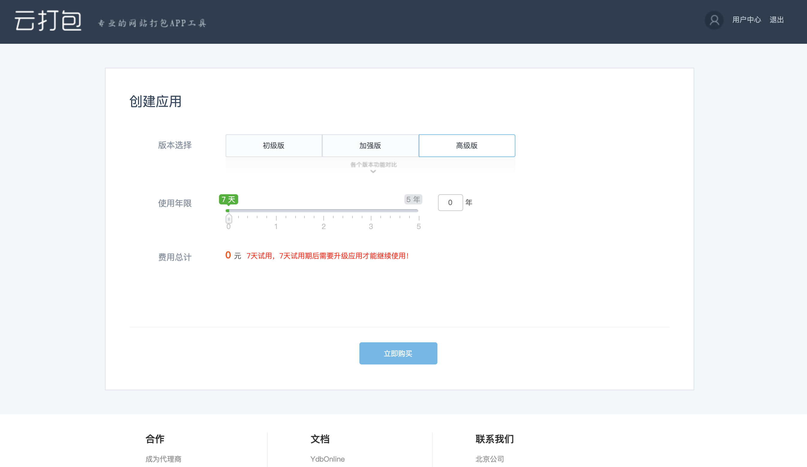

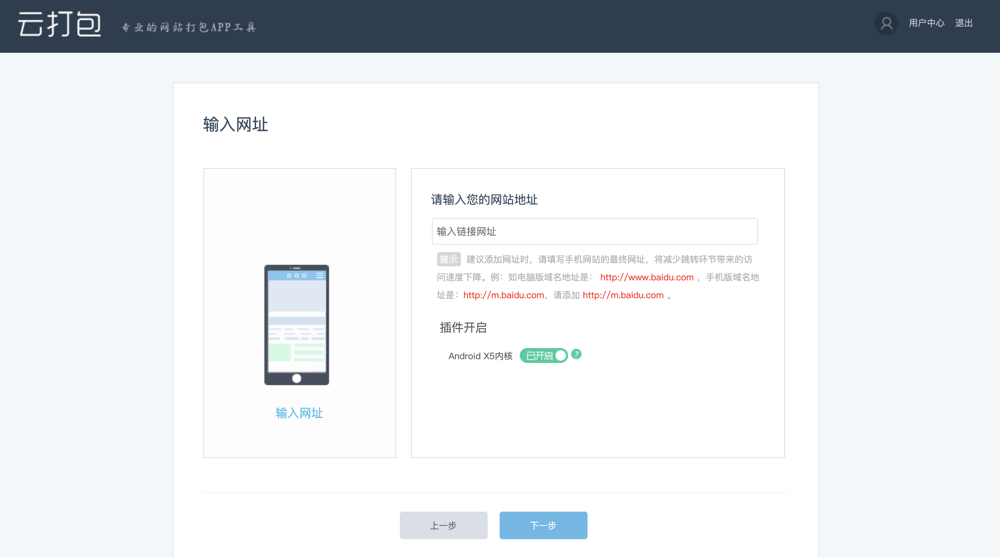

通过平台生成的应用有 ios 版和 android 版。ios 版需要扫描二维码下载应用“靓号助手”。在“靓号助手”中进入“云助手DEV”界面，填入通过二维码扫描得到的ID，进行测试。android 版可以直接进行下载 apk
文件。 

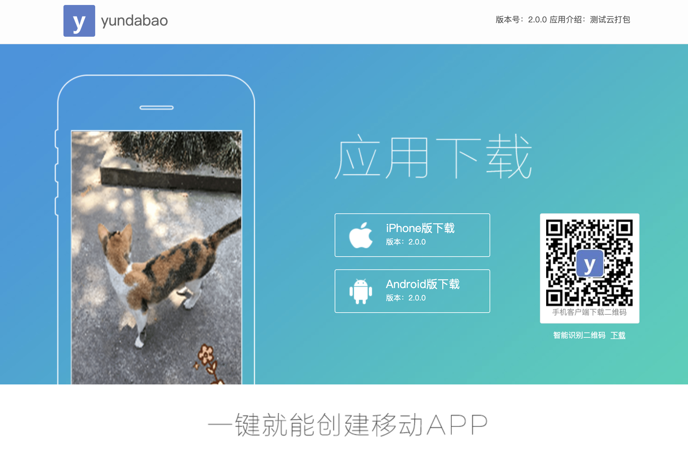

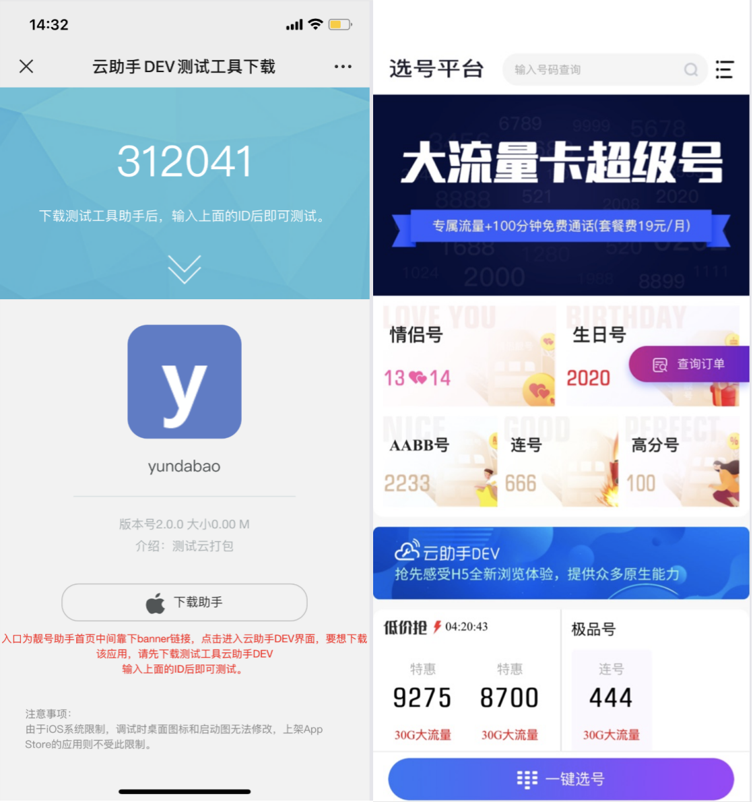

在云打包官网上还提供了部分客户应用案例，包含 android 和 ios，由于自行生成的 ios 实际上只可以在“靓号助手”中进行测试，所以后续对 ios 应用进行域名提取时，根据应用案例进行提取的。 

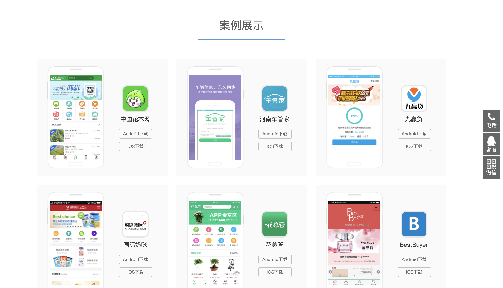

## 2、应用特征描述

通过云打包平台快速生成一个apk，其中应用特征为：

- android  
  Application：com.wta.NewCloudApp.exception.CrashApplication Launcher
  Activity：com.wta.NewCloudApp.activity.ZitianNewsActivity

- ios  
  Bundle Identifier：com.zitian.xxx (以com.zitian开头)

## 3、域名提取

### 3.1 android

在进行打包 apk 的过程中，提交的域名为 `“https://www.appscan.io/”`，于是在 apk 包中搜索域名。在应用包的 `res/xml/myxml.xml` 文件中找到了提交的域名。在反编译后的代码中搜索和
myxml.xml 文件相关的代码。 

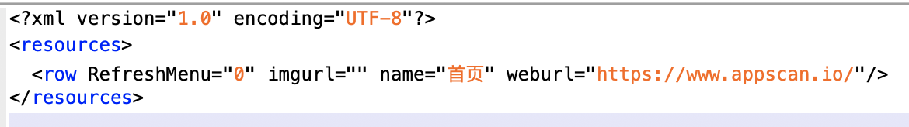

在类 com.wta.NewCloudApp.activity.BaseActivity 的 getXmlInfo() 方法中读取了 myxml.xml 文件，并将文件中的 name、imgurl、RefreshMenu、weburl
信息放入 com.wta.NewCloudApp.utility.InfoSort 当中 

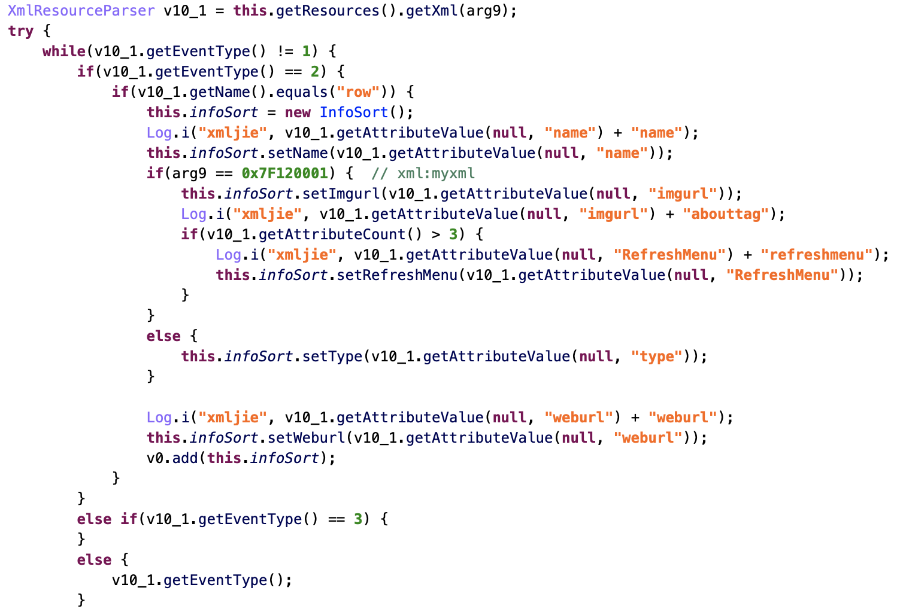

通过逆向分析，得出应用加载页面的流程如下： 
step1、在 Launcher Activity（com.wta.NewCloudApp.activity.ZitianNewsActivity）中，通过 initViews 方法将域名等信息配置到 InfoSort 中 

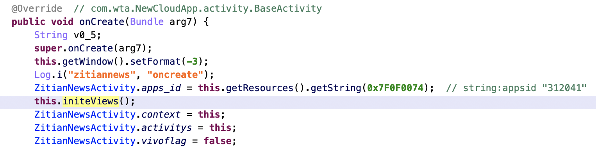

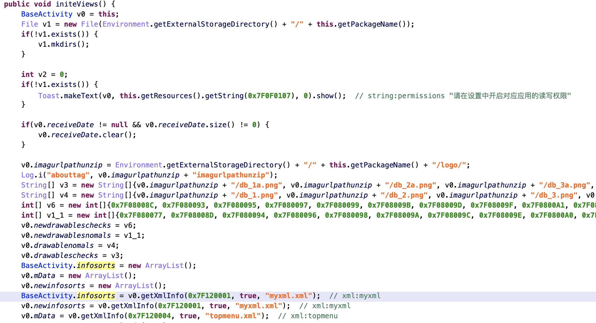

step2、当执行到 jumpToPage 方法打开页面时，通过 getWeburl 方法从 InfoSort 中获得 weburl 作为 jumpToPage 的参数。jumpToPage 方法将 weburl 放入 intent 并传给
AboutActivity。 

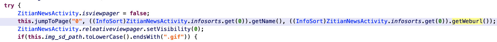

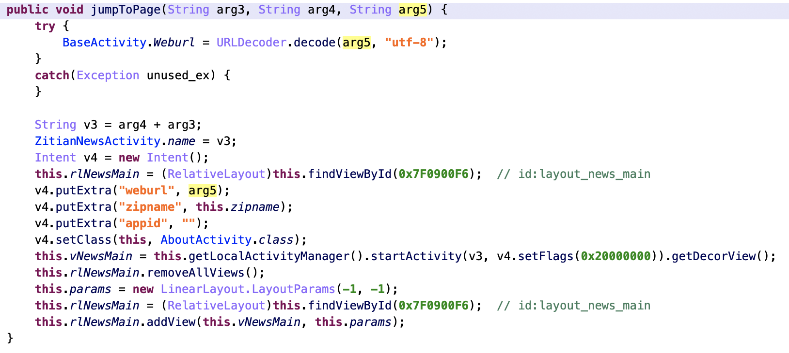

step3、AboutActivity 通过 AboutActivity.webview.loadUrl 打开域名 

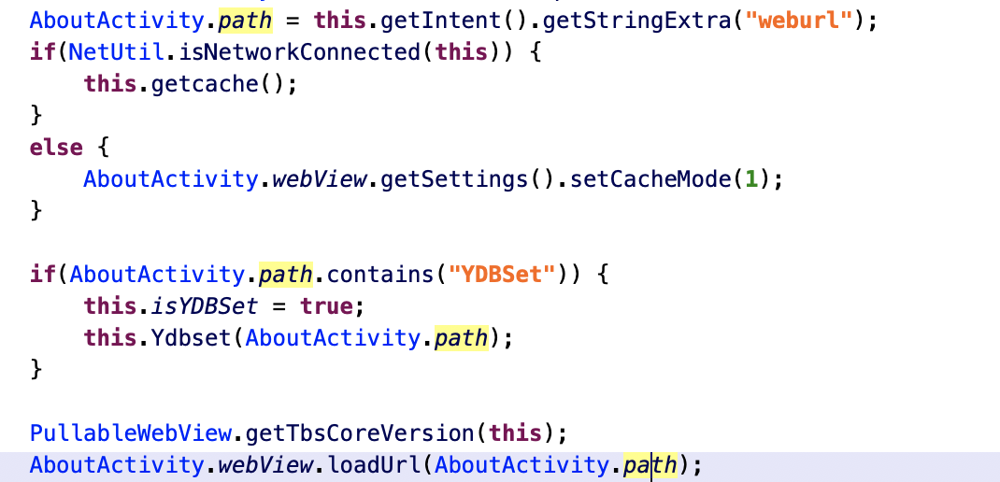

根据加载页面的流程来看，在拿到一个`云打包平台`生成的 apk 时，我们只要获取到`res/xml/myxml.xml`文件，并读取其中的 `weburl`，就可以获得应用启动后加载的页面了。效果如下： 

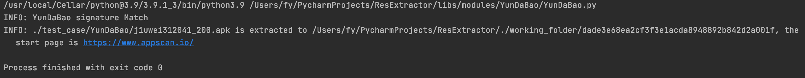

### 3.2 ios

以应用案例中的 “花木网” 为例。ios 应用和 android 类似类似，在对应的 “.app” 包中，同样存在一个 “myxml.xml” 文件，该文件中的`weburl`记录着应用访问的网站网址。 

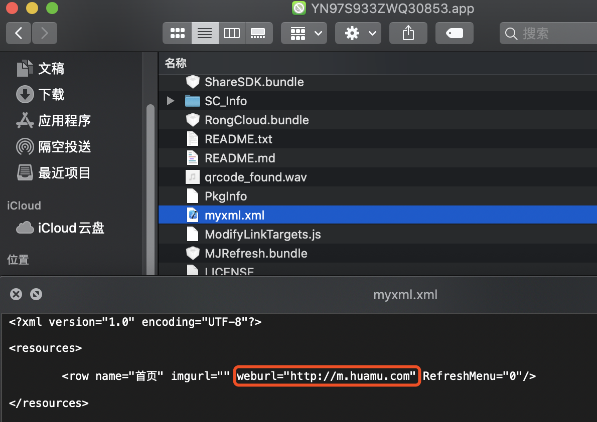

提取 “myxml.xml” 文件中的 `weburl`。 

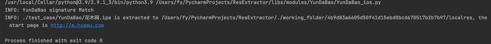
 
获得的 “http://m.huamu.com” 即应用对应的网站。 

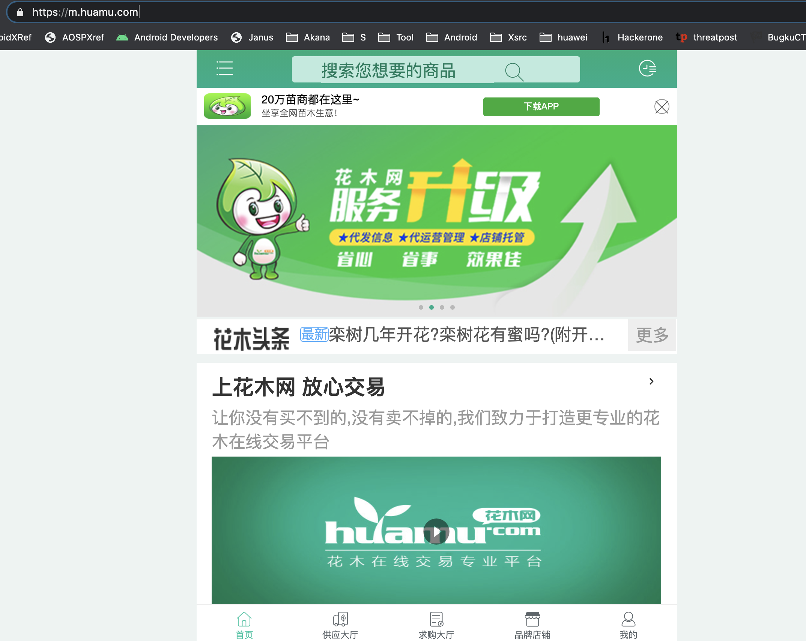

## 4、域名提取验证

android 部分，根据`云打包平台`的应用特征，找到了相关的 apk 进行验证。 

- 赢美 （SHA1: d4ba5c752a32c3c8a4f0e1d79fca3bc8e0d28c4a） 
  appUrl = `http://www.yingmeiguoji.com/wap`

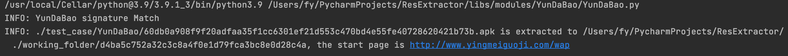

- 给你花 （SHA1: f5e68f31cc744c132f42741694448a5163e914a6） 
  appUrl = `http://www.dmmbb.com`（已不能正常访问）

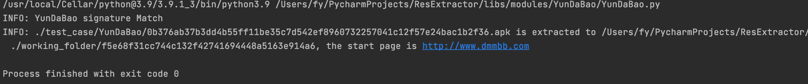

ios 部分，从应用案例中又选取了 “花总管” 进行域名提取验证。 

- 花总管 （SHA1: ac5471ed9bb2b77d2cb10109ad390bfc15f7558b 
  appUrl = `https://app.huazongguan.cn`

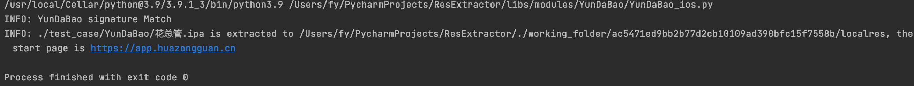

## 5、结论

`云打包平台`向开发者提供快速开发移动应用的方式，开发者只需要提交网址域名、图标等基本信息就可以开发出移动应用。开发出的移动应用包含 ios 和 android，本篇分析了 android 移动应用在启动后加载指定域名的流程，对 ios 和
android 应用进行域名提取。 

这种快速开发移动应用的模式，比较容易出现一些盗版应用。在进行域名提取验证的过程中，发现部分盗版的 android 应用，它们有着和正版应用一样的图标，但是应用包大小和代码逻辑完全不同。 

- 盗版应用一：正大银行.apk 7.3MB（SHA1: 013d2439fc77915e2992bbc2212e3d770eca279c） 
  appUrl = `http://119.8.41.132/`（已不能正常访问）

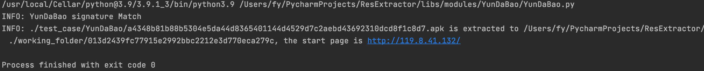

- 盗版应用二：兴业银行.apk 8MB（SHA1: 013d2439fc77915e2992bbc2212e3d770eca279c） 
  appUrl = `http://103.206.123.49`（已不能正常访问）

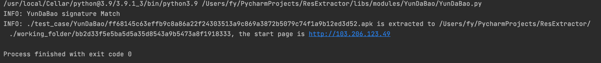

