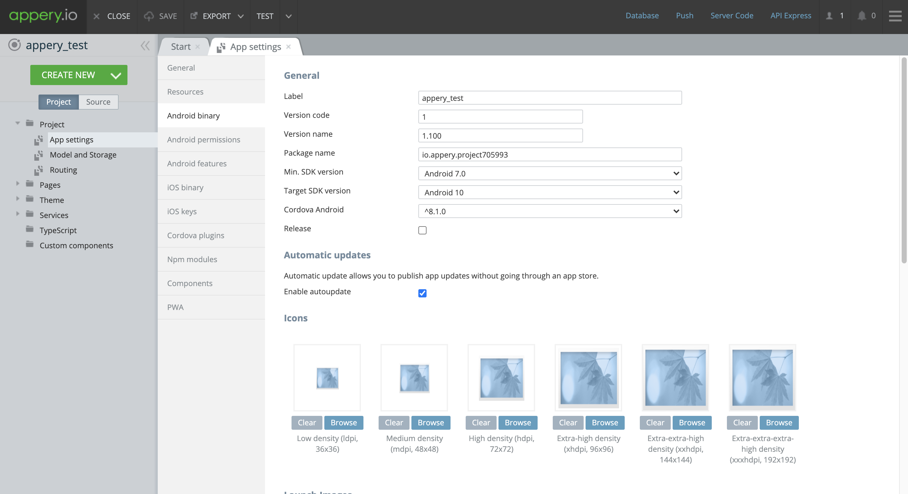
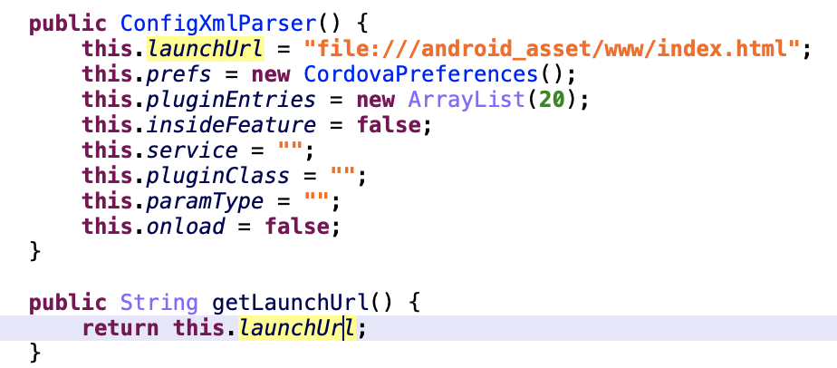
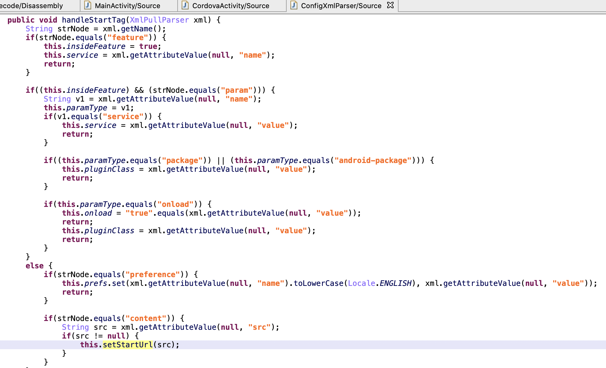
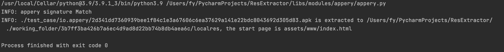
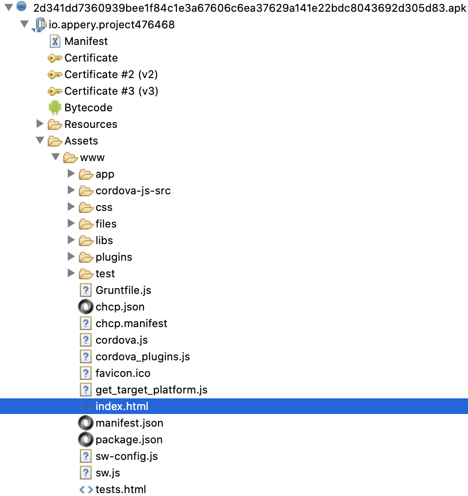
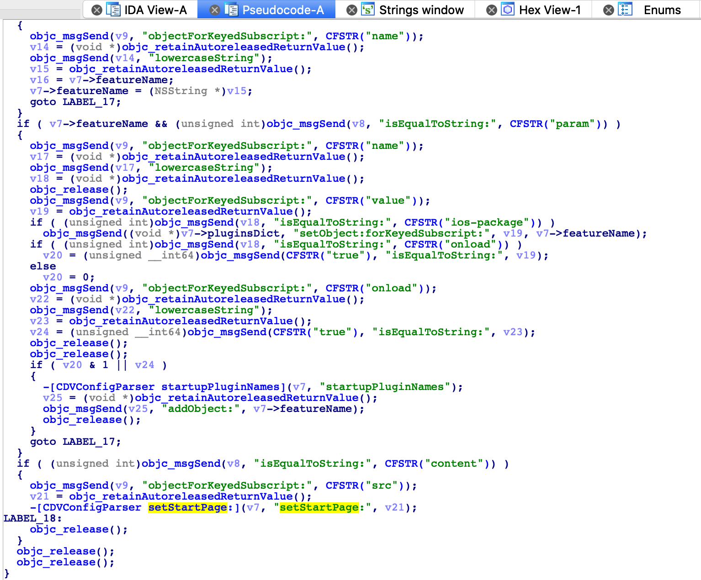
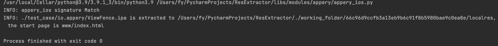
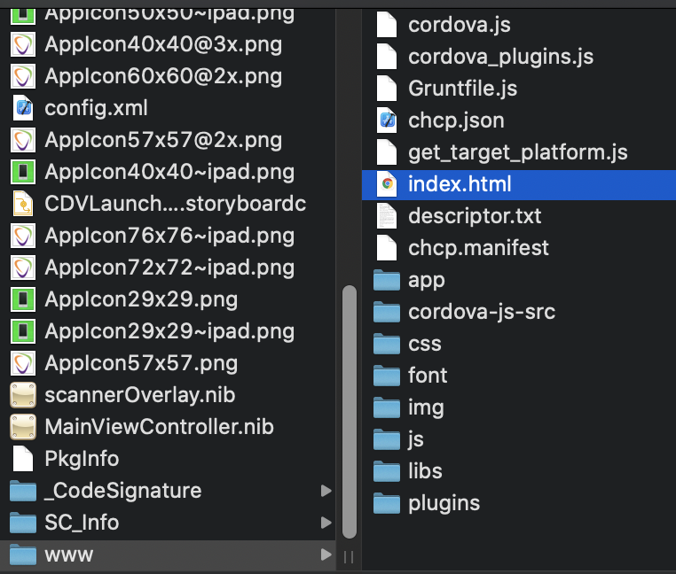
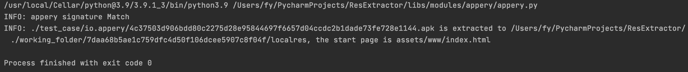
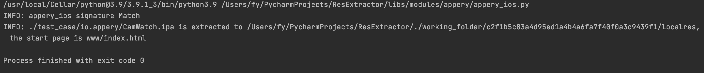

# appery Rev

作者：fy，如需转载请注明出处

## 目录

+ 1、简述
+ 2、应用特征描述
+ 3、资源提取
+ 4、资源提取验证
+ 5、结论

## 1 简述

开发者可以通过 <a href="https://appery.io/" target="_blank">appery官网</a> 开发 Android 应用和 iOS 应用。在 appery
官网上以网页控制台的方式，帮助开发者进行快速开发。

## 2 应用特征描述

在 appery 官网上进行开发的过程中，开发者可以在网页控制台中设置应用的包名(默认为 "io.appery" 开头)
。根据包名作为应用特征进行匹配时，会出现少数应用不匹配应用特征的情况。出现这个情况的原因是，开发者在开发过程中自定义了移动应用包名。

### 2.1 Android

Package Name(default): 以 `“io.appery”` 开头  
Launcher Activity(default): 以 `“io.appery”` 开头  

apk 包的文件特征与 Cordova 类似，“assets” 目录下存在 config.xml， “assets/www/” 目录下存在 cordova-js-src 文件夹、cordova.js 文件和
cordova_plugins.js

### 2.2 iOS

Bundle Identifier(default): 以 `“io.appery.app”` 开头  

ipa 包的文件特征与 Cordova 类似，“.app” 文件的目录下存在 config.xml， “.app/www/” 目录下存在 cordova-js-src 文件夹、cordova.js 文件和
cordova_plugins.js

## 3 资源提取

### 3.1 Android

应用启动时，进入入口 Activity 后，在父类的 onCreate 中对 `res/xml/config.xml` 文件进行解析，并分以下两种情况进行处理： 

1) 不存在该 config.xml 文件。 
   加载的网址为默认地址： `file:///android_asset/www/index.html`

2) 存在该config.xml 文件。 
   加载的网址为 config.xml 文件中，content 标签对应的 src 值

接下来对 Android 应用进行资源提取。apk 反编译之后，解析 `res/xml/config.xml` 文件获取加载界面的入口地址，并提取相应的资源文件，资源文件为 `assets/www` 目录

### 3.2 iOS

提取 appery 网站中的案例应用的 ipa 文件，解包之后反编译可执行文件，能够在反编译的 iOS 应用代码中找到提取 setStartPage 的代码位置。

接下来对 iOS 应用进行资源提取。ipa 解压缩之后，解析 “应用名.app” 目录下的 `config.xml` 文件获取加载界面的入口地址，并提取相应的资源文件，资源文件为 `应用名.app/www` 目录

## 4 资源提取验证

Android 部分进行验证的样本，根据应用特征进行匹配获取 apk 包；iOS 部分进行验证的样本，测试机下载 appery 官网提供的案例(`https://appery.io/case-studies`)，dump 出对应的 ipa
包。

1) Android

- Jordan Aviation (SHA1: 7daa68b5ae1c759dfc4d50f106dcee5907c8f04f) 
  appUrl = `assets/www/index.html`

2) iOS

- CamWatch (SHA1: c2f1b5c83a4d95ed1a4b4a6fa7f40f0a3c9439f1) 
  appUrl = `www/index.html`

## 5 总结

通过 appery 生成的应用包，文件结构与 cordova 类似，通过 config.xml 文件，获取入口地址，在 “www” 目录存放资源文件。在进行应用特征匹配时，单一的以包名作为规则只能命中一部分默认包名为 “io.appery”
开头的应用。实际上 appery 生成的应用，都是通过 cordova 进行打包，根据 cordova 的相关文件特征，可以命中应用包，但是，不能有效区分哪些是通过 appery 生成的。这一问题在后续对不同依赖于 cordova
打包的开发框架分析时做处理。
