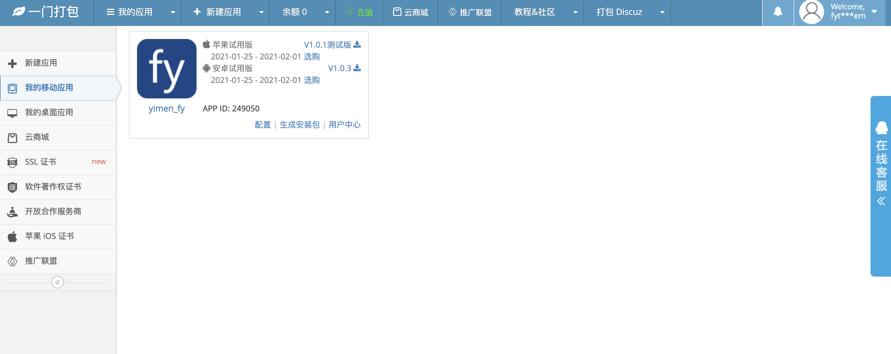
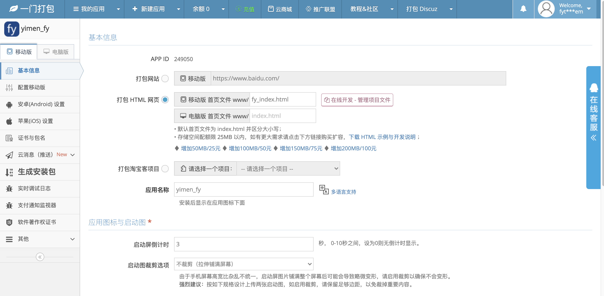
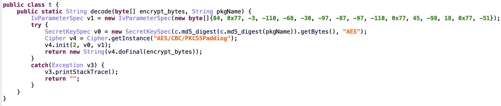
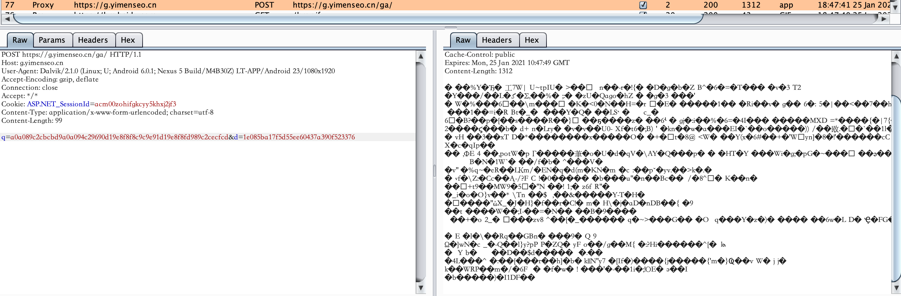
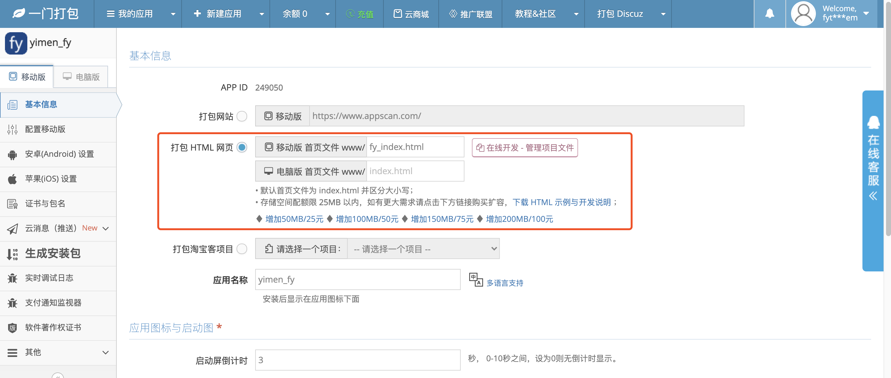
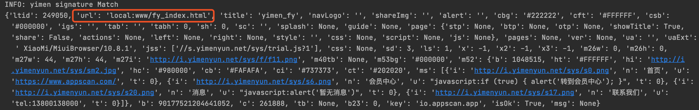
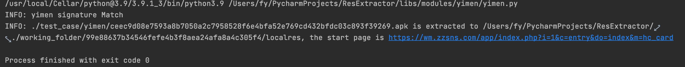
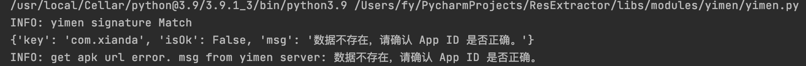

# yimen Rev

作者：fy，如需转载请注明出处

## 目录

+ 1 简述
+ 2 应用特征描述
+ 3 资源数据提取
+ 4 资源提取验证
+ 5 结论

## 1 简述

<a href="https://www.yimenapp.net/" target="_blank">一门打包</a>
可以快速成Android应用和iOS应用，开发者只需要在一门打包的开发者平台`https://www.yimenapp.cn/developer/`中进行apk的相关配置，就可完成开发。打包过程中可以选择以下三种方式进行打包：打包网站、打包html网页和打包淘宝客项目(暂不清楚淘宝客项目具体是指的什么)。

<div align=center></div>
<div align=center></div>

## 2 应用特征描述

### 2.1 Android

Launcher Activity: 以 `com.lt.app` 开头</br>

### 2.2 iOS

在Frameworks的文件夹下面包含YMPlugin.framework的文件夹.

## 3 资源数据提取

一门打包可以打包网站，也可以打包html网页(淘宝客项目由于不清楚具体内容，暂为进行相关分析)，故通过开发者平台，生成测试应用进行分析。

### 3.1 Android

1）打包网站的方式</br>
首先，启动应用时，在应用的application中会先检查“assets/”目录下的`y.x`文件，代码中进行解码，并提取相关的配置信息作为预先配置，其中就包含应用加载的url。</br>

解密代码如下，解密模式为"AES/CBC/PKCS5Padding"，其中iv为编辑在代码中的固定值，密钥为传入的应用包名。</br>
<div align=center></div>

然后，在入口组件MainActivity中，通过post请求，从一门打包的服务器获取配置信息，通过相同的解码方式，提取当前应用保存在服务器上的配置信息。后续在应用中点击“回到首页”即访问此时配置信息中的url。</br>

启动应用时，抓包获取到请求如下，其中body的d参数为设备的android_id，q参数为包名和版本信息通过编码得出的值。</br>
<div align=center></div>

响应包的内容如下，其中url所对应的值就是开发者配置的应用加载网址。 当前服务器返回的url为:</br>
"url": "https://www.appscan.com/"

```json
{
  "ltid": 249050,
  "url": "https://www.appscan.com/",
  "title": "yimen_fy",
  "navLogo": "",
  "shareImg": "",
  "alert": "",
  "cbg": "#222222",
  "cft": "#FFFFFF",
  "csb": "#000000",
  "igs": "",
  "tab": "",
  "tabh": 0,
  "sh": 0,
  "sc": "",
  "splash": null,
  "guide": null,
  "page": {
    "stp": null,
    "btp": null,
    "otp": null,
    "showTitle": true,
    "share": false,
    "actions": null,
    "left": null,
    "right": null,
    "style": "",
    "css": null,
    "script": null,
    "js": null
  },
  "pages": null,
  "ver": null,
  "ua": "",
  "uaExt": " XiaoMi/MiuiBrowser/10.8.1",
  "jss": [
    "//s.yimenyun.net/sys/trial.js?1"
  ],
  "css": null,
  "sd": 3,
  "ls": 1,
  "x": -1,
  "x2": -1,
  "x3": -1,
  "m26w": 0,
  "m26h": 0,
  "m27w": 44,
  "m27h": 44,
  "m27i": "http://i.yimenyun.net/sys/f/f11.png",
  "m40tb": null,
  "m53bg": "#000000",
  "m52": {
    "b": 1048515,
    "ht": "#FFFFFF",
    "hi": "http://i.yimenyun.net/sys/sm2.jpg",
    "hc": "#980000",
    "cb": "#FAFAFA",
    "ci": "#737373",
    "ct": "#202020",
    "ms": [
      {
        "i": "http://i.yimenyun.net/sys/s0.png",
        "n": "首页",
        "u": "https://www.appscan.com/",
        "t": 0
      },
      {
        "i": "http://i.yimenyun.net/sys/s6.png",
        "n": "会员中心",
        "u": "javascript:if (true) { alert('转到会员中心'); }",
        "t": 0
      },
      {
        "i": "http://i.yimenyun.net/sys/s20.png",
        "n": "消息",
        "u": "javascript:alert('暂无消息')",
        "t": 0
      },
      {
        "i": "http://i.yimenyun.net/sys/s17.png",
        "n": "联系我们",
        "u": "tel:13800138000",
        "t": 0
      }
    ]
  },
  "b": 90177521204641060,
  "c": 261888,
  "tb": null,
  "b23": 0,
  "key": "io.appscan.app",
  "isOk": true,
  "msg": null
}
```

2）打包html网页的方式</br>
和打包网站的方式对比，区别在于：

- 1、 服务器返回的url为 `local:xxx.html` 本地资源url</br>
- 2、 本地资源文件目录为 `assets/www/` </br>

在开发者平台上修改应用包信息为“打包html网页”，应用启动时获得的响应包的内容如下，其中url所对应的值就是开发者配置的应用加载网址。应用加载的html资源目录在“assets/www/”下，开发者可以指定 www
目录下的任意文件作为应用加载的首页文件。
<div align=center></div>

当前服务器返回的url为:</br>
"url": "local:www/fy_index.html"

<div align=center></div>

### 3.2 iOS
iOS版本的打包应用同样有类似的静态与动态两种方式，但是这两种方式在应用包上的区别并不明显。
应用包实际运行时加载的地址或者是资源是根据应用包中的几个配置文件所决定的。

这几个配置文件分别是包根目录下的config.z，包根目录下的config，包运行时网络上传输的config
其中config.z为明文存储而根目录的config与网络传输的config都是经过加密的。

config.z的内容格式如下，
```json
{"aid":252397,"alipay":"alipayltapp253397","baidu_ak":"","gtAppId":"","gtAppKey":"","gtAppSecret":"","is_basic":true,"jpush":"","jpush_pro":true,"mtj_appkey":"","p_weibo_appkey":"","p_weibo_redirect":"","p_bdface_licenseid":"","p_rc_lbs_key":"","p_u_appkey":"","p_u_channel":"","p_u_push":"","p_weibo_scope":"","p_ttad_app_id":"","qq":"","qq_mta":"","url":"https://www.qq.com/","weixin":"","weixin_ul":"https://www.163.com/","m":"","agreement":false,"crc":true,"p_hx_chid":"","p_hx_cpid":"","p_hx_splash":false,"plugins":{"appid":252397,"alipay":"alipayltapp253397","baidu_ak":"","p_weibo_appkey":"","p_weibo_redirect":"","p_weibo_scope":"","p_bdface_licenseid":"","yuemeng_appid":"","leto_appid":"","dyad_appid":"","dyad_appsecret":"","p_qmf_wxpay":"","p_qmf_wxul":"","p_qmf_alipay":"","p_qmf_upay":"","p_cncb_pwd":"","p_ht_appkey":"","p_ht_appsec":""}}
```

根目录和网络传输的config的本质结构相同，不过网络传输的是最新的config也就是可能动态下发的，根目录下的config则是在无法链接网络的时候使用。

config的加密是通过des进行加密。加密的密钥是应用的bundle identifier进行两次md5后取第12位到20位所得。

解密后的config的内容如下，
```json
{"ltid":252397,"url":"local:www/fy_index.html","title":"\xe7\x99\xbe\xe5\xba\xa6ios_fy","navLogo":"","shareImg":"","alert":"","cbg":"#222222","cft":"#FFFFFF","csb":"#000000","igs":"","tab":"","tabh":0,"sh":0,"sc":"","splash":null,"guide":null,"page":{"stp":null,"btp":null,"otp":null,"showTitle":true,"share":false,"actions":null,"left":null,"right":null,"style":"","css":null,"script":null,"js":null},"pages":null,"ver":null,"ua":"","uaExt":" Version/12.0 Safari/604.1","jss":["//s.yimenyun.net/sys/trial.js?1"],"css":null,"sd":0,"ls":1,"x":-1,"x2":-1,"x3":-1,"m26w":0,"m26h":0,"m27w":44,"m27h":44,"m27i":"http://i.yimenyun.net/sys/f/f11.png","m40tb":null,"m53bg":"","m52":{"b":1048515,"ht":"#FFFFFF","hi":"http://i.yimenyun.net/sys/sm2.jpg","hc":"#980000","cb":"#FAFAFA","ci":"#737373","ct":"#202020","ms":[{"i":"http://i.yimenyun.net/sys/s0.png","n":"\xe4\xbc\x9a\xe5\x91\x98\xe4\xb8\xad\xe5\xbf\x83","u":"https://www.163.com","t":0},{"i":"http://i.yimenyun.net/sys/s6.png","n":"\xe4\xbc\x9a\xe5\x91\x98\xe4\xb8\xad\xe5\xbf\x83","u":"javascript:if (true) { alert(\'\xe8\xbd\xac\xe5\x88\xb0\xe4\xbc\x9a\xe5\x91\x98\xe4\xb8\xad\xe5\xbf\x83\'); }","t":0},{"i":"http://i.yimenyun.net/sys/s20.png","n":"\xe6\xb6\x88\xe6\x81\xaf","u":"javascript:alert(\'\xe6\x9a\x82\xe6\x97\xa0\xe6\xb6\x88\xe6\x81\xaf\')","t":0},{"i":"http://i.yimenyun.net/sys/s17.png","n":"\xe8\x81\x94\xe7\xb3\xbb\xe6\x88\x91\xe4\xbb\xac","u":"tel:13800138000","t":0}]},"b":90177521204641052,"c":261888,"tb":null,"b23":12287,"key":"com.baidu.app.xf36fep","isOk":true,"msg":null}
```

应用对这些配置文件的读取方式如下，首先从config.z中读取主页面的网络地址，也就是config.z中的url项.
如果该项为空，则再根据网络config去读取url，如果网络config不存在则读取应用包根目录下的config内容。
而其他点击项或者页面的地址则就是直接通过网络config或本地根目录config。

因此最后提取资源的方式就是提取出config.z，网络config以及通过网络config中的url找到一些本地的资源文件。

## 4 资源提取验证

### 4.1 Android

根据一门打包生成的应用特征，从样本库中命中的应用选两个并进行提取验证

- 买折扣 (SHA1: 99e88637b34546fefe4b3f8aea24afa8a4c305f4)</br>
  appUrl = `https://wm.zzsns.com/app/index.php?i=1&c=entry&do=index&m=hc_card`(当前可访问，与应用加载的界面相同)

<div align=center></div>

- 牛操盘 (SHA1: 323835b220c27def7e55573c0221f4e83d56f7c0)</br>
  appUrl = 无(应用及网页链接提示"提示数据不存在，请确认App ID是否正确"，说明服务器端已无相关信息)

<div align=center></div>

### 4.2 iOS

暂无相关的ipa文件进行分析

## 5 总结

一门打包生成的apk，会先读取assets目录下的“y.x”文件，本地解密后作为默认配置信息。在打开MainActivity时，会访问一门打包的服务器获取最新的应用配置信息，通过本地解密之后，最后加载配置信息中的url字段。
