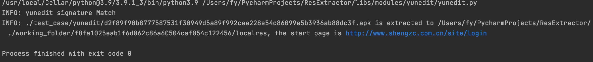

# yunedit Rev

作者：fy，如需转载请注明出处

## 目录

+ 1、简述
+ 2、应用特征描述
+ 3、资源提取
+ 4、资源提取验证
+ 5、结论

## 1 简述

开发者可以通过 <a href="https://www.yunedit.com/" target="_blank">香蕉云编官网</a>（简称 yeui）开发 Android 应用和 iOS
应用。当前在香蕉云编的官网上通知显示“打包和热更新功能暂停开放”，未能通过官网进行打包测试。本文使用的 apk 样本是根据”yunedit“等字符信息进行检索获得的。没有获得相关的 ipa 文件进行测试分析。
<div align=center></div>

## 2 应用特征描述

### 2.1 Android

框架必要文件: assets/phone/ 目录下的`start.html, index.html, js目录, css目录`</br>
launcher Activity: 以`“com.yunedit.yeui”`开头

### 2.2 iOS

暂无相关的ipa文件进行分析

## 3 资源提取

### 3.1 Android

yeui 的使用文档（https://www.yunedit.com/demo/first ）中有如下描述:</br>

```
下载的源码，这些文件不要删除:js目录的文件，css目录的文件、start.html和index.html
这些文件是不能删除的，是框架的必要文件。
```

<div align=center></div>

由此将框架的必要文件作为 yeui 应用的特征，将检索到的应用进行反编译。启动应用时通过startActivity跳转到 com.yunedit.yeui.WebViewActivity
并加载页面，加载的页面为startActivity中的 htmlPath 参数，其值在代码中为 “start.html”。

<div align=center></div>

在 WebViewActivity 处理intent的代码部分，对传入的 htmlPath 参数进行处理

<div align=center></div>

打开 assets 目录下的 index.html, 发现在script标签中还通过 location.replace() 方法进行重定向加载。</br>

以恶意应用“京东金服”为例，通过抓包可以获取到应用在启动时访问的域名。其中，`http://www.eqp88.cn` 为首次启动时应用访问的域名，`https://www.yunedit.com` 为 yeui 框架相关的域名。

<div align=center></div>

反编译“京东金服”apk包，在index.html中，通过 location.replace() 方法将当前资源重定向至：`"http://www.eqp88.cn:443/pcdd/"`(已无法访问)，与抓包获得的请求一致。

<div align=center></div>

index.html文件内容

```html
<html>
  <head>
    <meta charset="utf-8"/>
    <meta name="viewport" content="width=device-width,initial-scale=1,minimum-scale=1,maximum-scale=1,user-scalable=no"/>
    <meta name="viewport" content="width=device-width, viewport-fit=cover"/>
    <title>首页</title>
    <!--    <script type="text/javascript" src="js/jquery-1.11.1.min.js" ></script>-->
    <!--    <script src="js/mui.min.js"></script>-->
    <script src="js/zepto.min.js"/>
    <script src="js/config.js" type="text/javascript"/>
    <!-- 配置文件必须修改 -->
    <script src="js/yeui.js" type="text/javascript"/>
    <!--yeui.js依赖于jquery,必须放在jquery文件或zepto.min.js引用的后面-->
    <!--    <script  src="js/touch.js" type="text/javascript"></script>-->
    <!--    <script  src="js/jquery.flexslider-min.js" type="text/javascript"></script>-->
    <link href="css/icon.css" rel="stylesheet"/>
    <link href="css/yeui.css" rel="stylesheet"/>
    <script>
               if(isIosApp==true)
               {
                    var link = document.createElement('link');
                    link.type = 'text/css';
                    link.rel = 'stylesheet';
                    link.href = 'css/ioshead.css';
                    document.getElementsByTagName("head")[0].appendChild(link);
               }
    </script>
  </head>
  <body>
    <script>
      	  	function ydtback()
      		{
      			//closeWindow();
      	 		return "alert";
      	 	}
              function webviewRead()
              {
                  //closeOtherWindow();
                  location.replace("http://www.eqp88.cn:443/pcdd/");
                  
              }
              function childCallback(ret)
              {
                 // indexCheckLogin();
              }
    </script>
  </body>
</html>


```

根据以上分析对 yeui 框架的应用进行资源提取，代码如下：

- yeui框架应用特征：

```python
apk_file = zipfile.ZipFile(self.detect_file)
js_pattern = re.compile(r'^(assets/phone/js/).*')
css_pattern = re.compile(r'^(assets/phone/css/).*')
js_dir = ""
css_dir = ""
for f in apk_file.namelist():
    m = js_pattern.match(f)
    n = css_pattern.match(f)
    if m is not None:
        js_dir = m.group()
    if n is not None:
        css_dir = n.group()
features = ['assets/phone/start.html', 'assets/phone/index.html']
if (set(features) < set(apk_file.namelist())) and (len(js_dir)) and (len(css_dir)):
    return True
return self._find_main_activity("com.yunedit.yeui")
```

- 获取加载的地址：

```python
launch_path = "assets/phone/index.html"
start_page = os.path.join(resource_path, "start.html")
if os.path.exists(start_page):
    launch_path = "assets/phone/start.html"
index_page = os.path.join(resource_path, "index.html")
if os.path.exists(start_page):
    for str_line in open(index_page).read().split("\""):
        pattern = re.compile(r'^[a-z-]+://')
        if pattern.match(str_line):
            launch_path = str_line
```

资源提取结果如下：
<div align=center></div>

### 3.2 iOS

暂无相关的ipa文件进行分析

## 4 资源提取验证

### 4.1 Android

根据yeui框架应用的特征，从样本库中命中的应用选两个并进行提取验证

- 老品牌 (SHA1: f49cb87c25f6856d5ff4e8d12536f1b194f1bfa9)</br>
  appUrl = `http://thsdj.com`(当前可访问，与应用加载的界面相同)

<div align=center></div>

- 德益国际 (SHA1: f8fa1025eab1f6d062c86a60504caf054c122456)</br>
  appUrl = `http://www.shengzc.com.cn/site/login`(已无法正常访问)

<div align=center></div>

### 4.2 iOS

暂无相关的ipa文件进行分析

## 5 结论

香蕉云编yeui 框架生成的apk，其加载用的资源文件保存在apk包中的`assets/phone/`资源目录下，启动时加载的地址为资源目录下的`start.html`，在实际应用中，html文件通过
`location.replace()`的方法进行资源的重定向。而iOS应用，由于官网暂时没有开放打包功能，也没有实际的应用包进行分析。